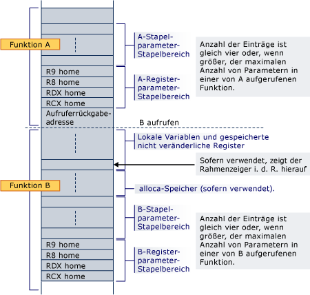

# Stapelreservierung
Eine Funktion Prolog ist verantwortlich für die Zuordnung von Stapelspeicher für lokale Variablen, gespeicherte Register, stack-Parameter, und registrieren Sie Parameter.  
  
 Der Parameterbereich befindet sich immer am unteren Ende des Stapels (selbst wenn Alloca verwendet wird), sodass es immer angrenzend an die Rücksendeadresse bei einem beliebigen Funktionsaufruf ist. Er enthält mindestens vier Einträge, aber immer ausreichend Speicherplatz für alle Parameter benötigt, von jeder Funktion, die aufgerufen werden kann. Beachten Sie, dass Speicherplatz für die Registerparameter immer reserviert wird, auch wenn die Parameter selbst nie auf dem Stapel befinden; eine aufgerufene Funktion ist garantiert, dass Speicherplatz für alle seine Parameter zugeordnet wurde. Privatadressen sind für Registerargumente erforderlich, damit ein zusammenhängender Bereich verfügbar ist, für den Fall, dass die aufgerufene Funktion die Adresse der Argumentliste (Va_list) oder ein einzelnes Argument verwenden muss. Dieser Bereich bietet außerdem einen sinnvoller Ort zum Speichern von Registerargumente während der Ausführung der Thunk und als eine Option für das Debuggen (z. B. vereinfacht die Argumente leicht zu finden, die während des Debuggens, wenn sie sich an ihren Privatadressen in der Prolog gespeichert sind). Auch wenn die aufgerufene Funktion über weniger als 4 Parameter verfügt, diese 4 Stapelspeicherorte gehören effektiv von der aufgerufenen Funktion und können von der aufgerufenen Funktion verwendet werden, für andere Zwecke neben Registerwerte speichern.  Der Aufrufer kann daher keine Informationen in dieser Region des Stapels über einen Funktionsaufruf hinweg speichern.  
  
 Wenn Speicherplatz dynamisch (Alloca) in einer Funktion zugeordnet ist, klicken Sie dann ein nicht flüchtiges Register muss als Frame-Pointer verwendet werden, um die Basis des fester Bestandteil des Stapels zu markieren und Registers gespeichert und im Prolog initialisiert werden muss. Beachten Sie, dass wenn Alloca verwendet wird, Aufrufe an den gleichen aufgerufenen vom gleichen Aufrufer unterschiedliche Basisadressen für ihre Parameter registrieren können.  
  
 Im Stapel werden immer 16-Byte-beibehalten ausgerichtet, außer im Prolog (z. B., nachdem die Rückgabeadresse abgelegt wird) und außer wie in angegeben [Funktionstypen](../build/function-types.md) für eine bestimmte Abfrageklasse Frame-Funktionen.  
  
 Im folgenden ist ein Beispiel für die where-Funktionsaufrufe ein ein innerer Prolog der Funktion Funktion Stapellayout für alle Register- und Parameter, die erforderlichen B am unteren Ende des Stapels bereits Speicherplatz zugeordnet wurde. Der Aufruf legt die Rückgabeadresse ab, und B Prolog reserviert Speicherplatz für die lokalen Variablen nicht flüchtigen Register und des erforderlichen Speicherplatzes für Funktionen aufgerufen. Wenn B Alloca verwendet wird, wird der Speicher zwischen der lokalen Variablen/nicht volatil Register und den Parameterbereich Stapel zugeordnet.  
  
   
  
 Wenn die Funktion B eine andere Funktion aufruft, wird die Rückgabeadresse direkt unterhalb der Privatadresse für RCX abgelegt.  
  
## Siehe auch  
 [Verwendung von Stapeln](../build/stack-usage.md)