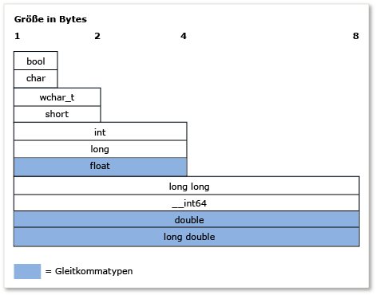

# <a name="c-type-system-modern-c"></a>C++- Typsystem (Modern C++)

Das Konzept der *Typ* in C++ sehr wichtig ist. Jede Variable, jedes Funktionsargument und jeder Rückgabewert muss über einen Typ verfügen, um kompiliert werden zu können. Außerdem wird jedem Ausdruck (einschließlich Literalwerten) vom Compiler implizit ein Typ angegeben, bevor der Ausdruck ausgewertet wird. Einige Beispiele für Typen sind **Int** zum Speichern von ganzzahliger Werten **doppelte** zum Speichern von Gleitkommawerten (auch bekannt als *skalare* -Datentypen), oder die Standardbibliotheksklasse [Std:: basic_string](../standard-library/basic-string-class.md) zum Speichern von Text. Sie können einen eigenen Typ erstellen, durch die Definition einer **Klasse** oder **Struktur**. Der Typ gibt den Speicher an, der für die Variable (oder das Ausdrucksergebnis) zugeordnet ist, die Wertarten, die in dieser Variablen gespeichert werden können, wie diese Werte (als Bitmuster) interpretiert werden, und die Vorgänge, die darauf ausgeführt werden können. In diesem Artikel ist eine informelle Übersicht der Hauptfunktionen des C++-Typsystems enthalten.

## <a name="terminology"></a>Terminologie

**Variable**: der symbolische Name einer Menge von Daten, damit der Name verwendet werden kann, für den Datenzugriff, die es verweist auf den Gültigkeitsbereich des Codes, in dem sie definiert ist. In C++ *Variable* wird in der Regel verwendet, um auf Instanzen von skalaren Datentypen zu verweisen, wohingegen Instanzen anderer Typen in der Regel aufgerufen werden *Objekte*.

**Objekt**: für die Einfachheit und Konsistenz in diesem Artikel verwendet den Begriff *Objekt* verweisen auf eine beliebige Instanz einer Klasse oder Struktur, und wenn es im allgemeinen Sinn verwendet wird enthält alle Typen, sogar skalare Variablen.

**POD-Typ** (plain old Data): Diese informelle Kategorie von Datentypen in C++ bezieht sich auf Typen, die skalare sind (siehe Abschnitt "grundlegende Typen) oder *POD-Klassen*. Eine POD-Klasse verfügt über keine statischen Datenmember, die nicht auch PODs sind. Sie verfügt über keine benutzerdefinierten Konstruktoren, keine benutzerdefinierten Destruktoren oder keine benutzerdefinierten Zuweisungsoperatoren. Darüber hinaus verfügt eine POD-Klasse über keine virtuellen Funktionen, keine Basisklasse und keine privaten oder geschützten nicht statischen Datenmember. POD-Typen werden häufig für externen Datenaustausch verwendet, z. B. mit einem in der Programmiersprache C (die nur über POD-Typen verfügt) geschriebenen Modul.

## <a name="specifying-variable-and-function-types"></a>Angeben von Variablen und Funktionstypen

C++ ist eine *stark typisierte* Sprache, und es ist auch *statisch*; jedes Objekt verfügt über einen Typ und die Typ ändert sich nie (nicht zu verwechseln mit Objekten der statischen Daten).
**Wenn Sie eine Variable deklarieren** in Ihrem Code müssen Sie entweder den Typ explizit angeben oder verwenden Sie die **automatisch** Schlüsselwort, um den Compiler anzuweisen, den Typ aus dem Initialisierer abzuleiten.
**Wenn Sie eine Funktion deklarieren** in Ihrem Code müssen Sie den Typ jedes Arguments und ihren Rückgabewert angeben oder **"void"** , wenn kein Wert von der Funktion zurückgegeben wird. Die Verwendung von Funktionsvorlagen, die Argumente beliebiger Typen ermöglichen stellen eine Ausnahme dar.

Nachdem Sie eine Variable deklariert haben, können Sie den Typ zu einem späteren Zeitpunkt nicht ändern. Sie können allerdings den Wert der Variablen oder den Rückgabewert einer Funktion in eine andere Variable eines anderen Typs kopieren. Solche Vorgänge heißen *typkonvertierungen*, diese sind manchmal erforderlich aber stellen auch mögliche Quellen von Datenverlust oder Unrichtigkeit dar.

Wenn Sie eine Variable des POD-Typs deklarieren, empfehlen wir dringend, sie zu initialisieren, ihr also einen Anfangswert zu geben. Wenn Sie eine Variable initialisieren, verfügt sie über einen "Garbage"-Wert, der aus allen Bits dessen besteht, das sich grade zuvor an diesem Speicherort befand. Sich an diesen Aspekt von C++ zu erinnern ist, insbesondere dann wichtig, wenn Sie vorher in einer anderen Sprache geschrieben haben, bei der die Initialisierung für Sie bearbeitet wurde. Wenn Sie eine Variable eines Typs deklarieren, der keine POD-Klasse ist, wird die Initialisierung vom Konstruktor behandelt.

Im folgenden Beispiel werden einige einfache Variablendeklarationen dargestellt, jeweils mit einigen Beschreibungen. In dem Beispiel wird auch die Verwendung der Typinformationen durch den Compiler dargestellt, um bestimmte nachfolgende Vorgänge in den Variablen zuzulassen oder zu verweigern.

```cpp
int result = 0;              // Declare and initialize an integer.
double coefficient = 10.8;   // Declare and initialize a floating
                             // point value.
auto name = "Lady G.";       // Declare a variable and let compiler
                             // deduce the type.
auto address;                // error. Compiler cannot deduce a type
                             // without an intializing value.
age = 12;                    // error. Variable declaration must
                             // specify a type or use auto!
result = "Kenny G.";         // error. Can’t assign text to an int.
string result = "zero";      // error. Can’t redefine a variable with
                             // new type.
int maxValue;                // Not recommended! maxValue contains
                             // garbage bits until it is initialized.
```

## <a name="fundamental-built-in-types"></a>Grundlegende (integrierte) Typen

Im Gegensatz zu einigen Sprachen gibt es bei C++ keinen universellen Basistyp, von dem alle anderen Typen abgeleitet werden. Die Visual C++-Implementierung der Sprache umfasst viele *Basistypen*, auch bekannt als *integrierten Typen*. Das schließt numerische Typen wie z. B. **Int**, **doppelte**, **lange**, **"bool"**, sowie die **Char** und **"wchar_t"** bzw.-Typen für ASCII- und Unicode-Zeichen. Die meisten grundlegenden Typen (außer **"bool"**, **doppelte**, **"wchar_t"** und verwandten Typen) haben alle unsigned, Versionen, die den Bereich der Werte ändern, die die Variable speichern kann. Z. B. eine **Int**, das eine 32-Bit-Ganzzahl mit Vorzeichen, speichert kann einen Wert darstellen von – 2.147.483.648 bis 2.147.483.647. Ein **ganze Zahl ohne Vorzeichen**, die auch als 32-Bits gespeichert wird, kann einen Wert zwischen 0 und 4.294.967.295 speichern. Die Gesamtzahl der möglichen Werte ist in beiden Fällen gleich, nur der Bereich ist anders.

Die grundlegenden Typen werden vom Compiler erkannt, der über interne Regeln verfügt, die bestimmen, welche Vorgänge auf den Typen ausgeführt werden können und wie sie in andere grundlegenden Typen konvertiert werden können. Eine vollständige Liste der integrierten Typen und ihre Größe und numerischen Grenzen, finden Sie unter [Basistypen](../cpp/fundamental-types-cpp.md).

In der folgende Abbildung wird die relative Größe der integrierten Datentypen dargestellt:



In der folgenden Tabelle werden die am häufigsten verwendeten grundlegenden Typen aufgelistet:

|Typ|Größe|Kommentar|
|----------|----------|-------------|
|int|4 Bytes|Die Standardauswahl für ganzzahlige Werte.|
|double|8 Bytes|Die Standardauswahl für Gleitkommawerte.|
|bool|1 Byte|Stellt Werte dar, die entweder wahr oder falsch sein können.|
|char|1 Byte|Verwenden Sie sie für ASCII-Zeichen in Zeichenfolgen im älteren C-Format oder in std::string Objekten, die nie in den UNICODE konvertiert werden müssen.|
|wchar_t|2 Bytes|Stellt "breite" Zeichenwerte dar, die in den UNICODE-Format codiert werden (UTF-16 bei Windows, andere Betriebssysteme können abweichen). Dies ist der Zeichentyp, der in Zeichenfolgen des Typs `std::wstring` verwendet wird.|
|unsigned char|1 Byte|C++ verfügt über keine integrierten `byte`-Typen.  Verwenden Sie "char" ohne Vorzeichen, um einen Bytewert darzustellen.|
|unsigned int|4 Bytes|Die Standardauswahl für Bitflags.|
|long long|8 Bytes|Stellt sehr große ganzzahlige Werte dar.|

## <a name="the-void-type"></a>Der void-Typ

Die **"void"** Typ ist ein spezieller Typ; Sie können eine Variable vom Typ nicht deklarieren **"void"**, aber Sie können eine Variable vom Typ deklarieren `void *` (Zeiger auf **"void"**), d.h. Manchmal erforderlich, wenn unformatierten (nicht typisiertem) Arbeitsspeicher zugeordnet. Jedoch Zeiger auf **"void"** sind nicht typsicher, und in der Regel ihre Verwendung ist stark in modernem C++ abgesehen. In der Deklaration einer Funktion einer **"void"** zurückgegeben Wert bedeutet, dass die Funktion keinen Wert zurückgibt,; dies ist eine generelle und zulässige Verwendung **"void"**. Während Sie die Funktionen der C-Sprache, die erforderlich sind, die keine Parameter, um zu deklarieren haben **"void"** in der Parameterliste, z. B. `fou(void)`, diese Vorgehensweise ist in modernem C++ abgesehen und sollte als deklariert werden `fou()`. Weitere Informationen finden Sie unter [Typumwandlungen und Typsicherheit](../cpp/type-conversions-and-type-safety-modern-cpp.md).

## <a name="const-type-qualifier"></a>const-Typqualifizierer

Alle integrierten oder benutzerdefinierten Typen werden vom const-Schlüsselwort qualifiziert. Darüber hinaus Memberfunktionen möglicherweise **const**-qualifiziert und sogar **const**-überladen. Der Wert des einem **const** Typ kann nicht geändert werden, nachdem es initialisiert wurde.

```cpp

const double PI = 3.1415;
PI = .75 //Error. Cannot modify const variable.

```

Die **const** Qualifizierer wird häufig verwendet, in der Funktions- und Variablendeklarationen und "const-Richtigkeit" ist ein wichtiges Konzept in C++; im Wesentlichen bedeutet verwenden **const** zu garantieren, zum Zeitpunkt der Kompilierung dass die Werte nicht versehentlich geändert werden. Weitere Informationen finden Sie unter [const](../cpp/const-cpp.md).

Ein **const** Typ unterscheidet sich von seiner nicht Const-Version, z. B. **const Int** ist ein eigenständiger Typ von **Int**. Können Sie die C++ **"const_cast"** Operators für jene seltenen Fälle, wenn Sie entfernen müssen *Konstanz* aus einer Variablen. Weitere Informationen finden Sie unter [Typumwandlungen und Typsicherheit](../cpp/type-conversions-and-type-safety-modern-cpp.md).

## <a name="string-types"></a>String-Typen

Genaugenommen hat die C++-Sprache keine integrierte String-Datentyp; **Char** und **"wchar_t"** speichern einzelne Zeichen: Sie müssen ein Array dieser Typen an eine Zeichenfolge, Ungefährer deklarieren, der einen abschließenden null-Wert hinzufügen (z. B. ASCII `'\0'`) auf das Arrayelement eine hinter dem letzten gültigen Zeichen (so genannte eine *Zeichenfolge im C-Stil*). Für Zeichenfolgen im C-Stil ist das Schreiben von viel mehr Code oder die Verwendung externer Hilfsprogrammbibliotheken für Zeichenfolgefunktionen erforderlich. Aber in modernem C++ haben wir die Standardbibliothekstypen `std::string` (8-Bit-Version **Char**--Zeichenfolgen) oder `std::wstring` (16-Bit-Version **"wchar_t"**--Zeichenfolgen). Diese C++-Standardbibliothek-Container können als systemeigene Zeichenfolgentypen betrachtet werden, da sie Teil der Standardbibliotheken sind, die in jeder kompatiblen C++-Buildumgebung enthalten sind. Verwenden Sie einfach die `#include <string>`-Anweisung, um diese Typen im Programm bereitzustellen. (Wenn Sie MFC oder ATL verwenden, ist auch die CString-Klasse verfügbar, aber Sie ist nicht Bestandteil des C++-Standards.) Von der Verwendung von auf NULL endenden Zeichenarrays (die bereits erwähnten Zeichenfolgen im C-Stil) wird im modernen C++ Abstand genommen.

## <a name="user-defined-types"></a>Benutzerdefinierte Typen

Beim Definieren einer **Klasse**, **Struktur**, **Union**, oder **Enum**, dieses Konstrukt wird in den restlichen Code verwendet, als handele es sich um ein grundlegender Typ . Es verfügt über eine bekannte Größe im Arbeitsspeicher und bestimmte Regeln zur Verwendung gelten zur Kompilierzeitüberprüfung und zur Laufzeit für die Lebensdauer des Programms. Die wichtigsten Unterschiede zwischen den grundlegenden integrierten Typen und den benutzerdefinierten Typen sind wie folgt:

- Der Compiler verfügt über kein integriertes Wissen zu einem benutzerdefinierten Typ. Er erfährt des Typs, wenn sie zuerst die Definition während der Kompilierung auftritt.

- Sie geben an, welche Vorgänge auf dem Typ ausgeführt werden können und wie er in andere Typen konvertiert werden kann, indem Sie (durch Überladen) die entsprechenden Operatoren entweder als Klassenmember oder als Funktionen definieren. Weitere Informationen finden Sie unter [Funktionsüberladung](function-overloading.md).

- Sie müssen nicht statisch typisiert werden (die Regel, das sich ein Objekttyp nie ändert trifft zu). Mithilfe der Mechanismen der *Vererbung* und *Polymorphie*, eine Variable deklariert, die als benutzerdefinierten Typ der Klasse (als Objektinstanz einer Klasse bezeichnet) möglicherweise einen anderen Typ zur Laufzeit als an Kompilierzeit. Weitere Informationen finden Sie unter [Vererbung](../cpp/inheritance-cpp.md).

## <a name="pointer-types"></a>Zeigertypen

Zurückgehend zur frühesten Versionen der Programmiersprache C, können Sie in C++ weiterhin eine Variable eines Zeigertyps deklarieren, indem Sie den speziellen Deklarator `*` (Sternchen) verwenden. Ein Zeigertyp speichert die Adresse des Speicherorts im Arbeitsspeicher, in dem der tatsächliche Datenwert gespeichert wird. In modernem C++ ist diese werden als bezeichnet *rohzeiger*, und der Zugriff auf in Ihrem Code durch besondere Operatoren `*` (Sternchen) oder `->` (Bindestrich mit größer-als). Dies wird als bezeichnet *Dereferenzierung*, und welches, die Sie verwenden, hängt davon ab, ob Sie einen Zeiger auf einen Skalarwert oder ein Zeiger auf ein Element in einem Objekt dereferenzieren. Das Arbeiten mit Zeigertypen ist seit Langem einer der schwierigsten und verwirrendsten Aspekte bei der Programmentwicklung mit C- und C++. In diesem Abschnitt wird beschrieben, einige Fakten und Vorgehensweisen zu unterstützen, unformatierte Zeiger zu verwenden, wenn Sie möchten, aber im modernen C++ ist nicht mehr erforderlich (oder empfohlen), unformatierte Zeiger für Objektbesitz aufgrund der Entwicklung von überhaupt verwenden die [intelligenten Zeiger](../cpp/smart-pointers-modern-cpp.md) () behandelt mehr am Ende dieses Abschnitts). Es ist dennoch hilfreich und sicher, unformatierte Zeiger für das Beobachten von Objekten zu verwenden. Wenn Sie sie aber für Objektbesitz verwenden müssen, sollten Sie dies mit Vorsicht tun und sich genau überlegen, wie die Objekte in deren Besitz erstellt und zerstört werden.

Als Erstes sollten Sie wissen, dass bei der Deklaration einer unformatierter Zeigervariable nur Speicher zugeordnet wird, der zum Speichern der Adresse des Speicherorts belegt wird, auf den der Zeiger verweist, wenn er dereferenziert wird. Speicherbelegung für den Datenwert selbst (so genannte *Sicherungsspeicher*) wurde noch nicht zugeordnet. Das heißt, indem Sie eine unformatierte Zeigervariable deklarieren, erstellen Sie eine Speicheradressenvariable, keine tatsächliche Datenvariable. Das Dereferenzieren einer Zeigervariable vor der Sicherstellung, dass sie eine gültige Adresse auf einen Sicherungsspeicher enthält, verursacht nicht definiertes Verhalten (normalerweise ein schwerwiegender Fehler) im Programm. Im folgenden Beispiel wird die Verwendung dieses Fehlertyps veranschaulicht.

```cpp
int* pNumber;       // Declare a pointer-to-int variable.
*pNumber = 10;      // error. Although this may compile, it is
                    // a serious error. We are dereferencing an
                    // uninitialized pointer variable with no
                    // allocated memory to point to.
```

Das Beispiel dereferenziert einen Zeigertyp, ohne dass Arbeitsspeicher zum Speichern der tatsächlichen Ganzzahldaten belegt ist oder dass ein gültiger Speicherort zu zugewiesen wurde. Der folgende Code korrigiert diese Fehler:

```cpp
    int number = 10;          // Declare and initialize a local integer
                              // variable for data backing store.
    int* pNumber = &number;   // Declare and initialize a local integer
                              // pointer variable to a valid memory
                              // address to that backing store.
...
    *pNumber = 41;            // Dereference and store a new value in
                              // the memory pointed to by
                              // pNumber, the integer variable called
                              // "number". Note "number" was changed, not
                              // "pNumber".
```

Im korrigierten Codebeispiel wird lokaler Stapelarbeitsspeicher zum Erstellen von Sicherungsspeicher, auf den `pNumber` verweist, verwendet. Wir verwenden der Einfachheit halber einen grundlegenden Typ. In der Praxis-Sicherungsspeicher für Zeiger sind die meisten häufig benutzerdefinierte Typen, die dynamisch zugeordnete in einem Bereich des Arbeitsspeichers, die aufgerufen werden die *Heap* (oder *freien Speicher*) mithilfe einer **neue** -schlüsselwortausdruck (in der Programmierung im C-Stil, die ältere `malloc()` C Runtime Library-Funktion verwendet wurde). Nach der Zuweisung werden diese Variablen in der Regel als Objekte bezeichnet insbesondere dann, wenn sie eine Klassendefinition basieren. Arbeitsspeicher, der mit ist **neue** müssen gelöscht werden, von einer entsprechenden **löschen** Anweisung (oder, wenn Sie verwendet die `malloc()` Funktion zuordnen, die C-Runtime-Funktion `free()`).

Es ist jedoch leicht vergessen, eine dynamisch zugeordnete Objekt – besonders bei komplexem Code löschen, das eine bezeichneten Ressourcenfehler verursacht eine *Speicherverlust*. Aus diesem Grund wird vor der Verwendung unformatierter Zeigern in modernem C++ abgesehen. Es ist fast immer besser, einen unformatierten Zeiger in umschließen einer [intelligenten Zeiger](../cpp/smart-pointers-modern-cpp.md), wird die den Arbeitsspeicher automatisch freigibt, sobald sein Destruktor aufgerufen wird (wenn der Code den Bereich für den intelligenten Zeiger verlässt); mithilfe eines intelligenten Zeigers Sie praktisch Entfernen Sie eine ganze Klasse von Fehlern in Ihren C++-Programmen. Im folgenden Beispiel wird angenommen, dass `MyClass` ein benutzerdefinierter Typ ist, der eine öffentliche Methode `DoSomeWork();` umfasst.

```cpp
void someFunction() {
    unique_ptr<MyClass> pMc(new MyClass);
    pMc->DoSomeWork();
}
  // No memory leak. Out-of-scope automatically calls the destructor
  // for the unique_ptr, freeing the resource.
```

Weitere Informationen zu intelligenten Zeigern finden Sie unter [intelligente Zeiger](../cpp/smart-pointers-modern-cpp.md).

Weitere Informationen über zeigerkonvertierungen finden Sie unter [Typumwandlungen und Typsicherheit](../cpp/type-conversions-and-type-safety-modern-cpp.md).

Weitere Informationen über Zeiger im Allgemeinen finden Sie unter [Zeiger](../cpp/pointers-cpp.md).

## <a name="windows-data-types"></a>Windows-Datentypen

In der klassischen Win32-Programmierung für C und C++ verwenden die meisten Funktionen Windows-spezifische Typdefinitionen und #define-Makros (die in `windef.h` definiert sind), um die Typen von Parametern und Rückgabewerten anzugeben. Diese Windows-Datentypen sind größtenteils nur die speziellen Namen (Aliase) für integrierte C/C++-Typen. Eine vollständige Liste dieser Typdefinitionen und Präprozessordefinitionen, finden Sie unter [Windows-Datentypen](/windows/desktop/WinProg/windows-data-types). Einige dieser Typdefinitionen, wie HRESULT und LCID, sind nützlich und beschreibend. Andere, wie INT, haben keine besondere Bedeutung und sind nur Alias für grundlegende C++-Typen. Weitere Windows-Datentypen haben Namen, die seit den Tagen der C-Programmierung und der 16-Bit-Prozessoren beibehalten werden. Sie haben keinen Zweck oder keine Bedeutung mehr bei moderner Hardware oder Betriebssystemen. Es gibt auch spezielle Datentypen, die die Windows Runtime Library, die als zugeordnete [Windows-Runtime-Basisdatentypen](/windows/desktop/WinRT/base-data-types). Für modernes C++ gilt die allgemeine Richtlinie, die grundlegenden C++-Typen vorzuziehen, es sei denn, mit dem Windows-Typ wird zusätzliche Bedeutung über die Interpretationsweise des Werts kommuniziert.

## <a name="more-information"></a>Weitere Informationen

Weitere Informationen zum Typsystem von C++ finden Sie in den folgenden Themen.

|||
|-|-|
|[Werttypen](../cpp/value-types-modern-cpp.md)|Beschreibt *Werttypen* sowie Probleme in Bezug auf ihre Verwendung.|
|[Typumwandlungen und Typsicherheit](../cpp/type-conversions-and-type-safety-modern-cpp.md)|Beschreibt allgemeine Typkonvertierungsprobleme und zeigt, wie sie vermieden werden.|

## <a name="see-also"></a>Siehe auch

[Willkommen zurück bei C++](../cpp/welcome-back-to-cpp-modern-cpp.md)<br/>
[C++-Programmiersprachenreferenz](../cpp/cpp-language-reference.md)<br/>
[C++-Standardbibliothek](../standard-library/cpp-standard-library-reference.md)