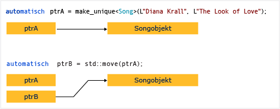

# Gewusst wie: Erstellen und Verwenden von unique_ptr-Instanzen

Ein [Unique_ptr](../standard-library/unique-ptr-class.md) der Zeiger wird nicht freigegeben. Es kann nicht in eine andere kopiert werden `unique_ptr`, als Wert an eine Funktion übergeben oder in einen C++-Standardbibliothek-Algorithmus, die Kopien erfordert verwendet. Ein `unique_ptr`-Objekt kann nur verschoben werden. Dies bedeutet, dass der Besitz der Arbeitsspeicherressource einem anderen `unique_ptr`-Objekt übertragen wird und das ursprüngliche `unique_ptr`-Objekt diese Ressource nicht mehr besitzt. Es empfiehlt sich, ein Objekt auf einen Besitzer zu beschränken, da mehrere Besitzer die Komplexität der Programmlogik erhöhen. Wenn Sie einen intelligenten Zeiger für ein einfaches C++-Objekt benötigen, daher können `unique_ptr`, und beim Erstellen einer `unique_ptr`, verwenden die [Make_unique](../standard-library/memory-functions.md#make_unique) Hilfsfunktion.

Das folgende Diagramm veranschaulicht die Eigentumsübertragung zwischen zwei `unique_ptr`-Instanzen.

`unique_ptr` wird definiert, der `<memory>` -Header in der C++-Standardbibliothek. Dabei handelt es sich genau so effizient wie ein unformatierter Zeiger in C++-Standardbibliothek-Containern verwendet werden können. Das Hinzufügen von `unique_ptr` -Instanzen, die C++-Standardbibliothek-Containern ist effizient, da der bewegungskonstruktor des der `unique_ptr` entfällt die Notwendigkeit für einen Kopiervorgang ab.

## Beispiel

Das folgende Beispiel zeigt, wie `unique_ptr`-Instanzen erstellt und zwischen Funktionen übergeben werden.

[!code-cpp[stl_smart_pointers#210](../cpp/codesnippet/CPP/how-to-create-and-use-unique-ptr-instances_1.cpp)]

Diese Beispiele zeigen diese grundlegende Eigenschaft des `unique_ptr`-Objekts: Es kann verschoben, jedoch nicht kopiert werden. "Wird verschoben" überträgt den Besitz einem neuen `unique_ptr`-Objekt und setzt das alte `unique_ptr`-Objekt zurück.

## Beispiel

Im folgenden Beispiel wird die Erstellung von `unique_ptr`-Instanzen und ihre Verwendung in einem Vektor dargestellt.

[!code-cpp[stl_smart_pointers#211](../cpp/codesnippet/CPP/how-to-create-and-use-unique-ptr-instances_2.cpp)]

Im Bereich der for-Schleife wird das `unique_ptr`-Objekt durch einen Verweis übergeben. Wenn Sie versuchen, das Objekt als Wert zu übergeben, löst der Compiler einen Fehler aus, da der `unique_ptr`-Kopierkonstruktor gelöscht wurde.

## Beispiel

Das folgende Beispiel zeigt, wie ein `unique_ptr`-Objekt initialisiert wird, das ein Klassenmember ist.

[!code-cpp[stl_smart_pointers#212](../cpp/codesnippet/CPP/how-to-create-and-use-unique-ptr-instances_3.cpp)]

## Beispiel

Können Sie [Make_unique](../standard-library/memory-functions.md#make_unique) zum Erstellen einer `unique_ptr` in ein Array, kann jedoch nicht `make_unique` um die Arrayelemente zu initialisieren.

[!code-cpp[stl_smart_pointers#213](../cpp/codesnippet/CPP/how-to-create-and-use-unique-ptr-instances_4.cpp)]

Weitere Beispiele finden Sie unter [Make_unique](../standard-library/memory-functions.md#make_unique).

## Siehe auch

[Intelligente Zeiger](../cpp/smart-pointers-modern-cpp.md) 
[make_unique](../standard-library/memory-functions.md#make_unique)