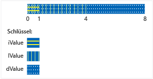

# <a name="unions"></a>Unions
Bei einer `union` handelt es sich um einen benutzerdefinierten Typ, in dem alle Member denselben Speicherbereich verwenden. Das heißt, eine Union kann niemals mehr als ein Objekt aus seiner Liste der Member enthalten. Es heißt zudem, unabhängig davon, über wie viele Member eine Union verfügt, sie immer nur so viel Arbeitsspeicher verwendet, um das größte Member zu speichern.  
  
 Unions können für das Einsparen von Arbeitsspeicher hilfreich sein, wenn Sie über viele Objekte bzw. begrenzten Arbeitsspeicher verfügen. Für ihre Verwendung ist jedoch besondere Vorsicht geboten, da Sie dafür verantwortlich sind, dass Sie immer auf das letzte Member zugreifen, in das geschrieben wurde. Wenn Membertypen über einen nicht trivialen Konstruktor verfügen, müssen Sie zusätzlichen Code schreiben, um dieses Member explizit zu erstellen und zu zerstören. Ziehen Sie vor dem Verwenden einer Union in Erwägung, ob das zu lösende Problem nicht durch die Verwendung einer Basisklasse und abgeleiteten Klasse ausgedrückt werden könnte.   
  
## <a name="syntax"></a>Syntax  
  
```cpp  
union [name]  { member-list };  
```  
  
#### <a name="parameters"></a>Parameter  
 `name`  
 Der Typname, der für die Union angegeben wurde.  
  
 `member-list`  
 Elemente, die die Union enthalten kann. Siehe Hinweise.  
  
## <a name="remarks"></a>Hinweise  
  
## <a name="declaring-a-union"></a>Deklarieren einer Union  
 Beginnen Sie die Deklaration einer Union mit dem `union`-Schlüsselwort und schließen Sie die Memberliste in geschweifte Klammern ein:  
  
```cpp  
// declaring_a_union.cpp  
union RecordType    // Declare a simple union type  
{  
    char   ch;  
    int    i;  
    long   l;  
    float  f;  
    double d;  
    int *int_ptr;  
};   
int main()  
{  
    RecordType t;  
    t.i = 5; // t holds an int  
    t.f = 7.25 // t now holds a float   
}  
```  
  
## <a name="using-unions"></a>Verwenden von Unions  
 Im vorherigen Beispiel muss der Code wissen, der auf die Union zugreift, welches Member welche Daten hält. Die gängigste Lösung für dieses Problem besteht darin, die Union in einer Struktur zusammen mit einem zusätzlichen Enumerationsmember einzuschließen, das den Typ der zurzeit in der Union gespeicherten Daten angibt. Hierbei spricht einen *unterscheidungsunion* und im folgende Beispiel wird das Basismuster gezeigt.  
  
```cpp  
#include "stdafx.h"  
#include <queue>  
  
using namespace std;  
  
enum class WeatherDataType  
{  
    Temperature, Wind  
};  
  
struct TempData  
{  
    int StationId;  
    time_t time;  
    double current;  
    double max;  
    double min;  
};  
  
struct WindData  
{  
    int StationId;  
    time_t time;  
    int speed;  
    short direction;  
};  
  
struct Input  
{  
    WeatherDataType type;  
    union  
    {  
        TempData temp;  
        WindData wind;  
    };  
};  
  
// Functions that are specific to data types  
void Process_Temp(TempData t) {}  
void Process_Wind(WindData w) {}  
  
// Container for all the data records  
queue<Input> inputs;  
void Initialize();  
  
int main(int argc, char* argv[])  
{  
    Initialize();  
    while (!inputs.empty())  
    {  
        Input i = inputs.front();  
        switch (i.type)  
        {  
        case WeatherDataType::Temperature:  
            Process_Temp(i.temp);  
            break;  
        case WeatherDataType::Wind:  
            Process_Wind(i.wind);  
            break;  
        default:  
            break;  
        }  
        inputs.pop();  
  
    }  
    return 0;  
}  
  
void Initialize()  
{  
    Input first, second;  
    first.type = WeatherDataType::Temperature;  
    first.temp = { 101, 1418855664, 91.8, 108.5, 67.2 };  
    inputs.push(first);  
  
    second.type = WeatherDataType::Wind;  
    second.wind = { 204,1418859354, 14, 27 };  
    inputs.push(second);  
}  
  
```  
  
 Beachten Sie, dass die Union in der Eingabestruktur im vorherigen Beispiel keinen Namen aufweist. Hierbei handelt es sich um eine anonyme Union. Der Zugriff auf ihre Member ist so möglich, als wären sie direkte Member der Struktur. Weitere Informationen über anonyme Unions finden Sie im folgenden Abschnitt.  
  
 Im vorherigen Beispiel wurde ein Problem gezeigt, das selbstredend mithilfe von aus einer allgemeinen Basisklasse abgeleiteten Klassen und durch das Verzweigen Ihres Codes auf Grundlage des Laufzeittyps jedes Objekts im Container gelöst werden könnte. Dies hätte Code zur Folge, der einfacher zu verwalten und zu verstehen wäre, wobei die Verwendung möglicherweise langsamer wäre als bei der Verwendung von Unions. Zudem können Sie mit einer Union vollständig nicht verknüpfte Typen speichern und den Typ des Werts dynamisch ändern, der gespeichert wird, ohne den Typ der Unionsvariablen an sich zu ändern. Daher können Sie ein heterogenes Array von „MyUnionType“ erstellen, dessen Elemente unterschiedliche Werte von unterschiedlichen Typen speichern.  
  
 Beachten Sie, dass die `Input`-Struktur im vorherigen Beispiel einfach missbraucht werden kann. Es liegt ganz im Ermessen des Benutzers, die Unterscheidung richtig zu verwenden, um auf das Member zuzugreifen, das die Daten hält. Sie können sich vor Missbrauch schützen, indem Sie die Union privat machen und besondere Zugriffsfunktionen bereitstellen, wie dies im nächsten Beispiel gezeigt wird.  
  
## <a name="unrestricted-unions-c11"></a>Uneingeschränkte Unions (C++11)  
 In C++03 und früher kann eine Union nicht statische Datenmember mit dem Klassentyp enthalten, solange der Typ über keine vom Benutzer bereitgestellten Konstruktoren, Destruktoren oder Zuweisungsoperatoren verfügt. In C++11 wurden diese Einschränkungen entfernt. Wenn Sie ein derartiges Member in Ihre Union einbeziehen, markiert der Compiler automatisch jede besondere Memberfunktion, die nicht vom Benutzer bereitgestellt wurde, als gelöscht. Wenn es sich bei der Union um eine anonyme Union in einer Klasse oder Struktur handelt, werden besondere Memberfunktionen der Klasse oder Struktur, die nicht vom Benutzer bereitgestellt wurden, als gelöscht markiert. Im folgenden Beispiel wird gezeigt, wie der Fall verarbeitet wird, in dem eines der Member der Union über ein Member verfügt, für das diese besondere Behandlung erforderlich ist:  
  
```cpp  
// for MyVariant  
#include <crtdbg.h>  
#include <new>  
#include <utility>  
  
// for sample objects and output  
#include <string>  
#include <vector>  
#include <iostream>  
  
using namespace std;  
  
struct A   
{  
    A() = default;  
    A(int i, const string& str) : num(i), name(str) {}  
  
    int num;  
    string name;  
    //...  
};  
  
struct B   
{  
    B() = default;  
    B(int i, const string& str) : num(i), name(str) {}  
  
    int num;  
    string name;  
    vector<int> vec;  
    // ...  
};  
  
enum class Kind { None, A, B, Integer };  
  
#pragma warning (push)  
#pragma warning(disable:4624)  
class MyVariant  
{  
public:  
    MyVariant()  
        : kind_(Kind::None)  
    {  
    }  
  
    MyVariant(Kind kind)  
        : kind_(kind)  
    {  
        switch (kind_)  
        {  
        case Kind::None:  
            break;  
        case Kind::A:  
            new (&a_) A();  
            break;  
        case Kind::B:  
            new (&b_) B();  
            break;  
        case Kind::Integer:  
            i_ = 0;  
            break;  
        default:  
            _ASSERT(false);  
            break;  
        }  
    }  
  
    ~MyVariant()  
    {  
        switch (kind_)  
        {  
        case Kind::None:  
            break;  
        case Kind::A:  
            a_.~A();  
            break;  
        case Kind::B:  
            b_.~B();  
            break;  
        case Kind::Integer:  
            break;  
        default:  
            _ASSERT(false);  
            break;  
        }  
        kind_ = Kind::None;  
    }  
  
    MyVariant(const MyVariant& other)  
        : kind_(other.kind_)  
    {  
        switch (kind_)  
        {  
        case Kind::None:  
            break;  
        case Kind::A:  
            new (&a_) A(other.a_);  
            break;  
        case Kind::B:  
            new (&b_) B(other.b_);  
            break;  
        case Kind::Integer:  
            i_ = other.i_;  
            break;  
        default:  
            _ASSERT(false);  
            break;  
        }  
    }  
  
    MyVariant(MyVariant&& other)  
        : kind_(other.kind_)  
    {  
        switch (kind_)  
        {  
        case Kind::None:  
            break;  
        case Kind::A:  
            new (&a_) A(move(other.a_));  
            break;  
        case Kind::B:  
            new (&b_) B(move(other.b_));  
            break;  
        case Kind::Integer:  
            i_ = other.i_;  
            break;  
        default:  
            _ASSERT(false);  
            break;  
        }  
        other.kind_ = Kind::None;  
    }  
  
    MyVariant& operator=(const MyVariant& other)  
    {  
        if (&other != this)  
        {  
            switch (other.kind_)  
            {  
            case Kind::None:  
                this->~MyVariant();  
                break;  
            case Kind::A:  
                *this = other.a_;  
                break;  
            case Kind::B:  
                *this = other.b_;  
                break;  
            case Kind::Integer:  
                *this = other.i_;  
                break;  
            default:  
                _ASSERT(false);  
                break;  
            }  
        }  
        return *this;  
    }  
  
    MyVariant& operator=(MyVariant&& other)  
    {  
        _ASSERT(this != &other);  
        switch (other.kind_)  
        {  
        case Kind::None:  
            this->~MyVariant();  
            break;  
        case Kind::A:  
            *this = move(other.a_);  
            break;  
        case Kind::B:  
            *this = move(other.b_);  
            break;  
        case Kind::Integer:  
            *this = other.i_;  
            break;  
        default:  
            _ASSERT(false);  
            break;  
        }  
        other.kind_ = Kind::None;  
        return *this;  
    }  
  
    MyVariant(const A& a)  
        : kind_(Kind::A), a_(a)  
    {  
    }  
  
    MyVariant(A&& a)  
        : kind_(Kind::A), a_(move(a))  
    {  
    }  
  
    MyVariant& operator=(const A& a)  
    {  
        if (kind_ != Kind::A)  
        {  
            this->~MyVariant();  
            new (this) MyVariant(a);  
        }  
        else  
        {  
            a_ = a;  
        }  
        return *this;  
    }  
  
    MyVariant& operator=(A&& a)  
    {  
        if (kind_ != Kind::A)  
        {  
            this->~MyVariant();  
            new (this) MyVariant(move(a));  
        }  
        else  
        {  
            a_ = move(a);  
        }  
        return *this;  
    }  
  
    MyVariant(const B& b)  
        : kind_(Kind::B), b_(b)  
    {  
    }  
  
    MyVariant(B&& b)  
        : kind_(Kind::B), b_(move(b))  
    {  
    }  
  
    MyVariant& operator=(const B& b)  
    {  
        if (kind_ != Kind::B)  
        {  
            this->~MyVariant();  
            new (this) MyVariant(b);  
        }  
        else  
        {  
            b_ = b;  
        }  
        return *this;  
    }  
  
    MyVariant& operator=(B&& b)  
    {  
        if (kind_ != Kind::B)  
        {  
            this->~MyVariant();  
            new (this) MyVariant(move(b));  
        }  
        else  
        {  
            b_ = move(b);  
        }  
        return *this;  
    }  
  
    MyVariant(int i)  
        : kind_(Kind::Integer), i_(i)  
    {  
    }  
  
    MyVariant& operator=(int i)  
    {  
        if (kind_ != Kind::Integer)  
        {  
            this->~MyVariant();  
            new (this) MyVariant(i);  
        }  
        else  
        {  
            i_ = i;  
        }  
        return *this;  
    }  
  
    Kind GetKind() const  
    {  
        return kind_;  
    }  
  
    A& GetA()  
    {  
        _ASSERT(kind_ == Kind::A);  
        return a_;  
    }  
  
    const A& GetA() const  
    {  
        _ASSERT(kind_ == Kind::A);  
        return a_;  
    }  
  
    B& GetB()  
    {  
        _ASSERT(kind_ == Kind::B);  
        return b_;  
    }  
  
    const B& GetB() const  
    {  
        _ASSERT(kind_ == Kind::B);  
        return b_;  
    }  
  
    int& GetInteger()  
    {  
        _ASSERT(kind_ == Kind::Integer);  
        return i_;  
    }  
  
    const int& GetInteger() const  
    {  
        _ASSERT(kind_ == Kind::Integer);  
        return i_;  
    }  
  
private:  
    Kind kind_;  
    union  
    {  
        A a_;  
        B b_;  
        int i_;  
    };  
};  
#pragma warning (pop)  
  
int main()  
{  
    A a(1, "Hello from A");  
    B b(2, "Hello from B");  
  
    MyVariant mv_1 = a;  
  
    cout << "mv_1 = a: " << mv_1.GetA().name << endl;  
    mv_1 = b;  
    cout << "mv_1 = b: " << mv_1.GetB().name << endl;  
    mv_1 = A(3, "hello again from A");  
    cout << R"aaa(mv_1 = A(3, "hello again from A"): )aaa" << mv_1.GetA().name << endl;  
    mv_1 = 42;  
    cout << "mv_1 = 42: " << mv_1.GetInteger() << endl;  
  
    b.vec = { 10,20,30,40,50 };  
  
    mv_1 = move(b);  
    cout << "After move, mv_1 = b: vec.size = " << mv_1.GetB().vec.size() << endl;  
  
    cout << endl << "Press a letter" << endl;  
    char c;  
    cin >> c;  
}  
#include <queue>  
#include <iostream>  
using namespace std;  
  
enum class WeatherDataType  
{  
    Temperature, Wind  
};  
  
struct TempData  
{  
    TempData() : StationId(""), time(0), current(0), maxTemp(0), minTemp(0) {}  
    TempData(string id, time_t t, double cur, double max, double min)  
        : StationId(id), time(t), current(cur), maxTemp(max), minTemp(0) {}  
    string StationId;  
    time_t time = 0;  
    double current;  
    double maxTemp;  
    double minTemp;  
};  
  
struct WindData  
{  
    int StationId;  
    time_t time;  
    int speed;  
    short direction;  
};  
  
struct Input  
{  
    Input() {}  
    Input(const Input&) {}  
  
    ~Input()  
    {  
        if (type == WeatherDataType::Temperature)  
        {  
            temp.StationId.~string();  
        }  
    }  
  
    WeatherDataType type;  
    void SetTemp(const TempData& td)  
    {  
        type = WeatherDataType::Temperature;  
  
        // must use placement new because of string member!  
        new(&temp) TempData(td);  
    }  
  
    TempData GetTemp()  
    {  
        if (type == WeatherDataType::Temperature)  
            return temp;  
        else  
            throw logic_error("Can't return TempData when Input holds a WindData");  
    }  
    void SetWind(WindData wd)  
    {  
        // Explicitly delete struct member that has a   
        // non-trivial constructor  
        if (type == WeatherDataType::Temperature)  
        {  
            temp.StationId.~string();  
        }  
        wind = wd; //placement new not required.  
    }  
    WindData GetWind()  
    {  
        if (type == WeatherDataType::Wind)  
        {  
            return wind;  
        }  
        else  
            throw logic_error("Can't return WindData when Input holds a TempData");  
    }  
  
private:  
  
    union  
    {  
        TempData temp;  
        WindData wind;  
    };  
};  
  
```  
  
 Unions können keine Verweise speichern. Unions unterstützen keine Vererbung. Daher kann eine Union an sich nicht als eine Basisklasse verwendet werden, aus einer andere Klasse erben oder virtuelle Funktionen aufweisen.  
  
## <a name="initializing-unions"></a>Initialisieren von Unions  
 Sie können eine Union in derselben Anweisung deklarieren und initialisieren, indem Sie einen Ausdruck zuweisen, der in geschweifte Klammern eingeschlossen ist. Der Ausdruck wird ausgewertet und dem ersten Feld der Union zugewiesen.  
  
```cpp  
#include <iostream>  
using namespace std;  
  
union NumericType  
{  
    short       iValue;  
    long        lValue;    
    double      dValue;    
};  
  
int main()  
{  
    union NumericType Values = { 10 };   // iValue = 10  
    cout << Values.iValue << endl;  
    Values.dValue = 3.1416;  
    cout << Values.dValue) << endl;  
}  
/* Output:  
 10  
 3.141600  
*/  
  
```  
  
 Die `NumericType`-Union ist im Arbeitsspeicher angeordnet (konzeptionell), wie in der folgenden Abbildung dargestellt.  
  
   
Speicherung von Daten in einer Union numerischer Typen  
  
## <a name="anonymous_unions"></a>Anonyme unions  
 Anonyme Unions sind Unions, die ohne deklariert sind eine *Klassenname* oder *Declarator-List*.  
  
```cpp  
union  {  member-list  }    
```  
  
Die in einer anonymen Union deklarierten Namen werden, wie Nichtmembervariablen, direkt verwendet. Daher müssen die in der anonymen Union deklarierten Namen eindeutig im umgebenden Bereich sein.  
  
Zusätzlich zu den Einschränkungen für benannte Unions unterliegen diesen zusätzlichen Einschränkungen anonyme Unions:  
  
-   Sie müssen auch als deklariert werden **statische** , wenn im Datei- oder Namespacebereich deklariert.  
  
-   Sie dürfen nur öffentliche Member besitzen; private und geschützte Member in anonymen Unions generieren Fehler.  
  
-   Sie können keine Memberfunktionen aufweisen.  
  
## <a name="see-also"></a>Siehe auch  
 [Klassen und Strukturen](../cpp/classes-and-structs-cpp.md)   
 [Stichwörter](../cpp/keywords-cpp.md)   
 [class](../cpp/class-cpp.md)   
 [struct](../cpp/struct-cpp.md)
