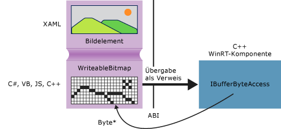

# <a name="obtaining-pointers-to-data-buffers-ccx"></a>Abrufen von Zeigern auf Datenpuffer (C++/CX)

In Windows Runtime bietet die [Windows::Storage::Streams::IBuffer](https://msdn.microsoft.com/library/windows/apps/windows.storage.streams.ibuffer.aspx) -Schnittstelle ein sprachneutrale, streambasierte Möglichkeit zum Zugriff auf Datenpuffer. In C++ können Sie einen Rohdatenzeiger auf das zugrunde liegende Bytearray abrufen, indem Sie die IBufferByteAccess-Schnittstelle der Windows Runtime-Bibliothek verwenden, die in robuffer.h definiert ist. Wenn Sie diesen Ansatz verwenden, können Sie das Bytearray lokal ändern, ohne dass unnötige Kopien der Daten erstellt werden müssen.

Im folgenden Diagramm ist ein XAML-Imageelement dargestellt, dessen Quelle eine [Windows::UI::Xaml::Media::Imaging WriteableBitmap](https://msdn.microsoft.com/%20library/windows/apps/windows.ui.xaml.media.imaging.writeablebitmap.aspx)ist. Eine Client-App, die in einer beliebigen Sprache geschrieben ist, kann einen Verweis auf `WriteableBitmap` an den C++-Code übergeben. Dann kann C++ mit diesem Verweis zum zugrunde liegenden Puffer gelangen. In einer universellen Windows-Plattform-app, die in C++ geschrieben ist, können Sie die Funktion im folgenden Beispiel direkt im Quellcode verwenden, ohne die in einer Windows-Runtime-Komponente verpacken.



## <a name="getpointertopixeldata"></a>GetPointerToPixelData

Die folgende Methode akzeptiert einen [Windows::Storage::Streams::IBuffer](https://msdn.microsoft.com/library/windows/apps/windows.storage.streams.ibuffer.aspx) und gibt einen Rohdatenzeiger auf den zugrunde liegenden Bytearray zurück. Um die Funktion aufzurufen, übergeben Sie in eine [WriteableBitmap::PixelBuffer](https://msdn.microsoft.com/library/windows/apps/windows.ui.xaml.media.imaging.writeablebitmap.pixelbuffer.aspx) -Eigenschaft.

```cpp
#include <wrl.h>
#include <robuffer.h>
using namespace Windows::Storage::Streams;
using namespace Microsoft::WRL;
typedef uint8 byte;
// Retrieves the raw pixel data from the provided IBuffer object.
// Warning: The lifetime of the returned buffer is controlled by
// the lifetime of the buffer object that's passed to this method.
// When the buffer has been released, the pointer becomes invalid
// and must not be used.
byte* Class1::GetPointerToPixelData(IBuffer^ pixelBuffer, unsigned int *length)
{
    if (length != nullptr)
    {
        *length = pixelBuffer ->Length;
    }
    // Query the IBufferByteAccess interface.
    ComPtr<IBufferByteAccess> bufferByteAccess;
    reinterpret_cast<IInspectable*>( pixelBuffer)->QueryInterface(IID_PPV_ARGS(&bufferByteAccess));

    // Retrieve the buffer data.
    byte* pixels = nullptr;
    bufferByteAccess->Buffer(&pixels);
    return pixels;
}
```

## <a name="complete-example"></a>Vollständiges Beispiel

Die folgenden Schritte zeigen, wie Sie eine C#-universelle Windows Plattform-app erstellt wird, übergibt ein `WriteableBitmap` eine C++-Windows-Runtime-Komponenten-DLL. Der C++-Code erhält einen Zeiger auf den Pixelpuffer und führt eine einfache direkte Änderung an dem Bild durch. Alternativ können Sie die Client-App in Visual Basic, in JavaScript oder in C++ anstelle von C# erstellen. Wenn Sie C++ verwenden, benötigen Sie die Komponenten-DLL. Sie können diese Methoden direkt der MainPage-Klasse oder einer beliebigen anderen Klasse hinzufügen, die Sie definieren.

#### <a name="create-the-client"></a>Erstellen der Clientanwendung

1. Verwenden Sie die Vorlage der leeren app-Projekt zum Erstellen einer C#-universelle Windows Plattform-app.

1. In MainPage.xaml

   - Verwenden Sie diesen XAML-Code, um das `Grid` -Element zu ersetzen:

        ```xml
        <Grid Background="{StaticResource ApplicationPageBackgroundThemeBrush}">
            <StackPanel HorizontalAlignment="Left" Margin="176,110,0,0" VerticalAlignment="Top" Width="932">
                <Image x:Name="Pic"/>
                <Button Content="Process Image" HorizontalAlignment="Stretch" VerticalAlignment="Stretch" Height="47" Click="Button_Click_1"/>
            </StackPanel>
        </Grid>
        ```

1. In MainPage.xaml.cs

   1. Fügen Sie diese Namespacedeklarationen hinzu:

        ```csharp
        using Windows.Storage;
        using Windows.Storage.FileProperties;
        using Windows.UI.Xaml.Media.Imaging;
        using Windows.Storage.Streams;
        using Windows.Storage.Pickers;
        ```

   1. Fügen Sie eine `WriteableBitmap` -Membervariable der `MainPage` -Klasse hinzu, und nennen Sie sie `m_bm`.

        ```csharp
        private WriteableBitmap m_bm;
        ```

   1. Verwenden Sie folgenden Code, um den Stub der `OnNavigatedTo` -Methode zu ersetzen. Damit wird die Dateiauswahl geöffnet, wenn die App gestartet wird. (Beachten Sie, dass das `async` -Schlüsselwort zur Funktionssignatur hinzugefügt wird).

        ```csharp
        async protected override void OnNavigatedTo(NavigationEventArgs e)
        {
            FileOpenPicker openPicker = new FileOpenPicker();
            openPicker.ViewMode = PickerViewMode.Thumbnail;
            openPicker.SuggestedStartLocation = PickerLocationId.PicturesLibrary;
            openPicker.FileTypeFilter.Add(".jpg");
            openPicker.FileTypeFilter.Add(".jpeg");
            openPicker.FileTypeFilter.Add(".png");

            StorageFile file = await openPicker.PickSingleFileAsync();
            if (file != null)
            {
                // Get the size of the image for the WriteableBitmap constructor.
                ImageProperties props = await file.Properties.GetImagePropertiesAsync();
                m_bm = new WriteableBitmap((int)props.Height, (int)props.Width);
                m_bm.SetSource(await file.OpenReadAsync());
                Pic.Source = m_bm;
            }
            else
            {
                //  Handle error...
            }
        }
        ```

   1. Fügen Sie den Ereignishandler für das Schaltflächen-Klickereignis hinzu. (Da der Verweis auf den `ImageManipCPP` -Namespace noch nicht erstellt wurde, kann er möglicherweise im Editorfenster wellenförmig unterstrichen sein.)

        ```csharp
        async private void Button_Click_1(object sender, RoutedEventArgs e)
        {
            ImageManipCPP.Class1 obj = new ImageManipCPP.Class1();
            await obj.Negativize(m_bm);
            Pic.Source = m_bm;
        }
        ```

#### <a name="create-the-c-component"></a>Erstellen der C++-Komponente

1. Fügen Sie der vorhandenen Projektmappe eine neue C++-Windows-Runtime-Komponente hinzu, und nennen Sie sie `ImageManipCPP`. Fügen Sie im C#-Projekt einen Verweis darauf hinzu, indem Sie im **Projektmappen-Explorer** mit der rechten Maustaste auf dieses Projekt klicken und erst **Hinzufügen**dann **Verweis**auswählen.

1. In Class1.h

   1. Fügen Sie dieses `typedef` in der zweiten Zeile direkt nach `#pragma once`hinzu:

        ```cpp
        typedef uint8 byte;
        ```

   1. Fügen Sie das `WebHostHidden` -Attribut direkt über dem Anfang der `Class1` -Deklaration hinzu.

        ```cpp
        [Windows::Foundation::Metadata::WebHostHidden]
        ```

   1. Fügen Sie diese Signatur aus der öffentlichen Methode zu `Class1`hinzu:

        ```cpp
        Windows::Foundation::IAsyncAction^ Negativize(Windows::UI::Xaml::Media::Imaging::WriteableBitmap^ bm);
        ```

   1. Fügen Sie die Signatur aus der `GetPointerToPixelData` -Methode hinzu, die im ersten Codeausschnitt dargestellt wird. Stellen Sie sicher, dass diese Methode privat ist.

1. In Class1.cpp

   1. Fügen Sie diese `#include` -Direktiven und Namespacedeklarationen hinzu:

        ```cpp
        #include <ppltasks.h>
        #include <wrl.h>
        #include <robuffer.h>

        using namespace Windows::Storage;
        using namespace Windows::UI::Xaml::Media::Imaging;
        using namespace Windows::Storage::Streams;
        using namespace Microsoft::WRL;
        ```

   1. Fügen Sie die Implementierung von `GetPointerToPixelData` aus dem früheren Codeausschnitt hinzu.

   1. Fügen Sie die Implementierung von `Negativize`hinzu. Mit dieser Methode wird ein Effekt erstellt, der einem Filmnegativ ähnelt, indem der Wert jedes RGB-Wertes im Pixel umgekehrt wird. Wir ändern die Methode in asynchron, da bei größeren Bildern möglicherweise eine deutlich wahrnehmbare Zeit erforderlich wird, um die Methode abzuschließen.

        ```cpp
        IAsyncAction^ Class1::Negativize(WriteableBitmap^ bm)
        {
            unsigned int length;
            byte* sourcePixels = GetPointerToPixelData(bm->PixelBuffer, &length);
            const unsigned int width = bm->PixelWidth;
            const unsigned int height = bm->PixelHeight;

            return create_async([this, width, height, sourcePixels]
            {
                byte* temp = sourcePixels;
                for(unsigned int k = 0; k < height; k++)
                {
                    for (unsigned int i = 0; i < (width * 4); i += 4)
                    {
                        int pos = k * (width * 4) + (i);
                        temp[pos] = ~temp[pos];
                        temp[pos + 1] = ~temp[pos + 1] / 3;
                        temp[pos + 2] = ~temp[pos + 2] / 2;
                        temp[pos + 3] = ~temp[pos + 3];
                    }
                }
            });

        }
        ```

      > [!NOTE]
      > Diese Methode wird möglicherweise schneller ausgeführt, wenn Sie AMP oder die Parallel Patterns Library verwenden, um den Vorgang zu parallelisieren.

1. Stellen Sie sicher, dass mindestens ein Bild im Bildordner vorhanden ist, und drücken Sie dann F5, um das Programm zu kompilieren und auszuführen.
