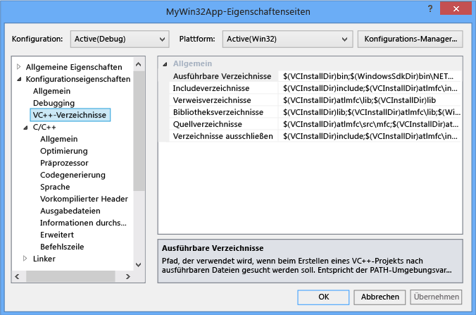
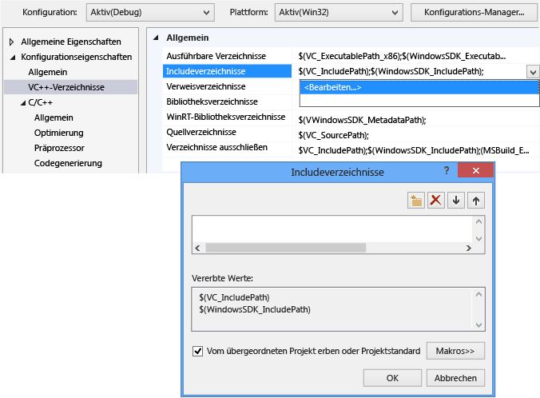
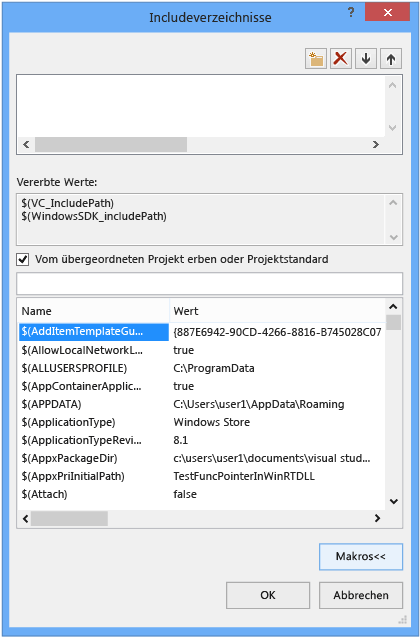
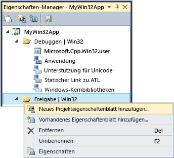

# Arbeiten mit Projekteigenschaften
[!INCLUDE[vs2017banner](../assembler/inline/includes/vs2017banner.md)]

In der IDE werden alle Informationen, die zum Erstellen eines Projekts benötigt als verfügbar gemacht              *Eigenschaften*. Diese Informationen umfassen den Anwendungsnamen, Erweiterung (z. B. DLL "," LIB "," EXE "), Compileroptionen, Linkeroptionen, Debuggereinstellungen, benutzerdefinierte Buildschritte und viele andere Dinge. Verwenden Sie              *Eigenschaftenseiten* (             **Projekt &#124; Eigenschaften**) anzeigen und ändern diese Eigenschaften.  
  
 Wenn Sie ein Projekt erstellen, weist das System die Werte für verschiedene Eigenschaften. Die Standardwerte, unterscheiden sich geringfügig, je nach Art des Projekts und welche Optionen wählen Sie in der app-Assistent. Z. B. ein ATL-Projekt verfügt über Eigenschaften, die im Zusammenhang mit der MIDL-Dateien, aber diese sind nicht in einer einfachen Konsolenanwendung.   Die Standardeigenschaften werden im Bereich "Allgemein" in den Eigenschaftenseiten angezeigt:  
  
   
  
 Einige Eigenschaften, z. B. den Anwendungsnamen, gelten für alle Build-Varianten, unabhängig von der Zielplattform oder ob es sich um einen Build Debug oder Release handelt. Aber die meisten Eigenschaften hängen von der Konfiguration ab.   Dies ist, da der Compiler muss wissen, welche bestimmten Plattform, die das Programm ausgeführt werden soll und welche bestimmten Compileroptionen verwenden, um den richtigen Code zu generieren. Daher, wenn Sie eine Eigenschaft festlegen, ist es wichtig, achten Sie auf die Konfiguration und Plattform, die auf der neue Wert angewendet werden soll.  Sollte es gelten nur für Debug Win32-Builds oder sollte es gelten auch für ARM Debuggen und Debuggen X64? Z. B. die              **Optimierung** -Eigenschaft in der Standardeinstellung festgelegt ist              **Geschwindigkeit maximieren (/ O2)** in einer Release-Konfiguration, jedoch in der Debugkonfiguration deaktiviert ist.  
  
 Die Eigenschaftenseiten sind so konzipiert, dass Sie immer an, und wenn nötig ändern, die Konfiguration und Plattform ein Eigenschaftswert für gelten sollte. Die folgende Abbildung zeigt die Eigenschaftenseiten, mit der Konfiguration und Plattforminformationen in den Listenfeldern oben. Wenn die Eigenschaft Optimierung hier festgelegt ist, wird es gelten nur für Debug Win32-Builds, dem es sich um die aktive Konfiguration werden wie durch rote Pfeile angezeigt.  
  
   
  
 Die folgende Abbildung zeigt die Eigenschaftenseite des gleichen Projekts, aber die Konfiguration auf Version geändert wurde. Beachten Sie den anderen Wert für die Eigenschaft Optimierung. Beachten Sie außerdem, dass die aktive Konfiguration immer noch Debuggen. Sie können die Eigenschaften für jede Konfiguration hier festlegen. Es muss keine aktiv sein.  
  
   
  
 Selbst Projektsystem beruht auf MSBuild, die Dateiformate und Regeln zum Erstellen von Projekten jeglicher Art definiert. MSBuild verwaltet viel von der Komplexität der Erstellung für mehrere Konfigurationen und Plattformen, aber Sie müssen ein wenig Informationen darüber, wie es funktioniert. Dies ist besonders wichtig, wenn Sie benutzerdefinierte Konfigurationen zu definieren oder wieder verwendbaren Sätze von Eigenschaften, die Freigabe und importieren Sie in mehreren Projekten erstellen möchten.  
  
 Projekteigenschaften werden gespeichert, entweder direkt in der Projektdatei (*.vcxproj) oder in anderen XML- oder PROPS-Dateien, die Project-Datei importiert und die Standardwerte bereitgestellt werden. Wie oben gezeigt, kann die gleiche Eigenschaft für die gleiche Konfiguration einen anderen Wert in verschiedenen Dateien zugewiesen werden. Wenn Sie ein Projekt erstellen, wertet das MSBuild-Modul die Projektdatei und die importierten Dateien in einer klar definierten Reihenfolge (siehe unten). Jede Datei ausgewertet wird, werden alle Eigenschaftswerte, die in dieser Datei definiert die vorhandenen Werte überschrieben.  Von Dateien, die zuvor ausgewertet wurden, werden alle Werte, die nicht angegeben werden geerbt.  Wenn Sie eine Eigenschaft mit Eigenschaftenseiten festlegen, ist es daher auch wichtig achten, wo sie festgelegt. Wenn Sie eine Eigenschaft "X" in eine PROPS-Datei festlegen, aber die Eigenschaft "Y" in der Projektdatei festgelegt ist, wird das Projekt mit der Eigenschaft "Y" festgelegt erstellt. Wenn die gleiche Eigenschaft auf "Z" für ein Projektelement, z. B. eine CPP-Datei festgelegt ist, verwendet das MSBuild-Modul den Wert "Z". Weitere Informationen finden Sie unter              [eigenschaftenvererbung](#bkmkPropertyInheritance) Weiter unten in diesem Artikel.  
  
## Buildkonfigurationen  
 Eine Konfiguration ist einfach eine beliebige Gruppe von Eigenschaften, die ein Name zugewiesen werden. Visual Studio enthält Debug- und Releasekonfigurationen und jeweils verschiedene Eigenschaften für ein Debugbuild oder Releasebuild entsprechend festgelegt. Können Sie die                  **Configuration Manager** benutzerdefinierte Konfigurationen auf einfache Weise auf Gruppeneigenschaften für eine bestimmte Art von Build zu definieren.  Der Eigenschaften-Manager wird für erweiterte arbeiten mit Eigenschaften verwendet, aber eine Einführung in diese hier da besser Konfigurationen zu visualisieren. Sie greifen über                  **&#124; anzeigen  Eigenschaften-Manager** oder                  **&#124; anzeigen Andere Windows &#124; Eigenschaften-Manager** je nach Ihren Einstellungen. Er weist Knoten für jedes Paar Configuration-Plattform in das Projekt. Unter diesen Knoten befinden sich Knoten für Eigenschaftenblätter (PROPS-Dateien), die einige spezifische Eigenschaften für diese Konfiguration festzulegen.  
  
   
  
 Wechseln Sie zum Bereich "Allgemein" in den Eigenschaftenseiten (siehe Abbildung oben) und legen Sie die Eigenschaft Zeichensatz "Nicht festgelegt" anstelle von "Verwenden von Unicode" und klicken Sie auf                  **OK**,  Eigenschaften-Manager zeigt keine                  **Unicode-Unterstützung** Eigenschaftenblatt für die aktuelle Konfiguration, aber sie werden es für andere Konfigurationen.  
  
 Weitere Informationen zu Eigenschaften-Manager und Eigenschaftenseiten finden Sie unter                  [Erstellen von wiederverwendbaren Eigenschaftenkonfigurationen](#bkmkPropertySheets) Weiter unten in diesem Artikel.  
  
> [!TIP]
>  Die User-Datei ist eine ältere Funktion, und es wird empfohlen, dass Sie ihn löschen, um Eigenschaften ordnungsgemäß gruppiert nach Konfiguration-Plattform zu halten.  
  
## Zielplattformen  
 *Zielplattform* bezieht sich auf die Art der Geräte- und/oder Betriebssystem, das die ausführbare Datei ausgeführt werden soll. Sie können ein Projekt für mehrere Plattformen erstellen. Die verfügbaren Zielplattformen für C++-Projekte hängt die Art des Projekts. Sie enthalten aber nicht beschränkt auf Win32 X64, ARM, Android und iOS.     Die                   **X86** Zielplattform, die möglicherweise in                  **Configuration Manager** ist identisch mit                  **Win32** in systemeigene C++-Projekte. Win32 bedeutet, dass 32-Bit-Windows und                  **X64** bedeutet, dass 64-Bit-Windows.  Weitere Informationen über diese beiden Plattformen finden Sie unter                  [Ausführen von 32-Bit Applications](https://msdn.microsoft.com/library/windows/desktop/aa384249\(v=vs.85\).aspx).  
  
 Die                  **Any CPU** Plattform Zielwert, die möglicherweise in                  **Configuration Manager** hat keine Auswirkung auf die systemeigene C++-Projekte; Dies ist relevant für C++ / CLI und anderen Projekttypen. Weitere Informationen finden Sie unter                  [/CLRIMAGETYPE (angeben Type of CLR Image)](../build/reference/clrimagetype-specify-type-of-clr-image.md).  
  
## Eigenschaftenseiten  
 Wie bereits erwähnt, basiert auf das Visual C++-Projektsystem                  [MSBuild](MSBuild%20Properties.md) und die Werte werden in der XML-Projektdatei Standard props-Format gespeichert und TARGETS-Dateien, (für Visual Studio 2015), in befinden                     **\< Laufwerk>\Programme-Dateien (x86)\MSBuild\Microsoft.Cpp\v4.0\V140** und benutzerdefinierte PROPS-Dateien, die Sie hinzufügen können. Es wird dringend empfohlen, dass Sie NICHT die Dateien manuell bearbeiten, und die Eigenschaftenseiten in der IDE stattdessen alle Eigenschaften, insbesondere zu ändern, die bei der Vererbung beteiligt sind, sofern ein sehr gutes Verständnis der MSBuild.  
  
 Die folgende Abbildung zeigt die Eigenschaftenseiten für ein Visual C++-Projekt. Klicken Sie im linken Bereich die                  **VC++-Verzeichnisse***Regel* ausgewählt ist, und im rechten Fenster werden die Eigenschaften, die dieser Regel zugeordnet sind. Die                  `$(...)` Werte sind leider bezeichnet                  *Makros*. Dies sind                  *nicht* C/C++-Makros, aber einfach während der Kompilierung Konstanten. Makros finden Sie im Abschnitt der                  [Eigenschaft Seite Makros](#bkmkPropertiesVersusMacros) Weiter unten in diesem Artikel.)  
  
   
  
> [!WARNING]
>  Die                      **Allgemeine Eigenschaften** -Konfigurationen in älteren Versionen von Visual Studio wurden entfernt. Um einen Verweis zu einem Projekt hinzuzufügen, verwenden Sie jetzt das Dialogfeld                      **Verweis hinzufügen** auf die gleiche Weise wie für verwaltete Sprachen. Finden Sie unter                      [Verwalten Verweise in einem Projekt](../Topic/Managing%20references%20in%20a%20project.md).  
  
#### So legen Sie eine Eigenschaft für ein Projekt fest  
  
1.  In den meisten Fällen können Sie die Eigenschaften auf Projektebene festlegen, ohne dass ein benutzerdefiniertes Eigenschaftenfenster. Wählen Sie im Hauptmenü                                  **Projekt &#124; Eigenschaften**, oder mit der rechten Maustaste auf den Projektknoten in                                  **Projektmappen-Explorer** und wählen Sie                                  **Eigenschaften**.  
  
2.  Verwenden der                                  **Konfiguration** und                                  **Plattform** Listenfeldern oben im Dialogfeld, um anzugeben, welche Gruppen die Änderungen angewendet werden soll. In vielen Fällen                                  **alle Plattformen** und                                  **Alle Konfigurationen** die richtige Wahl. Um Eigenschaften für mehrere, aber nicht alle Konfigurationen festzulegen, wählen Sie die gewünschten Konfigurationen im                                  **Eigenschaften-Manager**aus, öffnen Sie das Kontextmenü, und klicken Sie auf                                  **Eigenschaften**.  
  
 Im Dialogfeld                  **Eigenschaftenseiten** werden nur die Eigenschaftenseiten angezeigt, die für das aktuelle Projekt gelten. Wenn das Projekt beispielsweise keine IDL-Datei enthält, wird die MIDL-Eigenschaftenseite nicht angezeigt.  
  
 Wenn Sie eine Eigenschaft auf einer Eigenschaftenseite hervorheben, drücken Sie                  **F1** fahren Sie mit dem Referenzthema für Weitere Informationen zu den entsprechenden Compiler oder Linker-Switch.  
  
 Weitere Informationen zu den einzelnen Eigenschaftenseiten finden in den folgenden Themen:  
  
-   [Eigenschaftenseite "Allgemein" (Projekt)](../ide/general-property-page-project.md)  
  
-   [Eigenschaftenseite "Allgemein" (Datei)](../ide/general-property-page-file.md)  
  
-   [Eigenschaftenseiten für die Befehlszeile](../ide/command-line-property-pages.md)  
  
-   [Projekteinstellungen für eine C++-Debugkonfiguration](../Topic/Project%20Settings%20for%20a%20C++%20Debug%20Configuration.md)  
  
-   [NMAKE (Eigenschaftenseite)](../ide/nmake-property-page.md)  
  
-   [Linker-Eigenschaftenseiten](../ide/linker-property-pages.md)  
  
-   [Resources-Eigenschaftenseiten](../ide/resources-property-pages.md)  
  
-   [Eigenschaftenseiten "MIDL"](../ide/midl-property-pages.md)  
  
-   [Eigenschaftenseite "Webverweise"](../ide/web-references-property-page.md)  
  
-   [Eigenschaftenseite für die XML-Daten-Generator-Tool](../ide/xml-data-generator-tool-property-page.md)  
  
## So durchsuchen Sie einfach alle Sucheigenschaften  
 Die                  **alle Optionen** Eigenschaftenseite (unter der                  **Konfigurationseigenschaften &#124; C/C++** Knoten in der                  **Eigenschaftenseiten** im Dialogfeld) bietet eine schnelle Möglichkeit zum Durchsuchen und suchen die Eigenschaften, die im aktuellen Kontext verfügbar sind. Über ein spezielles Suchfeld und eine einfache Syntax können Sie Ergebnisse filtern:  
  
 Kein Präfix:  
 Suche nur in den Eigenschaftennamen (untergeordnete Zeichenfolge ohne Berücksichtigung der Groß-/Kleinschreibung)  
  
 '/' oder '-' :  
 Suche nur in den Compilerschaltern (Präfix ohne Berücksichtigung der Groß-/Kleinschreibung)  
  
 v:  
 Suche nur in Werten (untergeordnete Zeichenfolge ohne Berücksichtigung der Groß-/Kleinschreibung)  
  
##   Eigenschaft Seite Makros  
 Ein                  *Makro* ist eine Kompilierzeitkonstante, die auf einen Wert, der von Visual Studio oder das MSBuild-System definiert ist oder einen benutzerdefinierten Wert verweisen kann. Mit Makros anstelle von hartcodierten Werte wie Verzeichnispfaden können Eigenschafteneinstellungen zwischen Computern und verschiedenen Versionen von Visual Studio einfacher freigegeben werden. Zudem können Sie besser sicherstellen, dass die Projekteinstellungen ordnungsgemäß an der Eigenschaftenvererbung teilnehmen. Eigenschaften-Editor können Sie die Werte aller verfügbarer Makros anzuzeigen.  
  
### Vordefinierte Makros  
 Globale Makros  
 Gilt für alle Elemente in einer Projektkonfiguration. Besitzt die Syntax                                  `$(name)`. Ein Beispiel eines globalen Makros ist                                  `$(VCInstallDir)`, das das Stammverzeichnis der Visual Studio-Installation speichert. Ein globales Makro entspricht einer                                  `PropertyGroup` in MSBuild.  
  
 Elementmakros  
 Besitzt die Syntax                                  `%(name)`. Bei einer Datei gilt ein Elementmakro nur für diese Datei – z. B. können Sie                                  `%(AdditionalIncludeDirectories)` verwenden, um Includeverzeichnisse anzugeben, die nur für eine bestimmte Datei gelten. Diese Art des Elementmakros entspricht den                                  `ItemGroup` -Metadaten in MSBuild. Wenn ein Elementmakro im Zusammenhang mit einer Projektkonfiguration verwendet wird, gilt es für alle Dateien eines bestimmten Typs. Beispielsweise kann die C/C++-Konfigurationseigenschaft                                  **Präprozessordefinitionen** ein                                  `%(PreprocessorDefinitions)` -Elementmakro verwenden, das für alle CPP-Dateien im Projekt gilt. Diese Art des Elementmakros entspricht den                                  `ItemDefinitionGroup` -Metadaten in MSBuild. Weitere Informationen finden Sie unter                                  [Item Definitions](../Topic/Item%20Definitions.md).  
  
### benutzerdefinierte Makros  
 Sie können                          *benutzerdefinierte Makros* erstellen, um sie als Variablen in Projektbuilds zu verwenden. Sie können z. B. ein benutzerdefiniertes Makro erstellen, das einen Wert für einen benutzerdefinierten Buildschritt oder ein benutzerdefiniertes Buildtool bereitstellt. Ein benutzerdefiniertes Makro ist ein Name-Wert-Paar. Verwenden Sie in einer Projektdatei die                          **$(***name***)** -Notation, um auf den Wert zuzugreifen.  
  
 Ein benutzerdefiniertes Makro wird in einem Eigenschaftenblatt gespeichert. Wenn das Projekt nicht bereits ein Eigenschaftenblatt enthält, können Sie durch die Schritte unter Erstellen                          [Erstellen von wiederverwendbaren Eigenschaftenkonfigurationen](#bkmkPropertySheets).  
  
##### So erstellen Sie ein benutzerdefiniertes Makro  
  
1.  Öffnen Sie im Fenster                                          **Eigenschaften-Manager** (wählen Sie auf der Menüleiste                                          **Ansicht**und dann                                          **Eigenschaften-Manager**aus) das Kontextmenü für ein Eigenschaftenblatt (der Name endet auf .user), und wählen Sie "Eigenschaften" aus. Das Dialogfeld                                          **Eigenschaftenseiten** für dieses Eigenschaftenblatt wird geöffnet.  
  
2.  Wählen Sie im linken Bereich des Dialogfelds                                          **Benutzermakros**aus. Wählen Sie im rechten Bereich die Schaltfläche                                          **Makro hinzufügen** aus, um das Dialogfeld                                          **Benutzermakro hinzufügen** zu öffnen.  
  
3.  Geben Sie im Dialogfeld einen Namen und einen Wert für das Makro an. Optional können Sie das Kontrollkästchen                                          **Makro als Umgebungsvariable in Buildumgebung festlegen** aktivieren.  
  
## Eigenschaften-Editor  
 Mit dem Eigenschaften-Editor können Sie bestimmte Zeichenfolgeneigenschaften ändern und Makros als Werte auswählen. Um auf den Eigenschaften-Editor zuzugreifen, wählen Sie eine Eigenschaft auf einer Eigenschaftenseite aus, und klicken Sie rechts auf die Schaltfläche mit dem Pfeil nach unten. Wenn die Dropdown-Liste enthält                  **\< bearbeiten>**, können Sie Sie zur Anzeige der Eigenschaften-Editor für diese Eigenschaft auswählen.  
  
   
  
 Im Eigenschaften-Editor können Sie die Schaltfläche                  **Makros** wählen, um die verfügbaren Makros und deren aktuelle Werte anzuzeigen. Die folgende Abbildung zeigt den Eigenschaften-Editor für die Eigenschaft                  **Zusätzliche Includeverzeichnisse** , nachdem die Schaltfläche                  **Makros** ausgewählt wurde. Wenn das Kontrollkästchen                  **Vom übergeordneten Projekt erben oder Projektstandard** ausgewählt ist und Sie einen neuen Wert hinzufügen, wird dieser an alle Werte angefügt, die derzeit vererbt werden. Wenn Sie das Kontrollkästchen deaktivieren, ersetzt der neue Wert die vererbten Werte. In den meisten Fällen bleibt das Kontrollkästchen aktiviert.  
  
   
  
##   Erstellen von wiederverwendbaren Eigenschaftenkonfigurationen  
 Sie können zwar "globale" Eigenschaften für einen Benutzer und Computer festlegen, dies wird jedoch nicht mehr empfohlen. Stattdessen empfiehlt es sich, über den                  **Eigenschaften-Manager** ein                  *Eigenschaftenblatt* zu erstellen, um die Einstellungen für die Arten von Projekten zu speichern, die Sie wiederverwenden oder freigeben möchten. Über Eigenschaftenblätter verringern Sie zudem die Wahrscheinlichkeit, dass Eigenschafteneinstellungen für andere Projekttypen versehentlich geändert werden. Eigenschaftenblätter werden ausführlicher                  [Erstellen von wiederverwendbaren Eigenschaftenkonfigurationen](#bkmkPropertySheets).  
  
> [!IMPORTANT]
>  **User-Dateien und schwierigkeiten**  
>   
>  In früheren Versionen von Visual Studio kamen globale Eigenschaftenblätter mit der Erweiterung User diese befanden sich in der \< Userprofile>\AppData\Local\Microsoft\MSBuild\v4.0\ Ordner. Diese Dateien werden nicht mehr empfohlen, da sie Eigenschaften für Projektkonfigurationen pro Benutzer pro Computer festlegen. Solche "globalen" Einstellungen können Builds beeinträchtigen, insbesondere wenn Sie mehr als eine Zielplattform auf dem Buildcomputer verwenden. Wenn Sie beispielsweise ein MFC-Projekt und ein Windows Phone-Projekt haben, wären die USER-Eigenschaften für eines von ihnen ungültig. Wiederverwendbare Eigenschaftenblätter sind flexibler und stabiler.  
>   
>  USER-Dateien werden noch von Visual Studio installiert und nehmen an der Eigenschaftenvererbung teil, sie sind jedoch standardmäßig leer. Die empfohlene Vorgehensweise besteht darin, den Verweis auf diese Dateien im                      **Eigenschaften-Manager** zu löschen, um sicherzustellen, dass die Projekte unabhängig von den benutzer- und computerbezogenen Einstellungen funktionieren. Das ist wichtig, um das richtige Verhalten in einer SCC-Umgebung (Quellcodeverwaltung) zu gewährleisten.  
  
 Um den                  **Eigenschaften-Manager**anzuzeigen, klicken Sie in der Menüleiste auf                  **Ansicht**, dann auf                  **Weitere Fenster**und dann auf                  **Eigenschaften-Manager**.  
  
 Wenn Sie einen allgemeinen, häufig verwendeten Satz von Eigenschaften haben, den Sie in mehreren Projekten verwenden möchten, können Sie diese Eigenschaften über den                  **Eigenschaften-Manager** in einer wiederverwendbaren                  *Eigenschaftenblattdatei* aufzeichnen, deren Dateinamenerweiterung gemäß der Konvention ".props" lautet. Sie können das Blatt (oder die Blätter) auf neue Projekte anwenden, sodass Sie dessen Eigenschaften nicht von Grund auf neu festlegen müssen. Um auf den                  **Eigenschaften-Manager**zuzugreifen, klicken Sie auf der Menüleiste auf                  **Ansicht**und dann auf                  **Eigenschaften-Manager**.  
  
   
  
 Unter den einzelnen Konfigurationsknoten finden Sie unter Knoten für jede Eigenschaftenblatt, die für diese Konfiguration gilt. Das System fügt Eigenschaftenblätter, die Werte auf Grundlage der gewählten Optionen in der app-Assistent beim Erstellen des Projekts festgelegt. Mit der rechten Maustaste in einen beliebigen Knoten, und wählen Sie Eigenschaften, um die Eigenschaften anzuzeigen, die für diesen Knoten gelten.  Alle Eigenschaftenseiten werden automatisch in das Projekt "master" Eigenschaftenblatt (ms.cpp.props) importiert und in der Reihenfolge, die sie im Eigenschaften-Manager angezeigt werden ausgewertet. Sie können die Auswertungsreihenfolge ändern verschieben. Eigenschaftenblätter, die später ausgewertet werden, werden die Werte im Blatt vorher ausgewertet überschrieben.  
  
 Wenn Sie                  **Neues Projekteigenschaftenblatt hinzufügen** auswählen und dann beispielsweise das MyProps.props-Eigenschaftenblatt auswählen, wird ein Eigenschaftenseiten-Dialogfeld geöffnet. Beachten Sie, dass es für das MyProps-Eigenschaftenblatt gilt. Alle Änderungen, die Sie vornehmen, werden in das Blatt und nicht in die Projektdatei (VCXPROJ) geschrieben.  
  
 Eigenschaften in einem Eigenschaftenblatt werden überschrieben, wenn die gleiche Eigenschaft direkt in der VCXPROJ-Datei festgelegt ist.  
  
 Sie können ein Eigenschaftenblatt so oft wie nötig importieren. Mehrere Projekte in einer Projektmappe können Einstellungen aus demselben Eigenschaftenblatt erben, und ein Projekt kann über mehrere Blätter verfügen. Eigenschaftenblätter selbst können Einstellungen von einem anderen Eigenschaftenblatt erben.  
  
 Sie können auch ein Eigenschaftenblatt für mehrere Konfigurationen erstellen. Erstellen Sie dazu ein Eigenschaftenblatt für jede Konfiguration, öffnen Sie das Kontextmenü einer Konfiguration, wählen Sie                  **Vorhandenes Eigenschaftenblatt hinzufügen**aus, und fügen Sie die anderen Blätter hinzu. Wenn Sie ein gemeinsames Eigenschaftenblatt verwenden, beachten Sie jedoch, dass eine Eigenschaft für alle Konfigurationen festgelegt wird, für die das Blatt gilt. Dabei wird in der IDE nicht angezeigt, welche Projekte oder anderen Eigenschaftenblätter von einem bestimmten Eigenschaftenblatt erben.  
  
 In großen Projektmappen mit zahlreichen Projekten kann es hilfreich sein, ein Eigenschaftenblatt auf Projektmappenebene zu erstellen. Wenn Sie der Projektmappe ein Projekt hinzufügen, fügen Sie über den                  **Eigenschaften-Manager** das Eigenschaftenblatt dem Projekt hinzu. Bei Bedarf können Sie auf Projektebene ein neues Eigenschaftenblatt hinzufügen, über das projektspezifische Werte festgelegt werden.  
  
> [!IMPORTANT]
>  Eine PROPS-Datei wird standardmäßig nicht in der Quellcodeverwaltung verwendet, da sie nicht als Projektelement erstellt wird. Wenn Sie die Datei in die Quellcodeverwaltung aufnehmen möchten, können Sie sie manuell als Projektmappenelement hinzufügen.  
  
#### So erstellen Sie ein Eigenschaftenblatt  
  
1.  Wählen Sie in der Menüleiste                                  **Ansicht**und dann                                  **Eigenschaften-Manager**aus. Der                                  **Eigenschaften-Manager** wird geöffnet.  
  
2.  Um den Umfang des Eigenschaftenblatts zu definieren, wählen Sie das Element aus, auf das es angewendet wird. Dies kann eine bestimmte Konfiguration oder ein anderes Eigenschaftenblatt sein. Öffnen Sie das Kontextmenü für dieses Element, und wählen Sie                                  **Neues Projekteigenschaftenblatt hinzufügen**aus. Geben Sie einen Namen und den Speicherort an.  
  
3.  Öffnen Sie im                                  **Eigenschaften-Manager**das neue Eigenschaftenblatt, und legen Sie dann die Eigenschaften fest, die Sie aufnehmen möchten.  
  
##   Vererbung von Eigenschaften  
 Projekteigenschaften sind in Ebenen angelegt. Jede Ebene erbt die Werte der vorherigen Ebene. Ein geerbter Wert kann jedoch überschrieben werden, indem Sie explizit die Eigenschaft festlegen. So sieht die grundlegende Vererbungsstruktur aus:  
  
1.  Standardeinstellungen von MSBuild CPP Toolset („..\Programme\MSBuild\Microsoft.Cpp\v4.0\Microsoft.Cpp.Default.props“, die durch die VCXPROJ-Datei importiert wird)  
  
2.  Eigenschaftenblätter  
  
3.  VCXPROJ-Datei (Kann Standard- und die Eigenschaftenblatteinstellungen überschreiben.)  
  
4.  Elementmetadaten  
  
> [!TIP]
>  Auf einer Eigenschaftenseite wird eine Eigenschaft in                      `bold` im aktuellen Kontext definiert. Eine Eigenschaft in normaler Schriftart ist geerbt.  
  
 Eine Projektdatei (VCXPROJ) importiert zur Buildzeit andere Eigenschaftenblätter. Nachdem alle Eigenschaftenblätter importiert sind, wird die Projektdatei ausgewertet, und es wird die jeweils letzte Definition der Eigenschaftswerte verwendet. Manchmal ist es hilfreich, die erweiterte Datei anzuzeigen, um zu bestimmen, wie ein bestimmter Eigenschaftswert vererbt wird. Um die erweiterte Version anzuzeigen, geben Sie folgenden Befehl an einer Visual Studio-Eingabeaufforderung ein. (Ändern Sie die Platzhalterdateinamen in die Namen der Dateien, die Sie verwenden möchten.)  
  
 **msbuild /pp:** *temp* **.txt** *myapp* **.vcxproj**  
  
 Erweiterte Projektdateien können sehr groß und schwierig zu verstehen sein, wenn Sie nicht mit MSBuild vertraut sind. So sieht die grundlegende Struktur einer Projektdatei aus:  
  
1.  Grundlegende Projekteigenschaften, die in der IDE nicht verfügbar gemacht werden.  
  
2.  Import von Microsoft.cpp.default.props, die einige einfache, Toolset-unabhängige Eigenschaften definiert.  
  
3.  Globale Konfigurationseigenschaften (verfügbar gemacht als Standardeigenschaften                          **PlatformToolset** und                          **Projekt** ) auf der Seite                          **Konfiguration – Allgemein** . Diese Eigenschaften bestimmen, welche Toolset- und systeminternen Eigenschaftenblätter im nächsten Schritt in Microsoft.cpp.props importiert werden.  
  
4.  Import von Microsoft.cpp.props, die die meisten Projektstandardwerte festlegt.  
  
5.  Import aller Eigenschaftenblätter, einschließlich USER-Dateien. Diese Eigenschaftenblätter können alle Eigenschaften außer die Standardeigenschaften                          **PlatformToolset** und                          **Projekt** überschreiben.  
  
6.  Die restlichen Eigenschaften der Projektkonfiguration. Diese Werte können das überschreiben, was in den Eigenschaftenblättern festgelegt wurde.  
  
7.  Elemente (Dateien) zusammen mit ihren Metadaten. Diese stellen immer das letzte Wort in den MSBuild-Auswertungsregeln dar, selbst wenn sie vor anderen Eigenschaften und Importen auftreten.  
  
 Weitere Informationen finden Sie unter                  [MSBuild Properties](MSBuild%20Properties.md).  
  
## Hinzufügen eines Includeverzeichnisses zu den Standardverzeichnissen  
 Wenn Sie einem Projekt ein Includeverzeichnis hinzufügen, ist es wichtig darauf zu achten, die Standardverzeichnisse nicht zu überschreiben. Die richtige Methode, ein Verzeichnis hinzuzufügen, besteht darin, den neuen Pfad anzufügen, beispielsweise "C:\MeinNeuesIncludeVerz\", und dann das Makro                  **$(IncludePath)** an den Eigenschaftswert anzufügen.  
  
## Einstellungsumgebungsvariablen für einen Build  
 Der Visual C++-Compiler (cl.exe) erkennt bestimmte Umgebungsvariablen, insbesondere LIB, LIBPATH, PATH und INCLUDE. Wenn Sie die Erstellung mit der IDE vornehmen, werden die Eigenschaften, die in der                  [VC++ Directories Property Page](../ide/vcpp-directories-property-page.md) -Eigenschaftenseite festgelegt sind, zum Festlegen der Umgebungsvariablen verwendet. Wenn LIB-, LIBPATH- und INCLUDE-Werte bereits festgelegt wurden, beispielsweise durch eine Developer-Eingabeaufforderung, werden diese durch die Werte der entsprechenden MSBuild-Eigenschaften ersetzt. Der Build stellt dann PATH den Wert der ausführbaren Verzeichniseigenschaft VC++-Verzeichnisse voran. Sie können eine benutzerdefinierte Umgebungsvariable festlegen, indem Sie ein benutzerdefiniertes Makro erstellen und dann das Kontrollkästchen                  **Makro als Umgebungsvariable in Buildumgebung festlegen**aktivieren.  
  
## Einstellen von Umgebungsvariablen für eine Debugsitzung  
 Erweitern Sie im linken Bereich des Dialogfelds                  **Eigenschaftenseiten** des Projekts                  **Konfigurationseigenschaften** , und wählen Sie                  **Debugging**aus.  
  
 Ändern Sie im rechten Bereich die Projekteinstellungen                  **Umgebung** oder                  **Zusammenführungsumgebung** , und wählen Sie dann die Schaltfläche                  **OK** aus.  
  
## Siehe auch  
 [Erstellen und Verwalten von Visual C++-Projekte](../ide/creating-and-managing-visual-cpp-projects.md)