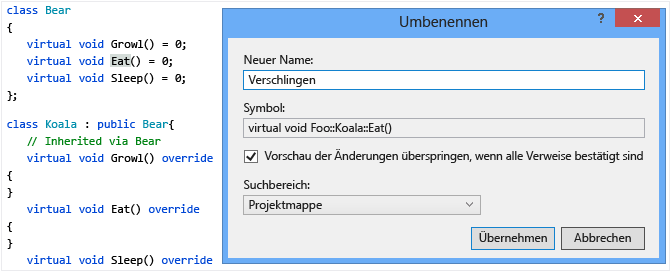
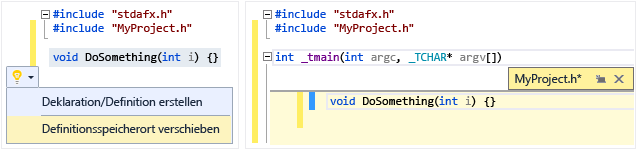
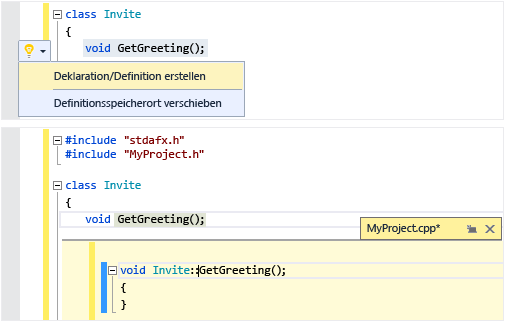
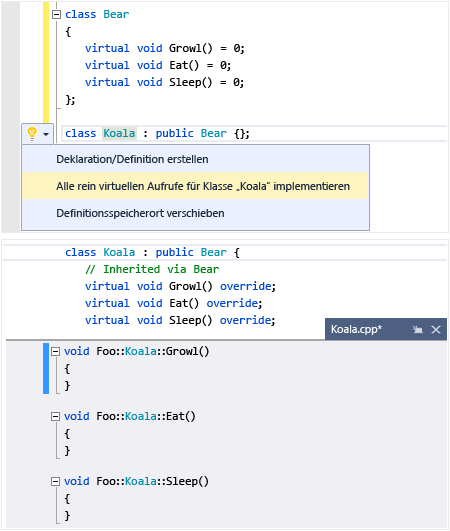
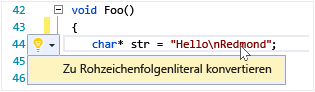

# Schreiben und Umgestalten von Code (C++)
[!INCLUDE[vs2017banner](../assembler/inline/includes/vs2017banner.md)]

Der Visual C\+\+\-Code\-Editor und die IDE bieten viele Codierungshilfen.  Einige sind nur für C\+\+, und einige sind im Wesentlichen für alle Visual Studio\-Sprachen identisch.  Optionen zum Aktivieren und Konfigurieren diese Funktionen befinden sich im Dialogfeld „C\+\+ erweitert“ des Text\-Editor \(**Extras &#124; Optionen &#124; Text\-Editor &#124; C\/C\+\+ &#124; Erweitert**, oder geben Sie "C\+\+ erweitert" in **Schnellstart** ein\).  Wenn Sie die gewünschte Option ausgewählt haben, können Sie mit **F1** weitere Hilfethemen abrufen, wenn das Dialogfeld den Fokus hat.  Geben Sie für allgemeine Codeformatierungsoptionen `Editor C++` in **Schnellstart** ein.  
  
## Hinzufügen von neuem Code  
 Wenn Sie ein Projekt erstellt haben, können Sie mit dem Codieren in den für Sie generierten Dateien beginnen.  Klicken Sie zum Hinzufügen neuer Dateien im Projektmappen\-Explorer mit der rechten Maustaste auf den Projektknoten, und wählen Sie **Hinzufügen I Neu**.  
  
 Geben Sie zum Festlegen von Formatierungsoptionen, z. B. Einzug, Klammerabschluss und Farbgebung, `C++-Formatierung` im Fenster **Schnellstart** ein.  
  
### IntelliSense  
 IntelliSense ist der Name für eine Gruppe von Funktionen, die Inline\-Informationen über Elemente, Typen und Funktionsüberladungen bereitstellen.  Die folgende Abbildung zeigt das Memberlisten\-Dropdownfeld, das während der Eingabe angezeigt wird.  Sie können die TAB\-Taste drücken, um den Text des ausgewählten Elements in Ihre Codedatei einzugeben.  
  
   
  
 Ausführliche Informationen finden Sie unter [Visual C\+\+ Intellisense](../Topic/Visual%20C++%20Intellisense.md).  
  
### Einfügen von Ausschnitten  
 Ein Ausschnitt ist ein vordefinierter Teil des Quellcodes.  Klicken Sie mit der rechten Maustaste auf einen einzelnen Punkt oder auf ausgewählten Text, um einen Ausschnitt einzufügen oder den ausgewählten Text mit dem jeweiligen Ausschnitt zu umschließen.  Die folgende Abbildung zeigt die drei Schritte zum Umschließen einer ausgewählten\-Anweisung mit einer „for“\-Schleife.  Die gelben Markierungen im endgültigen Bild sind veränderbare Felder, auf die Sie mit der TAB\-Taste zugreifen.  Weitere Informationen finden Sie unter [Codeausschnitte](../Topic/Code%20Snippets.md).  
  
   
  
### Klasse hinzufügen  
 Fügen Sie eine neue Klasse aus dem Menü **Projekt** mit dem Klassen\-Assistenten hinzu.  
  
   
  
### Klassen\-Assistent  
 Ändern oder untersuchen Sie eine vorhandene Klasse, oder fügen Sie eine neue Klasse hinzu, alles mit dem Klassen\-Assistenten.  Weitere Informationen finden Sie unter [Hinzufügen neuer Funktionen mit Code\-Assistenten \(C\+\+\)](../ide/adding-functionality-with-code-wizards-cpp.md).  
  
   
  
## Umgestaltung  
 Umgestaltungen stehen unter dem Schnellaktions\-Kontextmenüelement oder durch Klicken auf eine [Glühbirne](../Topic/Perform%20quick%20actions%20with%20light%20bulbs.md) im Editor zur Verfügung.  
  
### Umbenennen  
 Benennen Sie einen Typ, eine Funktion oder Variable um, unabhängig davon, wo sie im angegebenen Bereich verwendet wird.  In der folgenden Abbildung wird die `Eat`\-Methode in `Devour` in die abgeleitete und die Basisklasse umbenannt.  
  
   
  
### Schnelle Aktion: Definitionsspeicherort verschieben  
 Verschieben Sie eine oder mehrere Funktionsdefinitionen in die Headerdatei, die den gleichen Namen wie die Codedatei hat.  Wenn die Datei nicht bereits vorhanden ist, wird ein neuer Header erstellt.  Die resultierenden Definitionen werden inline in einem Peek\-Fenster angezeigt.  
  
   
  
### Schnelle Aktion: Deklaration\/Definition erstellen  
 Erstellen Sie eine oder mehrere Definitionen in der zugeordneten Codedatei für die ausgewählten Headerdeklarationen.  
  
   
  
### Schnelle Aktion: Alle rein virtuellen Aufrufe für eine Klasse implementieren  
 Generieren Sie schnell leere Implementierungsstubs für alle geerbten virtuellen Funktionen in einer Klasse.  Um nur die virtuellen Funktionen in einer bestimmten Basisklasse zu implementieren, markieren Sie einfach die Basisklasse in der abgeleiteten Klassendeklaration.  
  
   
  
### Zu Rohzeichenfolgenliteral konvertieren  
 Wenn Sie den Cursor über ein Zeichenfolgenliteral platzieren, können Sie mit der rechten Maustaste klicken und **Schnelle Aktionen &#124; Zu Rohzeichenfolgenliteral konvertieren** auswählen, um eine gewöhnliche Zeichenfolge in ein C\+\+ 11\-Rohzeichenfolgenliteral zu konvertieren.  
  
   
  
### Extract\-Funktion \(Visual Studio\-Erweiterung\)  
 Verwenden Sie die Extract\-Funktion \(verfügbar als [Erweiterung in der Visual Studio Gallery](https://visualstudiogallery.msdn.microsoft.com/a081dc8c-c805-4589-9b8b-c2c309a05789)\), um einen Codeabschnitt in eine eigene Funktion zu verschieben, und den Code durch einen Aufruf der Funktion zu ersetzen.  
  
   
  
## Navigieren und Verstehen  
  
### QuickInfo  
 Zeigen Sie auf eine Variable, um die Typinformationen anzuzeigen.  QuickInfo  
  
   
  
### Geöffnetes Dokument \(zu Header navigieren\)  
 Klicken Sie mit der rechten Maustaste auf den Headernamen in einer `#include`\-Richtlinie, und öffnen Sie die Headerdatei.  
  
   
  
### Definition einsehen  
 Zeigen Sie auf eine Variablen\- oder Funktionsdeklaration, klicken Sie mit der rechten Maustaste, und wählen Sie dann **Peek\-Definition** aus, um eine Inlineansicht der Definition anzuzeigen.  Weitere Informationen finden Sie unter [Peek\-Definition \(Alt\+F12\)](../Topic/How%20to:%20View%20and%20Edit%20Code%20by%20Using%20Peek%20Definition%20\(Alt+F12\).md).  
  
   
  
### Gehe zu Definition  
 Zeigen Sie auf eine Variablen\- oder Funktionsdeklaration, klicken Sie mit der rechten Maustaste, und wählen Sie dann **Gehe zu Definition** zum Öffnen des Dokuments aus, in dem das Objekt definiert wird.  
  
### Aufrufhierarchie anzeigen  
 Klicken Sie mit der rechten Maustaste auf alle Funktionsaufrufe, und zeigen Sie eine Liste aller aufgerufenen Funktionen und aller Funktionen an, die sie aufrufen.  Jede Funktion in der Liste kann auf die gleiche Weise erweitert werden.  Weitere Informationen finden Sie unter [Aufrufhierarchie](../Topic/Call%20Hierarchy.md).  
  
   
  
### Header\-\/Codedatei umschalten  
 Klicken Sie mit der rechten Maustaste, und wählen Sie „Header\-\/Codedatei umschalten“ aus, um zwischen einer Headerdatei und der zugeordneten Codedatei hin\- und her zu wechseln.  
  
### Gliedern  
 Klicken Sie mit der rechten Maustaste auf eine beliebige Stelle in einer Quellcodedatei, und wählen Sie **Gliedern** aus, um Definitionen und\/oder benutzerdefinierte Regionen zu reduzieren oder zu erweitern, um das Durchsuchen nur der Teile, die für Sie interessant sind, zu vereinfachen.  Weitere Informationen finden Sie unter [Gliedern](../Topic/Outlining.md).  
  
   
  
### Bildlaufleisten\-Zuordnungsmodus  
 Mit dem Bildlaufleisten\-Zuordnungsmodus können Sie schnell einen Bildlauf durchführen und eine Codedatei durchsuchen, ohne die aktuelle Position zu verlassen.  Oder klicken Sie auf eine beliebige Stelle auf der Codezuordnung, um direkt zu dieser Position zu wechseln.  
  
   
  
### Diagramm für Includedateien generieren  
 Klicken Sie mit der rechten Maustaste auf eine Codedatei im Projekt, und wählen Sie **Diagramm für Includedateien generieren** aus, um ein Diagramm darüber anzuzeigen, welche Dateien in anderen Dateien enthalten sind.  
  
   
  
### F1\-Hilfe  
 Platzieren Sie den Cursor in oder direkt hinter einen Typ, Schlüsselwort oder einer Funktion, und drücken Sie F1, um direkt zum entsprechenden MSDN\-Referenzthema zu wechseln.  F1 funktioniert auch für Objekte in der Fehlerliste und in vielen Dialogfeldern.  
  
### Schnellstart  
 Um einfach zu jedem Fenster oder Tool in Visual Studio zu navigieren, geben Sie den Namen in das Schnellstartfenster in der rechten oberen Ecke der Benutzeroberfläche ein.  Die AutoVervollständigen\-Liste filtert während der Eingabe.  
  
 