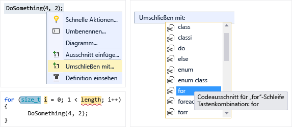
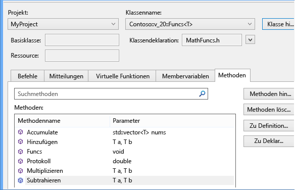
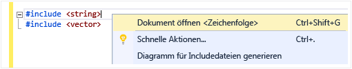
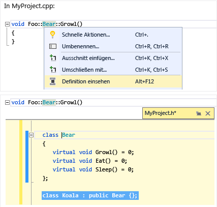
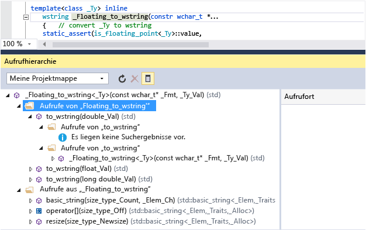
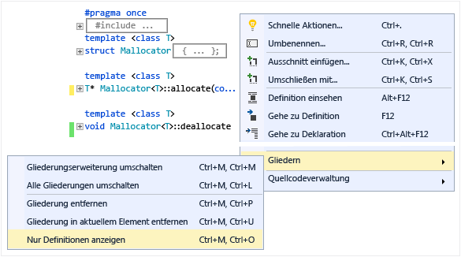
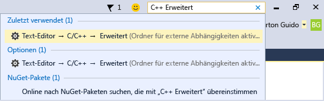

# Schreiben und Refactoring von Code (C++)

Der Visual C++-Code-Editor und die IDE bieten viele Codierungshilfen. Einige sind nur für C++, und einige sind im Wesentlichen für alle Visual Studio-Sprachen identisch. Weitere Informationen über die freigegebenen Funktionen finden Sie unter [Schreiben von Code im Code- und Text-Editor](/visualstudio/ide/writing-code-in-the-code-and-text-editor). Optionen zum Aktivieren und Konfigurieren von C++-spezifischen Funktionen befinden sich der [Text-Editor C++ erweitert](/visualstudio/ide/reference/options-text-editor-c-cpp-advanced) Dialogfeld (**Tools &#124; Optionen &#124; Text-Editor &#124; C/C++- &#124; Erweiterte** oder geben Sie "C++ Erweitert" **Schnellstart**). Nach dem auswählen, welche Option Sie festlegen möchten, erhalten Sie weitere Hilfe durch Drücken von **F1** Wenn wird das Dialogfeld den Fokus. Geben Sie für allgemeine Codeformatierungsoptionen `Editor C++` in **QuickLaunch**.

Experimentelle Features, die möglicherweise nicht in einer zukünftigen Version von Visual Studio enthalten sein, befinden sich in der [Text-Editor C++ experimentell](/visualstudio/ide/reference/options-text-editor-c-cpp-experimental) Dialogfeld. Sie können in Visual Studio 2017 aktivieren **Predictive Intellisense** in diesem Dialogfeld.

## Hinzufügen von neuem Code

Wenn Sie ein Projekt erstellt haben, können Sie mit dem Codieren in den für Sie generierten Dateien beginnen. Klicken Sie zum Hinzufügen neuer Dateien mit der rechten Maustaste auf den Projektknoten im Projektmappen-Explorer, und wählen Sie **hinzufügen &#124; Neue**.

Geben Sie zum Festlegen von Formatierungsoptionen, z. B. Einzüge, geschweifte Klammer und Farbgebung `C++ Formatting` in der **QuickLaunch** Fenster.

### IntelliSense

IntelliSense ist der Name für eine Gruppe von Funktionen, die Inline-Informationen über Elemente, Typen und Funktionsüberladungen bereitstellen. Die folgende Abbildung zeigt das Memberlisten-Dropdownfeld, das während der Eingabe angezeigt wird. Sie können die TAB-Taste drücken, um den Text des ausgewählten Elements in Ihre Codedatei einzugeben.

Ausführliche Informationen finden Sie unter [Visual C++ Intellisense](/visualstudio/ide/visual-cpp-intellisense).

### Einfügen von Ausschnitten

Ein Ausschnitt ist ein vordefinierter Teil des Quellcodes. Klicken Sie mit der rechten Maustaste auf einen einzelnen Punkt oder auf ausgewählten Text, um einen Ausschnitt einzufügen oder den ausgewählten Text mit dem jeweiligen Ausschnitt zu umschließen. Die folgende Abbildung zeigt die drei Schritte zum Umschließen einer ausgewählten-Anweisung mit einer „for“-Schleife. Die gelben Markierungen im endgültigen Bild sind veränderbare Felder, auf die Sie mit der TAB-Taste zugreifen. Weitere Informationen finden Sie unter [Codeausschnitte](/visualstudio/ide/code-snippets).

### Klasse hinzufügen

Fügen Sie eine neue Klasse von der **Projekt** Menü mit dem Klassen-Assistenten.

![Hinzufügen einer neuen Klasse in Visual C#, #43; &#43; ] (../ide/media/vs2015_cpp_add_class.png "vs2015_cpp_add_class")

### Klassen-Assistent

Ändern oder untersuchen Sie eine vorhandene Klasse, oder fügen Sie eine neue Klasse hinzu, alles mit dem Klassen-Assistenten. Weitere Informationen finden Sie unter [Hinzufügen neuer Funktionen mit Code-Assistenten (C++)](../ide/adding-functionality-with-code-wizards-cpp.md).

## Umgestaltung

Refactorings stehen unter dem Schnellaktions-Kontextmenü oder durch Klicken auf eine [Glühbirne](/visualstudio/ide/perform-quick-actions-with-light-bulbs) im Editor.  Einige auch befinden sich in der **Bearbeiten > Umgestalten** Menü.  Zu diesen Funktionen gehören:

* [Umbenennen](refactoring/rename.md)
* [&Funktion extrahieren](refactoring/extract-function.md)
* [Rein virtuelle Aufrufe implementieren](refactoring/implement-pure-virtuals.md)
* [Deklaration/Definition erstellen](refactoring/create-declaration-definition.md)
* [Funktionsdefinition](refactoring/move-definition-location.md)
* [Zu Rohzeichenfolgenliteral konvertieren](refactoring/convert-to-raw-string-literal.md)
* [Signatur ändern](refactoring/change-signature.md)

## Navigieren und Verstehen

Visual C++ teilt viele Funktionen für die Navigation von Code mit anderen Sprachen. Weitere Informationen finden Sie unter [Navigieren in Code](/visualstudio/ide/navigating-code) und [Anzeigen der Codestruktur](/visualstudio/ide/viewing-the-structure-of-code).

### QuickInfo

Zeigen Sie auf eine Variable, um die Typinformationen anzuzeigen.

### Geöffnetes Dokument (zu Header navigieren)

Klicken Sie mit der rechten Maustaste auf den Headernamen in einer `#include`-Richtlinie, und öffnen Sie die Headerdatei.

### Peek-Definition

Zeigen Sie auf eine Variablen- oder Funktionsdeklaration, mit der rechten Maustaste, klicken Sie dann wählen Sie **Peek-Definition** um eine Inlineansicht der Definition anzuzeigen. Weitere Informationen finden Sie unter [Peek-Definition (Alt + F12)](/visualstudio/ide/how-to-view-and-edit-code-by-using-peek-definition-alt-plus-f12).

### Gehe zu Definition

Zeigen Sie auf eine Variablen- oder Funktionsdeklaration, mit der rechten Maustaste, klicken Sie dann wählen Sie **Gehe zu Definition** zum Öffnen des Dokuments, in dem das Objekt definiert ist.

### Aufrufhierarchie anzeigen

Klicken Sie mit der rechten Maustaste auf alle Funktionsaufrufe, und zeigen Sie eine Liste aller aufgerufenen Funktionen und aller Funktionen an, die sie aufrufen. Jede Funktion in der Liste kann auf die gleiche Weise erweitert werden. Weitere Informationen finden Sie unter [Aufrufhierarchie](/visualstudio/ide/reference/call-hierarchy).

### Header-/Codedatei umschalten

Mit der rechten Maustaste, und wählen Sie **ein-/ausschalten Header / Codedatei** , zwischen einer Headerdatei und der zugeordneten Codedatei hin-und herwechseln.

### Gliedern

Mit der rechten Maustaste an einer beliebigen Stelle in einer Quellcodedatei, und wählen Sie **Gliedern** reduzieren oder erweitern, Definitionen und/oder benutzerdefinierte Regionen zu vereinfachen das Durchsuchen nur der Teile, die Sie von Interesse sind. Weitere Informationen finden Sie unter [Gliedern](/visualstudio/ide/outlining).

### Bildlaufleisten-Zuordnungsmodus

Mit dem Bildlaufleisten-Zuordnungsmodus können Sie schnell einen Bildlauf durchführen und eine Codedatei durchsuchen, ohne die aktuelle Position zu verlassen. Oder klicken Sie auf eine beliebige Stelle auf der Code Map, um direkt zu dieser Position zu wechseln.

![Codezuordnung in Visual C#, #43; &#43; ] (../ide/media/vs2015_cpp_code_map.png "vs2015_cpp_code_map")

### Diagramm für Includedateien generieren

Klicken Sie mit der rechten Maustaste auf eine Codedatei im Projekt, und wählen Sie **Diagramm für Includedateien generieren** um ein Diagramm darüber anzuzeigen, von denen Dateien von anderen Dateien enthalten sind.

### F1-Hilfe

Platzieren Sie den Cursor in oder direkt hinter einen Typ, Schlüsselwort oder einer Funktion, und drücken Sie F1, um direkt zum entsprechenden MSDN-Referenzthema zu wechseln. F1 funktioniert auch für Objekte in der Fehlerliste und in vielen Dialogfeldern.

### Schnellstart

Um einfach zu jedem Fenster oder Tool in Visual Studio zu navigieren, geben Sie den Namen in das Schnellstartfenster in der rechten oberen Ecke der Benutzeroberfläche ein. Die AutoVervollständigen-Liste filtert während der Eingabe.

