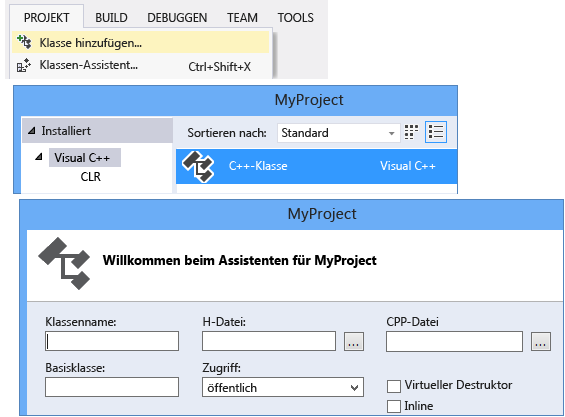
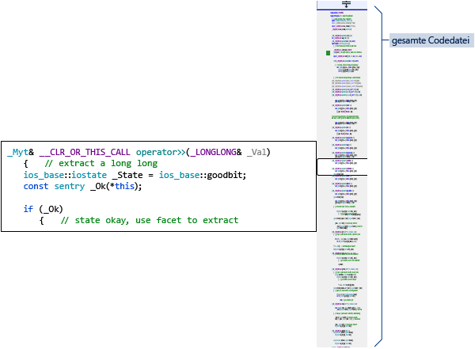

# Schreiben und Refactoring von Code (C++)

Der Visual C++-Code-Editor und die IDE bieten viele Codierungshilfen. Einige sind nur für C++, und einige sind im Wesentlichen für alle Visual Studio-Sprachen identisch. Weitere Informationen über die freigegebenen Features finden Sie unter [Schreiben von Code im Code- und Text-Editor](/visualstudio/ide/writing-code-in-the-code-and-text-editor). Optionen zum Aktivieren und Konfigurieren von C++-spezifischen Features finden Sie unter **Extras > Optionen > Text-Editor > C/C++**. Wenn Sie die gewünschte Option ausgewählt haben, können Sie mit **F1** weitere Hilfethemen abrufen, wenn das Dialogfeld im Fokus ist. Geben Sie `Editor C++` in **Schnellstart** ein, um allgemeine Codeformatierungsoptionen abzurufen.

Experimentelle Features, die möglicherweise nicht in einer zukünftigen Version von Visual Studio enthalten sind, finden Sie im Dialogfeld [Text Editor C++ Experimental](/visualstudio/ide/reference/options-text-editor-c-cpp-experimental) (C++-Text-Editor „Experimentell“). In Visual Studio 2017 können Sie **Predictive IntelliSense** in diesem Dialogfeld aktivieren.

## Hinzufügen von neuen Dateien

Klicken Sie mit der rechten Maustaste auf den Projektknoten im Projektmappen-Explorer, und wählen Sie **Hinzufügen > Neu** aus, um einem Projekt neue Dateien hinzuzufügen.

## Formatierungsoptionen

Geben Sie zum Festlegen von Formatierungsoptionen, z.B. Einzügen, Klammerabschluss und Farbgebung, „C++-Formatierung“ im Fenster **Schnellstart** ein. Visual Studio 2017 Version 15.7 und höher unterstützt ClangFormat. Sie können dies auf der [C/C++-Formatierung-Eigenschaftenseite](/visualstudio/ide/reference/options-text-editor-c-cpp-formatting) unter **Extras > Optionen > Text-Editor > C/C++ > Formatierung** konfigurieren.

## IntelliSense

IntelliSense ist der Name für eine Gruppe von Funktionen, die Inline-Informationen über Elemente, Typen und Funktionsüberladungen bereitstellen. Die folgende Abbildung zeigt das Memberlisten-Dropdownfeld, das während der Eingabe angezeigt wird. Sie können die TAB-Taste drücken, um den Text des ausgewählten Elements in Ihre Codedatei einzugeben.

Ausführliche Informationen finden Sie unter [Visual C++ IntelliSense](/visualstudio/ide/visual-cpp-intellisense).

## Einfügen von Ausschnitten

Ein Ausschnitt ist ein vordefinierter Teil des Quellcodes. Klicken Sie mit der rechten Maustaste auf einen einzelnen Punkt oder auf ausgewählten Text, um einen Ausschnitt einzufügen oder den ausgewählten Text mit dem jeweiligen Ausschnitt zu umschließen. Die folgende Abbildung zeigt die drei Schritte zum Umschließen einer ausgewählten-Anweisung mit einer „for“-Schleife. Die gelben Markierungen im endgültigen Bild sind veränderbare Felder, auf die Sie mit der TAB-Taste zugreifen. Weitere Informationen finden Sie unter [Codeausschnitte](/visualstudio/ide/code-snippets).

## Klasse hinzufügen

Fügen Sie mit dem Klassen-Assistenten eine neue Klasse aus dem Menü **Projekt** hinzu.

Sie können auch den Klassen-Assistenten verwenden, um eine vorhandene Klasse zu ändern oder zu untersuchen.

Weitere Informationen finden Sie unter [Adding Functionality with Code Wizards (C++) (Hinzufügen neuer Funktionen mit Code-Assistenten (C++))](../ide/adding-functionality-with-code-wizards-cpp.md).

## Umgestaltung

Refactorings stehen unter dem Kontextmenü „Schnelle Aktion“ oder durch Klicken auf eine [Glühbirne](/visualstudio/ide/perform-quick-actions-with-light-bulbs) im Editor zur Verfügung.  Einige befinden sich auch im Menü **Bearbeiten > Umgestalten**.  Zu diesen Features zählen:

* [Umbenennen](refactoring/rename.md)
* [&Funktion extrahieren](refactoring/extract-function.md)
* [Rein virtuelle Aufrufe implementieren](refactoring/implement-pure-virtuals.md)
* [Deklaration/Definition erstellen](refactoring/create-declaration-definition.md)
* [Funktionsdefinition](refactoring/move-definition-location.md)
* [Zu Rohzeichenfolgenliteral konvertieren](refactoring/convert-to-raw-string-literal.md)
* [Signatur ändern](refactoring/change-signature.md)

## Navigieren und Verstehen

Visual C++ teilt viele Features für die Codenavigation mit anderen Sprachen. Weitere Informationen finden Sie unter [Navigieren durch den Code](/visualstudio/ide/navigating-code) und [Anzeigen der Codestruktur](/visualstudio/ide/viewing-the-structure-of-code).

## QuickInfo

Zeigen Sie auf eine Variable, um die Typinformationen anzuzeigen.

## Geöffnetes Dokument (zu Header navigieren)

Klicken Sie mit der rechten Maustaste auf den Headernamen in einer `#include`-Richtlinie, und öffnen Sie die Headerdatei.

## Peek-Definition

Zeigen Sie auf eine Variablen- oder Funktionsdeklaration, klicken Sie mit der rechten Maustaste, und wählen Sie dann **Peek-Definition** aus, um eine Inlineansicht der Definition anzuzeigen. Weitere Informationen finden Sie unter [Peek-Definition (Alt+F12)](/visualstudio/ide/how-to-view-and-edit-code-by-using-peek-definition-alt-plus-f12).

## Gehe zu Definition

Zeigen Sie auf eine Variablen- oder Funktionsdeklaration, klicken Sie mit der rechten Maustaste, und wählen Sie dann **Gehe zu Definition** zum Öffnen des Dokuments aus, in dem das Objekt definiert wird.

## Aufrufhierarchie anzeigen

Klicken Sie mit der rechten Maustaste auf alle Funktionsaufrufe, und zeigen Sie eine Liste aller aufgerufenen Funktionen und aller Funktionen an, die sie aufrufen. Jede Funktion in der Liste kann auf die gleiche Weise erweitert werden. Weitere Informationen finden Sie unter [Aufrufhierarchie](/visualstudio/ide/reference/call-hierarchy).

## Header-/Codedatei umschalten

Klicken Sie mit der rechten Maustaste, und wählen Sie **Header-/Codedatei umschalten** aus, um zwischen einer Headerdatei und der zugeordneten Codedatei hin- und her zu wechseln.

## Gliedern

Klicken Sie mit der rechten Maustaste auf eine beliebige Stelle in einer Quellcodedatei, und wählen Sie **Gliedern** aus, um Definitionen und/oder benutzerdefinierte Regionen zu reduzieren oder zu erweitern, um das Durchsuchen nur der Teile, die für Sie interessant sind, zu vereinfachen. Weitere Informationen finden Sie unter [Gliedern](/visualstudio/ide/outlining).

## Scrollleisten-Zuordnungsmodus

Mit dem Bildlaufleisten-Zuordnungsmodus können Sie schnell einen Bildlauf durchführen und eine Codedatei durchsuchen, ohne die aktuelle Position zu verlassen. Oder klicken Sie auf eine beliebige Stelle auf der Code Map, um direkt zu dieser Position zu wechseln. Weitere Informationen finden Sie unter [Vorgehensweise: Verfolgen von Code durch Anpassen der Scrollleiste](/visualstudio/ide/how-to-track-your-code-by-customizing-the-scrollbar).

## Diagramm für Includedateien generieren

Klicken Sie mit der rechten Maustaste auf eine Codedatei im Projekt, und wählen Sie **Diagramm für Includedateien generieren** aus, um ein Diagramm darüber anzuzeigen, welche Dateien in anderen Dateien enthalten sind.

## F1-Hilfe

Platzieren Sie den Cursor in oder direkt hinter einen Typ, Schlüsselwort oder einer Funktion, und drücken Sie F1, um direkt das entsprechenden Referenzthema auf docs.microsoft.com zu öffnen. F1 funktioniert auch für Objekte in der Fehlerliste und in vielen Dialogfeldern.

## Schnellstart

Um einfach zu jedem Fenster oder Tool in Visual Studio zu navigieren, geben Sie den Namen in das Schnellstartfenster in der rechten oberen Ecke der Benutzeroberfläche ein. Die AutoVervollständigen-Liste filtert während der Eingabe.

