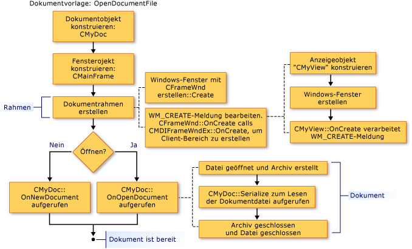

# Erstellen neuer Dokumente, Fenster und Ansichten

Die folgenden Abbildungen geben einen Überblick über der Erstellungsvorgang für Dokumente, Ansichten und Rahmenfenster. Weitere Artikel, die sich auf die beteiligten Objekte konzentrieren bieten weitere Details.

Nach Abschluss dieses Prozesses die kooperierender Objekte vorhanden, und Speichern von Zeigern miteinander. Die folgenden Abbildungen zeigen die Sequenz, in der Objekte erstellt werden. Sie können die Sequenz von Abbildung zu Abbildung folgen.

  
Reihenfolge beim Erstellen eines Dokuments

  
Reihenfolge beim Erstellen eines Rahmenfensters

  
Reihenfolge beim Erstellen einer Ansicht

Informationen wie das Framework für das neue Dokument, Ansicht und Rahmenfenster Objekte initialisiert werden, finden Sie unter Klassen [CDocument](../mfc/reference/cdocument-class.md), [CView](../mfc/reference/cview-class.md), [CFrameWnd](../mfc/reference/cframewnd-class.md), [CMDIFrameWnd](../mfc/reference/cmdiframewnd-class.md), und [CMDIChildWnd](../mfc/reference/cmdichildwnd-class.md) in der MFC-Bibliothek-Referenz. Siehe auch [technischen Hinweis 22](../mfc/tn022-standard-commands-implementation.md), dem erläutert wird, die Erstellung und Initialisierung Prozesse weiter unter der Erläuterung der des Frameworks-Standardbefehle für die **neu** und **Öffnen** Elemente auf der **Datei** Menü.

##   Initialisieren Ihre eigenen Ergänzungen auf diese Klassen

Die vorhergehenden Abbildungen empfiehlt es sich auch um die Punkte, an denen Sie die Memberfunktionen zum Initialisieren von Objekten der Anwendung überschreiben können. Eine Überschreibung der `OnInitialUpdate` in der Ansicht-Klasse ist der beste Ort für die Ansicht zu initialisieren. Die `OnInitialUpdate` Aufruf erfolgt, sobald das Rahmenfenster erstellt wird und die Ansicht im Rahmenfenster sein Dokument angefügt ist. Wenn Ihrer Ansicht einen Bildlauf ist z. B. (abgeleitet `CScrollView` statt `CView`), sollten Sie festlegen, die Größe der Ansicht basierend auf der Größe des Dokuments in Ihre `OnInitialUpdate` außer Kraft setzen. (Dieser Prozess wird beschrieben, in der Beschreibung der Klasse [CScrollView](../mfc/reference/cscrollview-class.md).) Können Sie überschreiben die `CDocument` Memberfunktionen `OnNewDocument` und `OnOpenDocument` anwendungsspezifische Initialisierung des Dokuments angeben. In der Regel müssen Sie beide überschreiben, da ein Dokument auf zwei Arten erstellt werden kann.

In den meisten Fällen sollten Ihre Überschreibung die Basisklassenversion aufrufen. Weitere Informationen finden Sie auf die benannte Memberfunktionen von Klassen [CDocument](../mfc/reference/cdocument-class.md), [CView](../mfc/reference/cview-class.md), [CFrameWnd](../mfc/reference/cframewnd-class.md), und [CWinApp](../mfc/reference/cwinapp-class.md) in die MFC-Bibliothek Bibliotheksreferenz.

## Siehe auch

[Dokumentvorlagen und der Erstellungsvorgang für Dokumente und Ansichten](../mfc/document-templates-and-the-document-view-creation-process.md) 
[Erstellen von Dokumentvorlagen](../mfc/document-template-creation.md) 
[Erstellen von Dokument/Ansicht](../mfc/document-view-creation.md) 
[Beziehungen zwischen MFC-Objekten](../mfc/relationships-among-mfc-objects.md)

