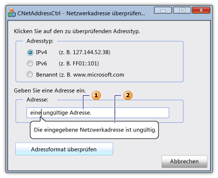

# CNetAddressCtrl-Klasse
[!INCLUDE[vs2017banner](../../assembler/inline/includes/vs2017banner.md)]

Die Klasse stellt die `CNetAddressCtrl` Netzwerkadressen\-Steuerelement dar, die Sie verwenden können, um das Format von IPv4, von IPv6 und benannten DNS\-Adressen einzugeben und zu überprüfen.  
  
## Syntax  
  
```  
class CNetAddressCtrl : public CEdit  
```  
  
## Mitglieder  
  
### Öffentliche Konstruktoren  
  
|Name|Description|  
|----------|-----------------|  
|[CNetAddressCtrl::CNetAddressCtrl](../Topic/CNetAddressCtrl::CNetAddressCtrl.md)|Erstellt ein `CNetAddressCtrl`\-Objekt.|  
  
### Öffentliche Methoden  
  
|Name|Description|  
|----------|-----------------|  
|[CNetAddressCtrl::Create](../Topic/CNetAddressCtrl::Create.md)|Erstellt eine Netzwerkadressen\-Steuerelement mit angegebenen Formaten und fügt sie dem aktuellen `CNetAddressCtrl`\-Objekt.|  
|[CNetAddressCtrl::CreateEx](../Topic/CNetAddressCtrl::CreateEx.md)|Erstellt eine Netzwerkadressen\-Steuerelement mit angegebenen erweiterten Formaten und fügt sie dem aktuellen `CNetAddressCtrl`\-Objekt.|  
|[CNetAddressCtrl::DisplayErrorTip](../Topic/CNetAddressCtrl::DisplayErrorTip.md)|Zeigt eine Fehlersprechblaseninfo an, wenn der Benutzer eine nicht unterstützte Netzwerkadresse in der Adressenkontrolle des aktuellen Netzwerks eingibt.|  
|[CNetAddressCtrl::GetAddress](../Topic/CNetAddressCtrl::GetAddress.md)|Ruft eine überprüfen und analysierte Darstellung der Netzwerkadresse ab, die mit der Adressenkontrolle des aktuellen Netzwerks zugeordnet ist.|  
|[CNetAddressCtrl::GetAllowType](../Topic/CNetAddressCtrl::GetAllowType.md)|Ruft den Typ der Netzwerkadresse ab, die den Adressenkontrolle des aktuellen Netzwerks unterstützen kann.|  
|[CNetAddressCtrl::SetAllowType](../Topic/CNetAddressCtrl::SetAllowType.md)|Legt den Typ der Netzwerkadresse fest, den die Adressenkontrolle des aktuellen Netzwerks unterstützen kann.|  
  
## Hinweise  
 Die Netzwerkadressen\-Steuerelement überprüft, ob das Format der Adresse, die der Benutzer eingibt, richtig ist.  Das Steuerelement nicht tatsächlich schließt an die Netzwerkadresse an.  Die [CNetAddressCtrl::SetAllowType](../Topic/CNetAddressCtrl::SetAllowType.md)\-Methode gibt eine oder mehrere Typen Adresse an, die die [CNetAddressCtrl::GetAddress](../Topic/CNetAddressCtrl::GetAddress.md)\-Methode analysieren und überprüfen kann.  Eine Adresse kann in Form eines IPv4, eines IPv6 oder mit einer Adresse für einen Server, ein Netzwerk, einen Host oder ein Broadcastmeldungsziel sein.  Wenn das Format der Adresse falsch ist, können Sie die [CNetAddressCtrl::DisplayErrorTip](../Topic/CNetAddressCtrl::DisplayErrorTip.md)\-Methode verwenden, um ein Infotippmeldungsfeld anzuzeigen, das sich grafisch im Textfeld der Netzwerkadressen\-Steuerelement und zeigt eine vordefinierte Fehlermeldung anzeigt.  
  
 Die `CNetAddressCtrl`\-Klasse wird von [CEdit](../../mfc/reference/cedit-class.md)\-Klasse abgeleitet.  Daher bietet das Netzwerkadressen\-Steuerelement Zugriff auf alle Windows\-Bearbeitungssteuerelementmeldungen.  
  
 Die folgende Abbildung stellt ein Dialogfeld dar, das eine Netzwerkadressen\-Steuerelement enthält.  Das Textfeld \(1\) für das Netzwerkadressen\-Steuerelement enthält eine ungültige Netzwerkadresse.  Die Infotippmeldung \(2\) wird angezeigt, wenn die Netzwerkadresse ungültig ist.  
  
   
  
## Beispiel  
 Im folgenden Codebeispiel ist Teil eines Dialogfelds, das eine Netzwerkadresse überprüft.  Die Ereignishandler für drei Optionsfelder geben an, dass die Netzwerkadresse einer von drei Adresstypen sein kann.  Der Benutzer gibt eine Adresse im Textfeld des Netzwerksteuerelements ein drückt, dann eine Schaltfläche, um die Adresse zu überprüfen.  Wenn die Adresse gültig ist, wird eine Erfolgsmeldung angezeigt; andernfalls wird die vordefinierte Infotippfehlermeldung angezeigt.  
  
 [!CODE [NVC_MFC_CNetAddressCtrl_s1#1](../CodeSnippet/VS_Snippets_Cpp/NVC_MFC_CNetAddressCtrl_s1#1)]  
  
## Beispiel  
 Im folgenden Codebeispiel aus der Dialogfeldheaderdatei definiert die [NC\_ADDRESS](http://msdn.microsoft.com/library/windows/desktop/bb773345) und [NET\_ADDRESS\_INFORMATION](http://msdn.microsoft.com/library/windows/desktop/bb773346)\-Variablen, die durch die [CNetAddressCtrl::GetAddress](../Topic/CNetAddressCtrl::GetAddress.md)\-Methode erforderlich sind.  
  
 [!CODE [NVC_MFC_CNetAddressCtrl_s1#2](../CodeSnippet/VS_Snippets_Cpp/NVC_MFC_CNetAddressCtrl_s1#2)]  
  
## Vererbungshierarchie  
 [CObject](../../mfc/reference/cobject-class.md)  
  
 [CCmdTarget](../../mfc/reference/ccmdtarget-class.md)  
  
 [CWnd](../../mfc/reference/cwnd-class.md)  
  
 [CEdit](../../mfc/reference/cedit-class.md)  
  
 `CNetAddressCtrl`  
  
## Anforderungen  
 **Header:** afxcmn.h  
  
 Diese Klasse wird in [!INCLUDE[windowsver](../../build/reference/includes/windowsver_md.md)] und höher unterstützt.  
  
 Zusätzliche Anforderungen für diese Klasse werden in [Anforderungen für die Erstellung von Windows Vista\-Standardsteuerelementen](../../mfc/build-requirements-for-windows-vista-common-controls.md) beschrieben.  
  
## Siehe auch  
 [CNetAddressCtrl Class](../../mfc/reference/cnetaddressctrl-class.md)   
 [Hierarchiediagramm](../../mfc/hierarchy-chart.md)   
 [CEdit Class](../../mfc/reference/cedit-class.md)