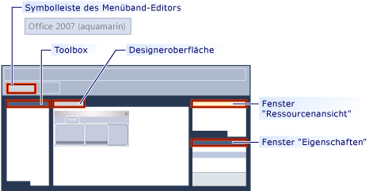

# <a name="ribbon-designer-mfc"></a>Menüband-Designer (MFC)

Mit dem Menüband-Designer können Sie Menübänder in MFC-Anwendungen erstellen und anpassen. Ein Menüband ist ein Element der Benutzeroberfläche (UI), auf dem Befehle in logischen Gruppen organisiert werden. Diese Gruppen werden auf separaten Registerkarten in einem Streifen entlang des oberen Fensterrahmens angezeigt. Das Menüband ersetzt die Menü- und Symbolleisten. Mit einem Menüband kann die Benutzerfreundlichkeit von Anwendungen erheblich verbessert werden. Weitere Informationen finden Sie unter [Menübänder](/windows/desktop/uxguide/cmd-ribbons). Die folgende Abbildung zeigt ein Menüband.


In früheren Versionen von Visual Studio Menübänder erstellt werden, indem Sie Code schreiben, der die MFC-Menübandklassen, wie z. B. verwendet musste [CMFCRibbonBar Class](../mfc/reference/cmfcribbonbar-class.md). In Visual Studio 2010 und höher bietet der Menüband-Designer eine alternative Methode zum Erstellen von Menübändern dar. Zunächst erstellen Sie ein Menüband als Ressource und passen es an. Dann laden Sie die Menübandressource vom Code in der MFC-Anwendung. Sie können Menübandressourcen und MFC-Menübandklassen sogar zusammen verwenden. Beispielsweise können Sie eine menübandressource erstellen und dann programmgesteuert weitere Elemente hinzufügen, zur Laufzeit mithilfe von Code.

## <a name="understanding-the-ribbon-designer"></a>Der Menüband-Designer

Mit dem Menüband-Designer wird das Menüband als Ressource erstellt und gespeichert. Wenn Sie eine Menübandressource erstellen, werden vom Menüband-Designer die folgenden drei Aktionen ausgeführt:

- Hinzufügen eines Eintrags im Projektressourcen-Definitionsskript (*.rc) Im folgenden Beispiel IDR_RIBBON ist der eindeutige Name, der die menübandressource identifiziert, RT_RIBBON_XML ist der Ressourcentyp und ribbon.mfcribbon-ms-ist der Name der Ressourcendatei.

```
    IDR_RIBBON RT_RIBBON_XML      "res\\ribbon.mfcribbon-ms"
```

- Hinzufügen der Definitionen von Befehls-IDs zur "resource.h"

```
#define IDR_RIBBON            307
```

- Eine Menübandressourcendatei (*.mfcribbon-ms), die den XML-Code enthält, mit dem die Schaltflächen des Menübands, die Steuerelemente und Attribute im Menüband definiert werden, wird erstellt. Änderungen, die im Menüband-Designer am Menüband vorgenommen werden, werden in der Ressourcendatei als XML gespeichert. Im folgenden Codebeispiel wird veranschaulicht, die Inhalte von einem \*.mfcribbon-ms-Datei:

```
<RIBBON_BAR>
<ELEMENT_NAME>RibbonBar</ELEMENT_NAME>
<IMAGE>
<ID>
<NAME>IDB_BUTTONS</NAME>
<VALUE>113</VALUE>
</ID>
```

Um die menübandressource in der MFC-Anwendung zu verwenden, laden Sie die Ressource durch Aufrufen von [CMFCRibbonBar::LoadFromResource](../mfc/reference/cmfcribbonbar-class.md#loadfromresource).

## <a name="creating-a-ribbon-by-using-the-ribbon-designer"></a>Erstellen eines Menübands mit dem Menüband-Designer

Dies sind die zwei Möglichkeiten, dem MFC-Projekt eine Menübandressource hinzuzufügen:

- Erstellen einer MFC-Anwendung und konfigurieren des MFC-Projekt-Assistenten zum Erstellen des Menübands. Weitere Informationen finden Sie unter [Exemplarische Vorgehensweise: erstellen ein Menüband mithilfe von MFC](../mfc/walkthrough-creating-a-ribbon-application-by-using-mfc.md).

- Erstellen Sie in einem vorhandenen MFC-Projekt eine Menübandressource und laden Sie sie. Weitere Informationen finden Sie unter [Exemplarische Vorgehensweise: Aktualisieren der MFC Scribble-Anwendung (Teil 1)](../mfc/walkthrough-updating-the-mfc-scribble-application-part-1.md).

Wenn das Projekt bereits über ein manuell codiertes Menüband verfügt, können Sie das vorhandene Menüband mit MFC Funktionen in eine Menübandressource konvertieren. Weitere Informationen finden Sie unter [wie: Konvertieren eines vorhandenen MFC-Menübands in eine Menübandressource](../mfc/how-to-convert-an-existing-mfc-ribbon-to-a-ribbon-resource.md).

> [!NOTE]
>  Menübänder können nicht in Anwendungen erstellt werden, die auf Dialogfeldern basieren. Weitere Informationen finden Sie unter [Anwendungstyp, MFC-Anwendungs-Assistent](../mfc/reference/application-type-mfc-application-wizard.md).

## <a name="customizing-ribbons"></a>Anpassen von Menübändern

Um ein Menüband im Menüband-Designer zu öffnen, doppelklicken Sie in der Ressourcenansicht auf die Menübandressource. Im Designer können Sie dem Menüband, der Anwendungsschaltfläche oder der Symbolleiste für den Schnellzugriff Elemente hinzufügen, entfernen und anpassen. Sie können auch Ereignisse, z. B. Klickereignisse einer Schaltfläche und Menüereignisse, mit einer Methode in der Anwendung verknüpfen.

Die folgende Abbildung zeigt die verschiedenen Komponenten im Menüband-Designer.



- **Toolbox:** enthält Steuerelemente, die auf die Designeroberfläche gezogen werden können.

- **Designer-Oberfläche:** enthält die visuelle Darstellung der menübandressource.

- **Fenster "Eigenschaften":** Listet die Attribute des Elements, das auf der Entwurfsoberfläche ausgewählt ist.

- **Ressourcenansicht (Fenster):** zeigt die Ressourcen, die Menübandressourcen in Ihr Projekt einbinden.

- **Ribbon-Editor-Symbolleiste:** enthält Befehle, mit denen Sie eine Vorschau die Multifunktionsleiste und das visuelle Design ändern.

In den folgenden Themen wird die Verwendung der Funktionen im Menüband-Designer beschrieben:

- [Vorgehensweise: Anpassen der Anwendungsschaltfläche](../mfc/how-to-customize-the-application-button.md)

- [Vorgehensweise: Anpassen der Symbolleiste für den Schnellzugriff](../mfc/how-to-customize-the-quick-access-toolbar.md)

- [Vorgehensweise: Hinzufügen von Menüband-Steuerelementen und Ereignishandlern](../mfc/how-to-add-ribbon-controls-and-event-handlers.md)

- [Vorgehensweise: Laden einer Menübandressource aus einer MFC-Anwendung](../mfc/how-to-load-a-ribbon-resource-from-an-mfc-application.md)

## <a name="definitions-of-ribbon-elements"></a>Definitionen von Menübandelementen


- **Schaltfläche "Anwendung":** die Schaltfläche, die auf der linken oberen Ecke eines Menübands angezeigt wird. Die Anwendungsschaltfläche ersetzt das Datei-Menü und ist sichtbar, wenn das Menüband minimiert wird. Wenn auf die Schaltfläche geklickt wird, wird ein Menü mit einer Liste von Befehlen angezeigt.

- **Symbolleiste für den Schnellzugriff:** eine kleine, anpassbare Symbolleiste, die zeigt häufig verwendete Befehle.

- **Kategorie**: die logische Gruppierung, die den Inhalt einer Registerkarte des Menübands darstellt.

- **Kategorien-Standardschaltfläche:** die Schaltfläche, die auf dem Menüband angezeigt wird, wenn das Menüband minimiert wird. Wenn auf die Schaltfläche geklickt wird, erscheint die Kategorie als Menü neu.

- **Bereich:** einen Bereich des Menübands, das eine Gruppe von verwandten Steuerelementen anzeigt. In jeder Menübandkategorie ist mindestens ein Menübandbereich enthalten.

- **Menübandelemente:** steuert in den Bereichen, z. B. Schaltflächen und Kombinationsfelder. Die verschiedenen Steuerelemente, die gehostet werden können, auf einem Menüband, finden Sie unter [RibbonGadgets-Beispiel: Gadgets Menübandanwendung](../visual-cpp-samples.md).

## <a name="see-also"></a>Siehe auch

[Elemente der Benutzeroberfläche](../mfc/user-interface-elements-mfc.md)<br/>
[Arbeiten mit Ressourcendateien](../windows/working-with-resource-files.md)

