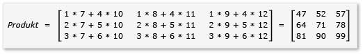
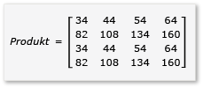

# Exemplarische Vorgehensweise: Matrixmultiplikation
[!INCLUDE[vs2017banner](../../assembler/inline/includes/vs2017banner.md)]

Befolgen Sie die exemplarische Vorgehensweise, um mithilfe von C\+\+ AMP die Ausführung der Matrixmultiplikation zu beschleunigen.  Es werden zwei Algorithmen vorgestellt, einer ohne und einer mit Tiling.  
  
## Vorbereitungsmaßnahmen  
 Vor dem Start:  
  
-   Lesen von [Übersicht über C\+\+ AMP](../../parallel/amp/cpp-amp-overview.md).  
  
-   Lesen von [Verwenden von Kacheln](../../parallel/amp/using-tiles.md).  
  
-   Überprüfen Sie, ob [!INCLUDE[win7](../../build/includes/win7_md.md)], [!INCLUDE[win8](../../build/includes/win8_md.md)], [!INCLUDE[winsvr08_r2](../../parallel/amp/includes/winsvr08_r2_md.md)] oder [!INCLUDE[winserver8](../../build/includes/winserver8_md.md)] auf dem Computer installiert ist.  
  
### So erstellen Sie das Projekt  
  
1.  Wählen Sie in der Visual Studio\-Menüleiste **Datei**, **Neu** und **Projekt** aus.  
  
2.  Wählen Sie im Vorlagenbereich unter**Installiert** die Option **Visual C\+\+**.  
  
3.  Wählen Sie **Leeres Projekt** aus, geben Sie `MatrixMultiply` im Feld **Name** ein, und wählen Sie dann die Schaltfläche **OK** aus.  
  
4.  Wählen Sie die Schaltfläche **Weiter** aus.  
  
5.  Öffnen Sie im **Projektmappen\-Explorer** das Kontextmenü für **Quelldateien**, wählen Sie **Hinzufügen** und dann **Neues Element**.  
  
6.  Wählen Sie im Dialogfeld **Neues Element hinzufügen** die Option **C\+\+\-Datei \(.cpp\)** aus, geben Sie `MatrixMultiply.cpp` im Feld **Name** ein, und wählen Sie dann die Schaltfläche **Hinzufügen** aus.  
  
## Multiplikation ohne Tiling  
 In diesem Abschnitt erwägen Sie die Multiplikation von zwei Matrizen, A und B, die folgendermaßen definiert werden:  
  
   
  
   
  
 A ist eine 3 x 2\-Matrix und B eine 2 x 3\-Matrix.  Das Produkt der Multiplikation von A nach B ist die folgende Matrix 3 x 3\-Matrix.  Das Produkt wird berechnet, indem die Zeilen von A mit den Spalten von B Element für Element multipliziert werden.  
  
   
  
### Multiplizieren ohne C\+\+ AMP  
  
1.  Öffnen Sie MatrixMultiply.cpp, und verwenden Sie den folgenden Code, um den vorhandenen Code zu ersetzen.  
  
    ```cpp  
  
    #include <iostream>  
  
    void MultiplyWithOutAMP() {  
  
        int aMatrix[3][2] = {{1, 4}, {2, 5}, {3, 6}};  
        int bMatrix[2][3] = {{7, 8, 9}, {10, 11, 12}};  
        int product[3][3] = {{0, 0, 0}, {0, 0, 0}, {0, 0, 0}};  
  
        for (int row = 0; row < 3; row++) {  
            for (int col = 0; col < 3; col++) {  
                // Multiply the row of A by the column of B to get the row, column of product.  
                for (int inner = 0; inner < 2; inner++) {  
                    product[row][col] += aMatrix[row][inner] * bMatrix[inner][col];  
                }  
                std::cout << product[row][col] << "  ";  
            }  
            std::cout << "\n";  
        }  
    }  
  
    void main() {  
        MultiplyWithOutAMP();  
        getchar();  
    }  
  
    ```  
  
     Der Algorithmus ist eine einfache Implementierung der Definition der Matrixmultiplikation.  Um die Berechnungszeit zu reduzieren verwendet er keine Parallel\- oder Threaded\-Algorithmen.  
  
2.  Wählen Sie in der Menüleiste die Option **Datei**, **Alle speichern** aus.  
  
3.  Drücken Sie die Taste F5, um das Debuggen zu starten und zu überprüfen, ob die Ausgabe richtig ist.  
  
4.  Drücken Sie EINGABETASTE, um die Anwendung zu beenden.  
  
### Multiplizieren mithilfe von C\+\+ AMP  
  
1.  In MatrixMultiply.cpp fügen Sie den folgenden Code vor der `main`\-Methode hinzu.  
  
    ```cpp  
  
    void MultiplyWithAMP() {  
        int aMatrix[] = { 1, 4, 2, 5, 3, 6 };  
        int bMatrix[] = { 7, 8, 9, 10, 11, 12 };  
        int productMatrix[] = { 0, 0, 0, 0, 0, 0, 0, 0, 0 };  
  
        array_view<int, 2> a(3, 2, aMatrix);  
        array_view<int, 2> b(2, 3, bMatrix);  
        array_view<int, 2> product(3, 3, productMatrix);  
  
        parallel_for_each(  
            product.extent,   
             [=](index<2> idx) restrict(amp) {  
                int row = idx[0];  
                int col = idx[1];  
                for (int inner = 0; inner < 2; inner++) {  
                    product[idx] += a(row, inner) * b(inner, col);  
                }  
            }  
        );  
  
        product.synchronize();  
  
        for (int row = 0; row < 3; row++) {  
            for (int col = 0; col < 3; col++) {  
                //std::cout << productMatrix[row*3 + col] << "  ";  
                std::cout << product(row, col) << "  ";  
            }  
            std::cout << "\n";  
        }  
    }  
  
    ```  
  
     Der AMP\-Code ähnelt dem Nicht\-AMP\-Code.  Der Aufruf `parallel_for_each` startet einen Thread für jedes Element in `product.extent` und ersetzt die `for`\-Schleifen für Zeile und Spalte.  Der Wert der Zelle an Zeile und Spalte ist in `idx` verfügbar.  Sie können auf die Elemente eines `array_view`\-Objekts zugreifen, indem Sie entweder den `[]`\-Operator und eine Indexvariable oder den `()`\-Operator und die Zeilen\- und Spaltenvariablen verwenden.  Das Beispiel zeigt beide Methoden.  Die `array_view::synchronize`\-Methode kopiert die Werte der `product`\-Variablen zurück in die `productMatrix`\-Variable.  
  
2.  Fügen Sie die folgenden `include`\- und `using`\-Anweisungen oben in MatrixMultiply.cpp hinzu.  
  
    ```cpp  
  
    #include <amp.h>  
    using namespace concurrency;  
  
    ```  
  
3.  Ändern Sie die `main`\-Methode, um die `MultiplyWithAMP`\-Methode aufzurufen.  
  
    ```cpp  
  
    void main() {  
        MultiplyWithOutAMP();  
        MultiplyWithAMP();  
        getchar();  
    }  
  
    ```  
  
4.  Drücken Sie die Tasten Strg\+F5, um das Debuggen zu starten und zu überprüfen, ob die Ausgabe richtig ist.  
  
5.  Wählen Sie die Leertaste, um die Anwendung zu beenden.  
  
## Multiplikation mit Tiling  
 Tiling ist eine Technik, bei der die Daten in gleich skalierte Teilmengen partitioniert werden, die als tiles bezeichnet werden.  Drei Dinge ändern sich, wenn Sie Tiling verwenden.  
  
-   Sie können `tile_static`\-Variablen erstellen.  Der Zugriff auf Daten im `tile_static`\-Space erfolgt möglicherweise um ein Vielfaches schneller als der Zugriff im globalen Namespace.  Eine Instanz einer `tile_static`\-Variable wird für jeden Tile erstellt, und alle Threads in den Tile haben Zugriff auf die Variable.  Der Hauptvorteil beim Tiling ist die Leistungssteigerung durch den `tile_static`\-Zugriff.  
  
-   Sie können die [tile\_barrier::wait](../Topic/tile_barrier::wait%20Method.md)\-Methode aufrufen, um alle Threads in einen Tile an einer bestimmten Codezeile zu beenden.  Sie können die Reihenfolge, in der die Threads ausgeführt werden, nicht sicherstellen, nur dass alle Threads in eine Tile beim Aufruf von `tile_barrier::wait` beendet werden, bevor sie weiter ausgeführt werden.  
  
-   Sie haben Zugriff auf den Index des Threads relativ zum vollständigen `array_view`\-Objekt und den Index relativ zur Tile.  Durch Verwenden des lokalen Index wird der Code einfacher zu lesen und zu debuggen.  
  
 Um Tiling in der Matrixmultiplikation zu nutzen, muss der Algorithmus die Matrix in Tiles partitionieren und die Tiledaten für einen schnelleren Zugriff in `tile_static`\-Variable kopieren.  In diesem Beispiel wird die Matrix in Submatrizes gleicher Größe partitioniert.  Das Produkt wird gefunden, indem die Submatrizes multipliziert werden.  Die zwei Matrizen und ihr Produkt sind in diesem Beispiel:  
  
   
  
   
  
   
  
 Die Matrizen sind in vier 2 x 2\-Matrizen partitioniert, die wie folgt definiert werden:  
  
   
  
   
  
 Das Produkt von A und B kann nun wie folgt geschrieben und berechnet werden:  
  
   
  
 Da es sich bei den Matrizen `a` bis `h` um 2 x 2\-Matrizen handelt, sind alle Produkte und Summen aus ihnen ebenfalls 2 x 2\-Matrizen.  Folgerichtig handelt es sich bei A\*B wie erwartet um eine 4 x 4\-Matrix.  Um den Algorithmus schnell zu überprüfen, berechnen Sie den Wert des Elements in der ersten Zeile\/ ersten Spalte im Produkt.  In diesem Beispiel ist dies der Wert des Elements in der ersten Zeile\/ersten Spalte von `ae + bg`.  Sie müssen für jeden Begriff nur die erste Spalte\/erste Zeile von `ae` und `bg` berechnen.  Dieser Wert für `ae` ist `1*1 + 2*5 = 11`.  Der Wert für `bg` ist `3*1 + 4*5 = 23`.  Der endgültige Wert ist `11 + 23 = 34`. Dies ist korrekt.  
  
 Um diesen Algorithmus implementieren, verwendet der Code:  
  
-   ein `tiled_extent`\-Objekt anstelle eines `extent`\-Objekts im `parallel_for_each`\-Aufruf.  
  
-   ein `tiled_index`\-Objekt anstelle eines `index`\-Objekts im `parallel_for_each`\-Aufruf.  
  
-   Erstellt `tile_static`\-Variablen, um die Submatrizes aufzunehmen.  
  
-   Verwendet die `tile_barrier::wait`\-Methode, um die Threads für die Berechnung der Produkte der Submatrizes zu beenden.  
  
### Multiplizieren mit AMP und Tiling  
  
1.  In MatrixMultiply.cpp fügen Sie den folgenden Code vor der `main`\-Methode hinzu.  
  
    ```cpp  
  
    void MultiplyWithTiling()  
    {  
        // The tile size is 2.  
        static const int TS = 2;  
  
        // The raw data.  
        int aMatrix[] =       { 1, 2, 3, 4, 5, 6, 7, 8, 1, 2, 3, 4, 5, 6, 7, 8 };  
        int bMatrix[] =       { 1, 2, 3, 4, 5, 6, 7, 8, 1, 2, 3, 4, 5, 6, 7, 8 };  
        int productMatrix[] = { 0, 0, 0, 0, 0, 0, 0, 0, 0, 0, 0, 0, 0, 0, 0, 0 };  
  
        // Create the array_view objects.  
        array_view<int, 2> a(4, 4, aMatrix);  
        array_view<int, 2> b(4, 4, bMatrix);  
        array_view<int, 2> product(4, 4, productMatrix);  
  
        // Call parallel_for_each by using  2x2 tiles.  
        parallel_for_each(product.extent.tile< TS, TS >(),  
            [=] (tiled_index< TS, TS> t_idx) restrict(amp)   
            {  
                // Get the location of the thread relative to the tile (row, col) and the entire array_view (rowGlobal, colGlobal).  
                int row = t_idx.local[0];   
                int col = t_idx.local[1];  
                int rowGlobal = t_idx.global[0];  
                int colGlobal = t_idx.global[1];  
                int sum = 0;  
  
                // Given a 4x4 matrix and a 2x2 tile size, this loop executes twice for each thread.  
                // For the first tile and the first loop, it copies a into locA and e into locB.  
                // For the first tile and the second loop, it copies b into locA and g into locB.  
                for (int i = 0; i < 4; i += TS) {  
                    tile_static int locA[TS][TS];  
                    tile_static int locB[TS][TS];  
                    locA[row][col] = a(rowGlobal, col + i);  
                    locB[row][col] = b(row + i, colGlobal);  
                    // The threads in the tile all wait here until locA and locB are filled.  
                    t_idx.barrier.wait();  
  
                    // Return the product for the thread. The sum is retained across  
                    // both iterations of the loop, in effect adding the two products  
                    // together, for example, a*e.  
                    for (int k = 0; k < TS; k++) {  
                        sum += locA[row][k] * locB[k][col];  
                    }  
  
                    // All threads must wait until the sums are calculated. If any threads  
                    // moved ahead, the values in locA and locB would change.        
                    t_idx.barrier.wait();  
                    // Now go on to the next iteration of the loop.            
                }  
  
                // After both iterations of the loop, copy the sum to the product variable by using the global location.  
                product[t_idx.global] = sum;  
        });  
  
            // Copy the contents of product back to the productMatrix variable.  
            product.synchronize();  
  
            for (int row = 0; row < 4; row++) {  
            for (int col = 0; col < 4; col++) {  
                // The results are available from both the product and productMatrix variables.  
                //std::cout << productMatrix[row*3 + col] << "  ";  
                std::cout << product(row, col) << "  ";  
            }  
            std::cout << "\n";  
        }  
  
    }  
  
    ```  
  
     Dieses Beispiel unterscheidet sich deutlich vom Beispiel ohne Tiling.  Der Code verwendet diese grundlegenden Schritte:  
  
    1.  Kopieren Sie die Elemente der Tile \[0,0\] von `a` in `locA`.  Kopieren Sie die Elemente der Tile \[0,0\] von `b` in `locB`.  Beachten Sie, dass Tiling für `product`, aber nicht für `a` und `b` angewendet wird.  Sie verwenden daher globale Indizes, um auf `a, b` und `product`.  Der Aufruf von `tile_barrier::wait` ist äußerst wichtig.  Er beendet alle Threads in die Tile, bis `locA` und `locB` gefüllt werden.  
  
    2.  Multiplizieren Sie `locA` und `locB`, und fügen Sie die Ergebnisse in `product` ein.  
  
    3.  Kopieren Sie die Elemente der Tile \[0,1\] von `a` in `locA`.  Kopieren Sie die Elemente der Tile \[1,0\] von `b` in `locB`.  
  
    4.  Multiplizieren Sie `locA` und `locB`, und fügen Sie sie den Ergebnissen hinzu, die bereits in `product` vorhanden sind.  
  
    5.  Die Multiplikation von Tile \[0,0\] ist vollständig.  
  
    6.  Wiederholen Sie sie für die anderen vier Tiles.  Es gibt kein Indizieren speziell für die Tiles, und die Threads können in jeder Reihenfolge ausgeführt werden.  Während jeder Thread ausgeführt wird, werden die Variablen `tile_static` für jedes Tile entsprechend erstellt und der Aufruf von `tile_barrier::wait` steuert den Programmfluss.  
  
    7.  Wenn Sie den Algorithmus sorgfältig untersuchen, beachten Sie, dass jede Submatrix zweimal in einen `tile_static`\-Arbeitsspeicher geladen wird.  Diese Datenübertragung kann länger dauern.  Wenn sich die Daten aber einmal im `tile_static`\-Speicher befinden, ist der Zugriff auf die Daten wesentlich schneller.  Da das Berechnen der Produkte wiederholten Zugriff auf die Werte in den Submatrizes erfordert, gibt es einen Gesamtleistungsgewinn.  Für jeden Algorithmus muss der optimale Algorithmus und die Tilegröße durch Experimentieren herausgefunden werden.  
  
         In den Beispielen ohne AMP und ohne Tiling wird vom globalen Arbeitsspeicher aus auf jedes Elements von A und B viermal zugegriffen, um das Produkt zu berechnen.  Im Tile\-Beispiel wird auf jedes Element zweimal aus dem globalen Arbeitsspeicher und viermal aus dem `tile_static`\-Speicher zugegriffen.  Dies bedeutet keinen signifikanten Leistungsgewinn.  Dies ist jedoch der Fall, wenn es sich bei A und B um 1024 x 1024\-Matrizen und um Tilegrößen von 16 handelt.  In diesem Fall würde jedes Element nur 16 Mal in den`tile_static`\-Speicher kopiert und 1024 Mal aus dem`tile_static`\-Arbeitsspeicher zugegriffen.  
  
2.  Ändern Sie die Main\-Methode, um die `MultiplyWithTiling`\-Methode aufrufen, wie dargestellt.  
  
    ```cpp  
  
    void main() {  
        MultiplyWithOutAMP();  
        MultiplyWithAMP();  
        MultiplyWithTiling();  
        getchar();  
    }  
  
    ```  
  
3.  Drücken Sie die Tasten Strg\+F5, um das Debuggen zu starten und zu überprüfen, ob die Ausgabe richtig ist.  
  
4.  Wählen Sie die Leertaste, um die Anwendung zu beenden.  
  
## Siehe auch  
 [C\+\+ AMP \(C\+\+ Accelerated Massive Parallelism\)](../../parallel/amp/cpp-amp-cpp-accelerated-massive-parallelism.md)   
 [Exemplarische Vorgehensweise: Debuggen einer C\+\+ AMP\-Anwendung](../../parallel/amp/walkthrough-debugging-a-cpp-amp-application.md)