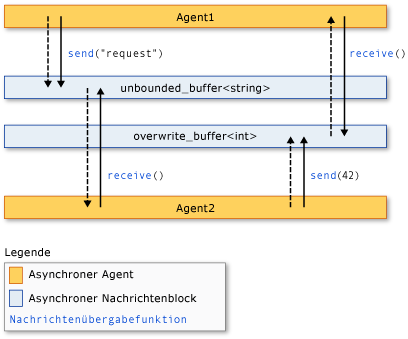

# <a name="asynchronous-agents-library"></a>Asynchronous Agents Library

Die Asynchronous Agents Library (oder nur *Agents Library*) bietet ein Programmiermodell, der sich die Stabilität der parallelitätsfähigen Anwendungsentwicklung steigern lässt. Die Agents Library ist eine C++-Vorlagenbibliothek, die ein akteurbasiertes Programmiermodell und prozessinterne Nachrichtenübergabe für undifferenzierten Datenfluss und Pipelineaufgaben begünstigt. Die Agents Library baut auf der Planung und den Ressourcenverwaltungskomponenten von der Concurrency Runtime auf.

## <a name="programming-model"></a>Programmiermodell

Die Agents Library bietet Alternativen zum Freigabezustand, indem Sie isolierte Komponenten durch ein asynchrones Kommunikationsmodell verbinden können, das auf Datenfluss anstatt auf Ablaufsteuerung basiert. *Datenfluss* verweist auf ein Programmiermodell Modell, in dem Berechnungen erstellt werden, wenn alle Daten erforderlichen, verfügbar ist. *ablaufsteuerung* bezieht sich auf ein Programmiermodell, in dem Berechnungen erstellt werden, in einer vorherbestimmten Reihenfolge.

Das Datenflussprogrammiermodell bezieht sich auf das Konzept der *Nachrichtenübergabe*, bei dem unabhängige Komponenten eines Programms miteinander kommunizieren, indem sie Nachrichten senden.

Die Agents Library besteht aus drei Komponenten: *asynchrone Agents*, *asynchrone Meldungsblöcke*, und *Meldungsübergabefunktionen*. Agents behalten den Zustand bei und verwenden Meldungsblöcke und Meldungsübergabefunktionen für die Kommunikation miteinander und mit externen Komponenten. Mit Meldungsübergabefunktionen können Agents Meldungen an die externen Komponenten senden und von diesen erhalten. Asynchrone Meldungsblöcke halten Meldungen und ermöglichen es Agents, auf synchronisierte Weise zu kommunizieren.

Aus folgender Abbildung geht hervor, wie zwei Agents mithilfe von Meldungsblöcke und Meldungsübergabefunktionen kommunizieren. In dieser Abbildung `agent1` sendet eine Nachricht an `agent2` mithilfe der [Concurrency:: Send](reference/concurrency-namespace-functions.md#send) Funktion und ein [Concurrency:: unbounded_buffer](reference/unbounded-buffer-class.md) Objekt. `agent2` verwendet die [Concurrency:: Receive](reference/concurrency-namespace-functions.md#receive) Funktion, um die Nachricht zu lesen. `agent2` verwendet dieselbe Methode, um eine Meldung an `agent1` zu senden. Gestrichelte Pfeile stellen den Datenstrom zwischen Agents dar. Ausgefüllte Pfeile verbinden die Agents mit den Meldungsblöcken, auf die sie schreiben oder von denen sie lesen.



Ein Codebeispiel, bei dem diese Abbildung implementiert wird, finden Sie weiter unten in diesem Thema.

Das Agent-Programmiermodell hat im Vergleich zu anderen Parallelitäts- und Synchronisierungsmechanismen verschiedene Vorteile wie Ereignisse. Ein Vorteil besteht darin, dass Sie durch die Verwendung der Meldungsübergabe zum Senden von Zustandsänderungen zwischen Objekten den Zugriff auf freigegebene Ressourcen isolieren und dadurch die Skalierbarkeit steigern können. Ein Vorteil der Meldungsübergabe ist, dass es die Synchronisierung an Daten bindet anstatt an ein externes Synchronisierungsobjekt. Dies vereinfacht die Datenübermittlung zwischen Komponenten und kann in den Anwendungen Programmierfehler ausschließen.

## <a name="when-to-use-the-agents-library"></a>Wann die Agents Library verwendet werden soll

Verwenden Sie die Agents Library, wenn Sie mehrere Operationen haben, die asynchron miteinander kommunizieren müssen. Durch Meldungsblöcke und Meldungsübergabefunktionen können Sie parallele Anwendungen schreiben, ohne dass dabei Synchronisierungsmechanismen wie Sperren erforderlich sind. So können Sie sich auf die Anwendungslogik konzentrieren.

Das Agent-Programmiermodell wird häufig zum Erstellen *Datenpipelines* oder *Netzwerke*. Eine Datenpipeline besteht aus einer Reihe von Komponenten, von denen jedes eine bestimmte Aufgabe ausführt, die zu einem größeren Ziel beiträgt. Jede einzelne Komponente in einer Datenflusspipeline führt Arbeiten aus, wenn sie von einer anderen Komponente eine Meldung empfängt. Das Ergebnis dieser Arbeit wird an andere Komponenten in der Pipeline oder im Netzwerk übergeben. Die Komponenten können weitere Funktionen für eine differenzierte Parallelität von anderen Bibliotheken, z. B. die [Parallel Patterns Library (PPL)](../../parallel/concrt/parallel-patterns-library-ppl.md).

## <a name="example"></a>Beispiel

Im folgenden Beispiel wird die Abbildung implementiert, die in diesem Thema bereits angezeigt wurde.

[!code-cpp[concrt-basic-agents#1](../../parallel/concrt/codesnippet/cpp/asynchronous-agents-library_1.cpp)]

Dieses Beispiel erzeugt die folgende Ausgabe:

```Output
agent1: sending request...
agent2: received 'request'.
agent2: sending response...
agent1: received '42'.
```

In den folgenden Themen wird die in diesem Beispiel verwendete Funktionalität beschrieben.

## <a name="related-topics"></a>Verwandte Themen

[Asynchrone Agents](../../parallel/concrt/asynchronous-agents.md)<br/>
Beschreibt die Rolle asynchroner Agents beim Lösen größerer Computeraufgaben.

[Asynchrone Nachrichtenblöcke](../../parallel/concrt/asynchronous-message-blocks.md)<br/>
Beschreibt die verschiedenen Meldungsblocktypen, die von der Agents Library bereitgestellt werden.

[Funktionen zum Übergeben von Nachrichten](../../parallel/concrt/message-passing-functions.md)<br/>
Beschreibt die verschiedenen Meldungsübergaberoutinen, die von der Agents Library bereitgestellt werden.

[Vorgehensweise: Implementieren verschiedener Producer-Consumer-Muster](../../parallel/concrt/how-to-implement-various-producer-consumer-patterns.md)<br/>
Beschreibt die Implementierung des Producer-Consumer-Musters in der Anwendung.

[Vorgehensweise: Bereitstellen von Arbeitsfunktionen für die call- und transformer-Klassen](../../parallel/concrt/how-to-provide-work-functions-to-the-call-and-transformer-classes.md)<br/>
Veranschaulicht verschiedene Möglichkeiten zum Bereitstellen von Arbeitsfunktionen der [Concurrency:: Call](../../parallel/concrt/reference/call-class.md) und [Concurrency:: transformer](../../parallel/concrt/reference/transformer-class.md) Klassen.

[Vorgehensweise: Verwenden von „transformer“ in einer Datenpipeline](../../parallel/concrt/how-to-use-transformer-in-a-data-pipeline.md)<br/>
Zeigt, wie die [Concurrency:: transformer](../../parallel/concrt/reference/transformer-class.md) Klasse in einer Datenpipeline.

[Vorgehensweise: Auswählen von abgeschlossenen Tasks](../../parallel/concrt/how-to-select-among-completed-tasks.md)<br/>
Zeigt, wie die [Choice](../../parallel/concrt/reference/choice-class.md) und [Concurrency:: Join](../../parallel/concrt/reference/join-class.md) Klassen, die erste Aufgabe zum Abschließen eines Suchalgorithmus auszuwählen.

[Vorgehensweise: Senden einer Nachricht in regelmäßigen Intervallen](../../parallel/concrt/how-to-send-a-message-at-a-regular-interval.md)<br/>
Zeigt, wie die [Concurrency:: Timer](../../parallel/concrt/reference/timer-class.md) Klasse, um eine Nachricht in regelmäßigen Abständen zu senden.

[Vorgehensweise: Verwenden eines Nachrichtenblockfilters](../../parallel/concrt/how-to-use-a-message-block-filter.md)<br/>
Veranschaulicht die Verwendung eines Filters, um einem asynchronen Nachrichtenblock das Annehmen oder Ablehnen von Nachrichten zu ermöglichen.

[Parallel Patterns Library (PPL)](../../parallel/concrt/parallel-patterns-library-ppl.md)<br/>
Beschreibt, wie verschiedene parallele Muster wie parallele Algorithmen in den Anwendungen verwendet werden.

[Concurrency Runtime](../../parallel/concrt/concurrency-runtime.md)<br/>
Beschreibt die Concurrency Runtime, die die parallele Programmierung vereinfacht, und stellt Links zu verwandten Themen bereit.
