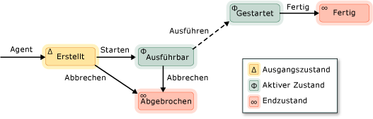

# Asynchrone Agents

Ein *asynchroner Agent* (oder nur *Agent*) ist eine Anwendungskomponente, die asynchron arbeitet mit anderen Agents aus, um größere Rechenaufgaben zu lösen. Stellen Sie sich ein Agent als eine Aufgabe, die einen festgelegten Lebenszyklus hat. Ein Agent kann beispielsweise lesen, Daten aus einem e/a-Gerät (z. B. der Tastatur, eine Datei auf dem Datenträger oder eine Netzwerkverbindung) und ein anderer Agent Aktion für diese Daten ausführen können, sobald diese verfügbar werden. Der erste Agent verwendet Meldungsübergabe, um dem zweiten Agent darüber zu informieren, dass mehr Daten verfügbar ist. Die Concurrency Runtime-Aufgabenplaner stellt einen effizienten Mechanismus zum Aktivieren von Agents zum Blockieren und Zurückhalten kooperativ ohne die vorzeitige Entfernung weniger effizient.

Die Agents Library definiert die [Concurrency:: Agent](../../parallel/concrt/reference/agent-class.md) Klasse, um die Darstellung eines asynchronen Agents. `agent` ist eine abstrakte Klasse, die die virtuelle Methode deklariert [Concurrency::agent::run](reference/agent-class.md#run). Die `run` -Methode führt die Aufgabe, die vom Agent ausgeführt wird. Da `run` ist abstrakt, müssen Sie diese Methode in jeder Klasse, die Sie eine Ableitung aus implementieren `agent`.

## Lebenszyklus von Agents

Agents besitzen einen festgelegten Lebenszyklus. Die [concurrency::agent_status](reference/concurrency-namespace-enums.md#agent_status) Enumeration definiert die verschiedenen Zustände eines Agents. In der folgende Abbildung ist ein Zustandsdiagramm, das zeigt, wie die Agents von einem Zustand in einen anderen übergehen. In dieser Abbildung darstellen durchgezogene Linien für Methoden, die von Ihrer Anwendung aufgerufen werden; gepunktete Linien stellen die Methoden, die von der Laufzeit aufgerufen werden.

Die folgende Tabelle beschreibt die einzelnen Status in der `agent_status` Enumeration.

|Agent-Status|Beschreibung|
|-----------------|-----------------|
|`agent_created`|Der Agent wurde nicht für die Ausführung geplant.|
|`agent_runnable`|Die Runtime ist die Planung des Agents für die Ausführung.|
|`agent_started`|Der Agent wurde gestartet und ausgeführt wird.|
|`agent_done`|Der Agent wurde beendet.|
|`agent_canceled`|Der Agent wurde abgebrochen, bevor sie eingegeben haben die `started` Zustand.|

`agent_created` ist der anfängliche Status eines Agents, `agent_runnable` und `agent_started` werden die aktiven Zustände und `agent_done` und `agent_canceled` sind die Endzustände.

Verwenden der [Concurrency::agent::status](reference/agent-class.md#status) Methode zum Abrufen des aktuellen Status einer `agent` Objekt. Obwohl die `status` Methode ist nebenläufigkeitssicher, der Status des Agents kann ändern, indem Sie die Zeit der `status` Methodenrückgabe. Z. B. möglicherweise ein Agent in der `agent_started` Zustand beim Aufrufen der `status` -Methode, jedoch verschoben werden, um die `agent_done` direkt nach Status der `status` Methodenrückgabe.

## Methoden und Funktionen

Die folgende Tabelle zeigt einige der wichtigen Methoden, die zu gehören die `agent` Klasse. Weitere Informationen zu allen dem `agent` -Klassenmethoden, finden Sie unter [Agent-Klasse](../../parallel/concrt/reference/agent-class.md).

|Methode|Beschreibung|
|------------|-----------------|
|[start](reference/agent-class.md#start)|Zeitpläne die `agent` Objekt für die Ausführung und legt es auf die `agent_runnable` Zustand.|
|[run](reference/agent-class.md#run)|Führt die Aufgabe, die von ausgeführt wird, die die `agent` Objekt.|
|[done](reference/agent-class.md#done)|Verschiebt einen Agent für die die `agent_done` Zustand.|
|[cancel](../../parallel/concrt/cancellation-in-the-ppl.md#cancel)|Wenn der Agent nicht gestartet wurde, wird diese Methode bricht die Ausführung des Agents ab und legt es auf die `agent_canceled` Zustand.|
|[Status](reference/agent-class.md#status)|Ruft den aktuellen Zustand der `agent` Objekt.|
|[wait](reference/agent-class.md#wait)|Wartet darauf, dass die `agent` Objekt eingeben der `agent_done` oder `agent_canceled` Zustand.|
|[wait_for_all](reference/agent-class.md#wait_for_all)|Wartet, bis alle bereitgestellten `agent` Objekte zur Eingabe der `agent_done` oder `agent_canceled` Zustand.|
|[wait_for_one](reference/agent-class.md#wait_for_one)|Wartet darauf, dass mindestens eines der bereitgestellten `agent` Objekte zur Eingabe der `agent_done` oder `agent_canceled` Zustand.|

Nachdem Sie ein Agent-Objekt erstellen, rufen die [Verwaltungsroutinen](reference/agent-class.md#start) Methode, um ihn für die Ausführung planen. Ruft die Laufzeit die `run` Methode nach der Planung des Agents und wird auf die `agent_runnable` Zustand.

Die Common Language Runtime verwaltet keine Ausnahmen, die von asynchronen Agents ausgelöst werden. Weitere Informationen zur Behandlung von Ausnahmen und Agents finden Sie unter [Exception Handling](../../parallel/concrt/exception-handling-in-the-concurrency-runtime.md).

## Beispiel

Ein Beispiel, das Erstellen einer einfachen agentbasierten Anwendung veranschaulicht, finden Sie unter [Exemplarische Vorgehensweise: Erstellen einer agentbasierten Anwendung](../../parallel/concrt/walkthrough-creating-an-agent-based-application.md).

## Siehe auch

[Asynchrone Agents Library](../../parallel/concrt/asynchronous-agents-library.md)
