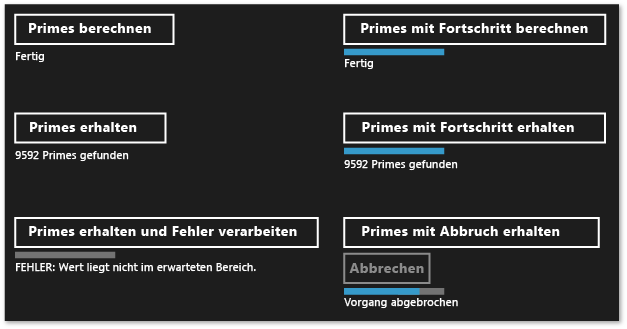
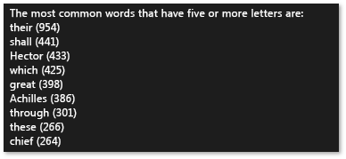

# Erstellen von asynchronen Vorgängen in C++ für uwp-Apps
Dieses Dokument beschreibt einige der wichtigsten Punkte zu bedenken, wenn Sie die Task-Klasse verwenden, um Windows-ThreadPool-basierte asynchrone Vorgänge in einer app (Universelle Windows Runtime) zu erzeugen.  
  
 Die Verwendung der asynchronen Programmierung ist eine zentrale Komponente der Windows-Runtime-app-Modell, weil dadurch von apps auf Benutzereingaben reaktionsfähig bleibt. Sie können eine lang dauernde Aufgabe starten, ohne den Benutzeroberflächenthread zu blockieren, und die Ergebnisse der Aufgabe später empfangen. Sie können Aufgaben auch abbrechen und Statusbenachrichtigungen beim Ausführen von Aufgaben im Hintergrund erhalten. Das Dokument [asynchrone Programmierung in C++](/windows/uwp/threading-async/asynchronous-programming-in-cpp-universal-windows-platform-apps) bietet eine Übersicht über das asynchrone Muster, das in Visual C++ zum Erstellen von uwp-apps verfügbar ist. Dieses Dokument erfahren, wie sowohl nutzen, und Erstellen von Ketten asynchroner Windows-Runtime-Vorgänge. In diesem Abschnitt wird beschrieben, wie die Typen in "ppltasks.h" verwenden, um asynchrone Vorgänge zu erstellen, die von einer anderen Windows-Runtime-Komponente genutzt werden können und wie asynchroner Arbeit gesteuert wird ausgeführt. Außerdem können Sie sich [asynchrone Programmierung Muster und Tipps in Hilo (Windows Store-apps mit C++ und XAML)](http://msdn.microsoft.com/library/windows/apps/jj160321.aspx) , darüber informieren, wie die Task-Klasse zum Implementieren asynchroner Vorgänge in Hilo, einer Windows-Runtime-app mit C++ und XAML.  
  
> [!NOTE]
>  Sie können die [Parallel Patterns Library](../../parallel/concrt/parallel-patterns-library-ppl.md) (PPL) und [Asynchronous Agents Library](../../parallel/concrt/asynchronous-agents-library.md) in einer uwp-app. Aufgabenplaner oder Ressourcen-Manager können jedoch nicht verwendet werden. Dieses Dokument beschreibt weitere Funktionen, die die PPL bietet, die nur zu einer uwp-app, und nicht auf einem desktop-app verfügbar sind.  
  
## Wesentliche Punkte  

-   Erstellen Sie mithilfe von [concurrency::create_async](reference/concurrency-namespace-functions.md#create_async) asynchrone Vorgänge, die von anderen Komponenten genutzt werden können (die möglicherweise in einer anderen Sprache als C++ geschrieben sind).  

  
-   Verwenden Sie [concurrency::progress_reporter](../../parallel/concrt/reference/progress-reporter-class.md) zum Übermitteln von Statusbenachrichtigungen an Komponenten, von denen die asynchronen Vorgänge aufgerufen werden.  
  
-   Mithilfe von Abbruchtoken können interne asynchrone Vorgänge abgebrochen werden.  
  
-   Das Verhalten der `create_async` -Funktion hängt vom Rückgabetyp der daran übergebenen Arbeitsfunktion ab. Eine Arbeitsfunktion, die eine Aufgabe zurückgibt (entweder `task<T>` oder `task<void>`) oder synchron in dem Kontext ausgeführt wird, in dem `create_async`aufgerufen wurde. Eine Arbeitsfunktion, die `T` oder `void` zurückgibt, wird in einem die oft ausgegebene Befehlszeilen  Kontext ausgeführt.  
  
-   Mithilfe der [concurrency::task::then](reference/task-class.md#then) -Methode können Sie eine Kette von Aufgaben erstellen, die nacheinander ausgeführt werden. In einer uwp-app hängt der Standardkontext für die Fortsetzungen einer Aufgabe wie diese Aufgabe erstellt wurde. Wenn die Aufgabe durch Übergabe einer asynchronen Aktion an den Aufgabenkonstruktor oder durch Übergabe eines Lambda-Ausdrucks erstellt wurde, der eine asynchrone Aktion zurückgibt, handelt es sich beim Standardkontext für alle Fortsetzungen dieser Aufgabe um den aktuellen Kontext. Wenn die Aufgabe nicht durch eine asynchrone Aktion erstellt wird, wird für die Fortsetzungen der Aufgabe standardmäßig ein beliebiger Kontext verwendet. Sie können den Standardkontext mit der [concurrency::task_continuation_context](../../parallel/concrt/reference/task-continuation-context-class.md) -Klasse überschreiben.  

  
## Inhalt dieses Dokuments  
  
-   [Erstellen von asynchronen Operationen](#create-async)  
  
-   [Beispiel: Erstellen einer C++-Komponente für Windows-Runtime](#example-component)  
  
-   [Steuern des Ausführungs-Threads](#exethread)  
  
-   [Beispiel: Steuern der Ausführung in einer Windows-Runtime-App mit C++ und XAML](#example-app)  
  
##   Erstellen von asynchronen Operationen  
 Sie können das Aufgaben- und Fortsetzungsmodell in der Parallel Patterns Library (PPL) verwenden, um Hintergrundaufgaben sowie zusätzliche Aufgaben zu definieren, die nach Abschluss der vorherigen Aufgabe ausgeführt werden sollen. Diese Funktionalität wird von der [concurrency::task](../../parallel/concrt/reference/task-class.md) -Klasse bereitgestellt. Weitere Informationen zu diesem Modell und der `task` -Klasse finden Sie unter [Task Parallelism](../../parallel/concrt/task-parallelism-concurrency-runtime.md)aufgerufen wurde.  
  
 Windows-Runtime ist eine Programmierschnittstelle, die mit uwp-apps erstellen, die nur in einer bestimmten betriebssystemumgebung ausgeführt werden können. Solche apps verwenden autorisierte Funktionen, Datentypen und Geräte und von Microsoft Store verteilt werden. Windows-Runtime wird dargestellt, indem die *Application Binary Interface* (ABI). Die ABI ist ein zugrunde liegender binärer Vertrag, der Windows-Runtime-APIs für Programmiersprachen wie Visual C++ verfügbar macht.  
  
 Mithilfe der Windows-Runtime zu verwenden, können Sie die besten Funktionen verschiedener Programmiersprachen verwenden und in einer app kombinieren. Beispielsweise können Sie die Benutzeroberfläche in JavaScript erstellen und die rechenintensive App-Logik in einer C++-Komponente ausführen. Die Fähigkeit, diese rechenintensiven Vorgänge im Hintergrund auszuführen, ist ein Schlüsselfaktor dafür, die Benutzeroberfläche reaktionsfähig zu halten. Da die `task` Klasse C++-spezifisch ist, müssen Sie eine Windows-Runtime-Schnittstelle verwenden, um asynchrone Vorgänge an andere Komponenten zu übergeben (die in anderen Sprachen als C++ geschrieben sind). Windows-Runtime stellt vier Schnittstellen, die Sie verwenden können, um asynchrone Vorgänge dargestellt:  
  
 [Windows::Foundation::IAsyncAction](http://msdn.microsoft.com/library/windows/apps/windows.foundation.iasyncaction.aspx)  
 Stellt eine asynchrone Aktion dar.  
  
 [Windows::Foundation::IAsyncActionWithProgress\<TProgress>](http://msdn.microsoft.com/library/windows/apps/br206581.aspx)  
 Stellt eine asynchrone Aktion für Statusbenachrichtigungen dar.  
  
 [Windows::Foundation::IAsyncOperation\<TResult>](http://msdn.microsoft.com/library/windows/apps/br206598.aspx)  
 Stellt einen asynchronen Vorgang dar, der ein Ergebnis zurückgibt.  
  
 [Windows::Foundation::IAsyncOperationWithProgress\<TResult, TProgress>](http://msdn.microsoft.com/library/windows/apps/br206594.aspx)  
 Stellt einen asynchronen Vorgang dar, der ein Ergebnis zurückgibt und den Status meldet.  
  
 Der Begriff *Aktion* bedeutet, dass die asynchrone Aufgabe keinen Wert generiert (denken Sie an eine Funktion, die `void`zurückgibt). Der Begriff *Vorgang* bedeutet, dass die asynchrone Aufgabe einen Wert generiert. Der Begriff *Status* bedeutet, dass die Aufgabe Statusbenachrichtigungen an den Aufrufer übermitteln kann. JavaScript, .NET Framework und Visual C++ bieten jeweils eine eigene Möglichkeit zum Erstellen von Instanzen dieser Schnittstellen zur ABI-übergreifenden Verwendung. Für Visual C++ stellt die PPL die [concurrency::create_async](reference/concurrency-namespace-functions.md#create_async) -Funktion bereit. Diese Funktion erstellt eine Windows-Runtime asynchrone Aktion bzw. einen Vorgang, der den Abschluss einer Aufgabe darstellt. Die `create_async` -Funktion akzeptiert eine Arbeitsfunktion (in der Regel einen Lambdaausdruck), erstellt intern ein `task` -Objekt und umschließt diese Aufgabe in einem der vier asynchronen Windows-Runtime-Schnittstellen mit.  
  
> [!NOTE]
>  Verwendung `create_async` nur wenn unbedingt notwendig Funktionalität erstellen, die von einer anderen Sprache oder eine andere Windows-Runtime-Komponente zugegriffen werden kann. Verwenden Sie die `task` -Klasse direkt, wenn Sie wissen, dass der Vorgang von C++-Code in der gleichen Komponente sowohl erstellt als auch genutzt wird.  
  
 Der Rückgabetyp von `create_async` wird durch den Typ der Argumente bestimmt. Wenn z. B. die Arbeitsfunktion weder einen Wert zurückgibt und noch den Status meldet, wird von `create_async` eine `IAsyncAction`zurückgegeben. Wenn die Arbeitsfunktion keinen Wert zurückgibt, jedoch den Status meldet, wird von `create_async` eine `IAsyncActionWithProgress`zurückgegeben. Stellen Sie für Statusmeldungen ein [concurrency::progress_reporter](../../parallel/concrt/reference/progress-reporter-class.md) -Objekt als Parameter der Arbeitsfunktion bereit. Durch Statusbenachrichtigungen kann gemeldet werden, wie viel Arbeit bereits erledigt wurde und wie viel noch verbleibt (beispielsweise als Prozentsatz). Zudem können Ergebnisse gemeldet werden, sobald sie verfügbar sind.  
  
 Die `IAsyncAction`-, `IAsyncActionWithProgress<TProgress>`-, `IAsyncOperation<TResult>`- und `IAsyncActionOperationWithProgress<TProgress, TProgress>` -Schnittstellen bieten jeweils eine `Cancel` -Methode, die das Abbrechen des asynchronen Vorgangs ermöglicht. Die `task` -Klasse verwendet Abbruchtoken. Wenn Sie Arbeit mithilfe eines Abbruchtokens abbrechen, wird von der Runtime keine neue Verarbeitung gestartet, die dieses Token abonniert. Für eine bereits aktive Verarbeitung kann das entsprechende Abbruchtoken überwacht und die Verarbeitung zum angegebenen Zeitpunkt beendet werden. Im Dokument [Cancellation in the PPL](cancellation-in-the-ppl.md)wird dieser Mechanismus ausführlich beschrieben. Sie können den Aufgabenabbruch mit den Windows-Runtime verbinden`Cancel` Methoden auf zwei Arten. Die erste Möglichkeit besteht darin, die an `create_async` zu übergebende Arbeitsfunktion so zu definieren, dass diese ein [concurrency::cancellation_token](../../parallel/concrt/reference/cancellation-token-class.md) -Objekt akzeptiert. Beim Aufrufen der `Cancel` -Methode wird dieses Abbruchtoken abgebrochen, und für das zugrunde liegende `task` -Objekt, das den `create_async` -Aufruf unterstützt, gelten die normale Abbruchregeln. Wenn Sie kein `cancellation_token` -Objekt bereitstellen, wird dieses vom zugrunde liegenden `task` -Objekt implizit definiert. Definieren Sie ein `cancellation_token` -Objekt, wenn auf Abbrüche in der Arbeitsfunktion kooperativ reagiert werden muss. Der Abschnitt [Beispiel: Steuern der Ausführung in einer Windows-Runtime-App mit C++ und XAML-](#example-app) zeigt ein Beispiel zum Ausführen von Abbrüchen in einer universellen Windows-Plattform (UWP)-app mit c# und XAML, die eine benutzerdefinierte Windows Runtime C++ verwendet von Komponente.  
  
> [!WARNING]
>  In einer Kette von Aufgabenfortsetzungen sollte stets der Zustand bereinigt und anschließend [concurrency::cancel_current_task](reference/concurrency-namespace-functions.md#cancel_current_task) aufgerufen werden, wenn das Abbruchtoken abgebrochen wird. Wenn Sie frühzeitig zurückkehren, anstatt `cancel_current_task`aufzurufen, geht der Vorgang in den Zustand "Abgeschlossen" anstelle von "Abgebrochen" über.  

  
 In der folgenden Tabelle werden die Kombinationen zusammengefasst, die Sie zum Definieren asynchroner Vorgänge in Ihrer App verwenden können.  
  
|So erstellen diese Windows-Runtime-Schnittstelle|Rückgabe dieses `create_async`-Typs|Übergabe dieser Parametertypen an die Arbeitsfunktion zur Verwendung als implizites Abbruchtoken|Übergabe dieser Parametertypen an die Arbeitsfunktion zur Verwendung als explizites Abbruchtoken|  
|----------------------------------------------------------------------------------|------------------------------------------|--------------------------------------------------------------------------------------------|--------------------------------------------------------------------------------------------|  
|`IAsyncAction`|`void` oder `task<void>`|(keine)|(`cancellation_token`)|  
|`IAsyncActionWithProgress<TProgress>`|`void` oder `task<void>`|(`progress_reporter`)|(`progress_reporter`, `cancellation_token`)|  
|`IAsyncOperation<TResult>`|`T` oder `task<T>`|(keine)|(`cancellation_token`)|  
|`IAsyncActionOperationWithProgress<TProgress, TProgress>`|`T` oder `task<T>`|(`progress_reporter`)|(`progress_reporter`, `cancellation_token`)|  
  
 Bei der Rückgabe kann es sich um einen Wert oder ein `task` -Objekt handeln, dass von der an die `create_async` -Funktion übergebenen Arbeitsfunktion zurückgeben wird. Diese Unterschiede führen zu verschiedenen Verhalten. Bei Rückgabe eines Werts wird die Arbeitsfunktion zur Ausführung auf einem Hintergrundthread mit `task` umschlossen. Zudem wird von der zugrunde liegenden `task` ein implizites Abbruchtoken verwendet. Umgekehrt wird die Arbeitsfunktion bei Rückgabe eines `task` -Objekts synchron ausgeführt. Stellen Sie daher beim Zurückgeben eines `task` -Objekts sicher, dass alle längeren Vorgänge in der Arbeitsfunktion auch als Aufgaben ausgeführt werden, damit die App reaktionsfähig bleiben kann. Zudem wird von der zugrunde liegenden `task` kein implizites Abbruchtoken verwendet. Daher müssen Sie die Arbeitsfunktion so definieren, dass diese ein `cancellation_token` -Objekt akzeptiert, falls bei der Rückgabe eines `task` -Objekts durch `create_async`Abbruchunterstützung erforderlich ist.  
  
 Das folgende Beispiel zeigt die verschiedenen Methoden zum Erstellen einer `IAsyncAction` -Objekt, das von einer anderen Windows-Runtime-Komponente genutzt werden kann.  
  
 [!code-cpp[concrt-windowsstore-primes#100](../../parallel/concrt/codesnippet/cpp/creating-asynchronous-operations-in-cpp-for-windows-store-apps_1.cpp)]  
  
##   Beispiel: Erstellen einer C++ Windows-Runtime-Komponente und ihre Verwendung von C# aus  
 Erwägen Sie eine app, die XAML und c# zum Definieren der Benutzeroberfläche und eine C++-Windows-Runtime-Komponente verwendet, um rechenintensive Vorgänge auszuführen. In diesem Beispiel wird von der C++-Komponente berechnet, bei welchen Zahlen in einem angegebenen Bereich es sich um Primzahlen handelt. Um die Unterschiede zwischen den vier Windows-Runtime asynchrone Aufgabe Schnittstellen zu veranschaulichen, in Visual Studio erstellen zunächst ein **leere Projektmappe** und nennen Sie es `Primes`. Fügen Sie der Projektmappe dann ein Projekt für **Windows-Runtime-Komponente** hinzu, und nennen Sie es `PrimesLibrary`. Fügen Sie der generierten C++-Headerdatei folgenden Code hinzu (in diesem Beispiel wird "Class1.h" in "Primes.h" umbenannt). Jede `public` -Methode definiert eine der vier asynchronen Schnittstellen. Die Methoden, die einen Wert zurückgeben Zurückgeben einer [Windows::Foundation::Collections::IVector\<Int >](http://msdn.microsoft.com/library/windows/apps/br206631.aspx) Objekt. Die den Status meldenden Methoden generieren `double` -Werte, die den Prozentsatz der abgeschlossenen Gesamtarbeit definieren.  
  
 [!code-cpp[concrt-windowsstore-primes#1](../../parallel/concrt/codesnippet/cpp/creating-asynchronous-operations-in-cpp-for-windows-store-apps_2.h)]  
  
> [!NOTE]
>  Gemäß der Konvention enden die Namen von asynchronen Methoden in Windows-Runtime in der Regel mit "Async".  
  
 Fügen Sie der generierten C++-Quelldatei folgenden Code hinzu (in diesem Beispiel wird "Class1.cpp" in "Primes.cpp" umbenannt). Mit der `is_prime` -Funktion wird ermittelt, ob es sich bei der Eingabe um eine Primzahl handelt. Mit den verbleibenden Methoden wird die `Primes` -Klasse implementiert. Für jeden Aufruf von `create_async` wird eine mit der aufrufenden Methode kompatible Signatur verwendet. Da von `Primes::ComputePrimesAsync` beispielsweise `IAsyncAction`zurückgegeben wird, gibt die für `create_async` bereitgestellte Arbeitsfunktion keinen Wert zurück und akzeptiert kein `progress_reporter` -Objekt als Parameter.  
  
 [!code-cpp[concrt-windowsstore-primes#2](../../parallel/concrt/codesnippet/cpp/creating-asynchronous-operations-in-cpp-for-windows-store-apps_3.cpp)]  
  
 Jede Methode führt zuerst eine Validierung aus, um sicherzustellen, dass die Eingabeparameter nicht negativ sind. Im Fall eines negativen Eingabewerts wird von der Methode [Platform::InvalidArgumentException](http://msdn.microsoft.com/library/windows/apps/hh755794\(v=vs.110\).aspx)ausgelöst. Die Fehlerbehandlung wird weiter unten in diesem Abschnitt erläutert.  
  
 Um diese Methoden aus einer uwp-app zu nutzen, verwenden Sie die Visual C#- **leere App (XAML)** Vorlage, die Visual Studio-Projektmappe ein zweites Projekt hinzu. In diesem Beispiel wird das Projekt `Primes`genannt. Fügen Sie anschließend im Projekt `Primes` einen Verweis auf das Projekt `PrimesLibrary` hinzu.  
  
 Fügen Sie "MainPage.xaml" den folgenden Code hinzu. Durch diesen Code wird die Benutzeroberfläche definiert, damit Sie die C++-Komponente aufrufen und Ergebnisse anzeigen können.  
  
 [!code-xml[concrt-windowsstore-primes#3](../../parallel/concrt/codesnippet/xaml/creating-asynchronous-operations-in-cpp-for-windows-store-apps_4.xaml)]  
  
 Fügen Sie der `MainPage` -Klasse in "MainPage.xaml" den folgenden Code hinzu. Durch diesen Code werden ein `Primes` -Objekt und die Ereignishandler für Schaltflächen definiert.  
  
 [!code-cs[concrt-windowsstore-primes#4](../../parallel/concrt/codesnippet/csharp/creating-asynchronous-operations-in-cpp-for-windows-store-apps_5.cs)]  
  
 Von diesen Methoden wird mithilfe des `async` -Schlüsselworts und des `await` -Schlüsselworts die Benutzeroberfläche aktualisiert, nachdem die asynchronen Vorgänge abgeschlossen wurden. Informationen zum asynchronen Schreiben von Code in uwp-apps finden Sie unter [Threading und die asynchrone Programmierung](/windows/uwp/threading-async).  
  
 Die `getPrimesCancellation` -Methode und die `cancelGetPrimes` -Methode werden zusammen verwendet, damit der Benutzer den Vorgang abbrechen kann. Wenn der Benutzer wählt die **"Abbrechen"** Schaltfläche, die `cancelGetPrimes` Methodenaufrufe [IAsyncOperationWithProgress\<TResult, TProgress >:: "Abbrechen"](http://msdn.microsoft.com/library/windows/apps/windows.foundation.iasyncinfo.cancel.aspx) um den Vorgang abzubrechen. Die Concurrency Runtime, die den zugrunde liegenden asynchronen Vorgang verwaltet, löst einen internen Ausnahmetyp, der von der Windows-Runtime mitzuteilen, dass Abbruchvorgangs abgefangen wurde. Weitere Informationen zum Abbruchmodell finden Sie unter [Abbruch](../../parallel/concrt/cancellation-in-the-ppl.md).  
  
> [!IMPORTANT]
>  Damit kann die PPL ordnungsgemäß Windows-Runtime Berichten, dass sie den Vorgang abgebrochen wurde, fangen Sie nicht diesen internen Ausnahmetyp. Dies bedeutet auch, dass nicht alle Ausnahmen abgefangen werden sollten(`catch (...)`). Wenn Sie alle abfangen müssen Ausnahmen erneut ausgelöst, die Ausnahme aus, um sicherzustellen, dass die Windows-Runtime der Abbruchvorgang abgeschlossen werden kann.  
  
 In der folgenden Abbildung wird die `Primes` -App nach Auswahl aller Optionen dargestellt.  
  
   
  
 Beispiele für das Verwenden von `create_async` zum Erstellen asynchroner Aufgaben, die von anderen Sprachen genutzt werden können, finden Sie unter [Verwenden von C++ im Beispiel zum Reise-Optimierer von Bing Maps](http://msdn.microsoft.com/library/windows/apps/hh699891\(v=vs.110\).aspx) und [Windows 8 Asynchronous Operations in C++ with PPL](http://code.msdn.microsoft.com/windowsapps/windows-8-asynchronous-08009a0d)(Asynchrone Vorgänge unter Windows 8 in C++ mit PPL).  
  
##   Steuern des Ausführungs-Threads  
 Windows-Runtime verwendet die COM-Threadingmodell. In diesem Modell werden Objekte in unterschiedlichen Apartments gehostet, abhängig von der jeweiligen Synchronisierungsmethode. Threadsichere Objekte werden im Multithread-Apartment (MTA) gehostet. Objekte, auf die von einem einzelnen Thread zugegriffen werden muss, werden in einem Singlethread-Apartment (STA) gehostet.  
  
 In einer App mit Benutzeroberfläche ist der ASTA (Application STA)-Thread für das Verschieben von Fenstermeldungen zuständig und ist der einzige Thread im Prozess, von dem die STA-gehosteten UI-Steuerelemente aktualisiert werden können. Dies hat zwei Auswirkungen. Erstens sollten alle CPU-intensiven und E/A-Vorgänge nicht im ASTA-Thread ausgeführt werden, damit die App reaktionsfähig bleibt. Zweitens müssen von Hintergrundthreads stammende Ergebnisse zurück in das ASTA gemarshallt werden, um die Benutzeroberfläche zu aktualisieren. In einer C++-UWP-app `MainPage` und alle anderen XAML-Seiten im ASTA ausgeführt. Daher werden im ASTA deklarierte Aufgabenfortsetzungen standardmäßig dort ausgeführt, sodass Steuerelemente direkt im Fortsetzungstext aktualisiert werden können. Wenn Sie jedoch eine Aufgabe in einer anderen Aufgabe schachteln, werden alle Fortsetzungen dieser geschachtelten Aufgabe im MTA ausgeführt. Daher sollten Sie berücksichtigen, ob der Ausführungskontext dieser Fortsetzungen explizit angegeben werden muss.  
  
 Dank einer besonderen Semantik können die Threaddetails bei durch einen asynchronen Vorgang wie `IAsyncOperation<TResult>`erstellten Aufgaben ignoriert werden. Obwohl ein Vorgang möglicherweise in einem Hintergrundthread ausgeführt wird (oder überhaupt nicht von einem Thread unterstützt wird), erfolgen dessen Fortsetzungen in jedem Fall standardmäßig in dem Apartment, von dem die Fortsetzungsvorgänge gestartet wurden (d. h. im Apartment, von dem `task::then`aufgerufen wurde). Mithilfe der [concurrency::task_continuation_context](../../parallel/concrt/reference/task-continuation-context-class.md) -Klasse kann der Ausführungskontext einer Fortsetzung gesteuert werden. Verwenden Sie zum Erstellen von `task_continuation_context` -Objekten die folgenden statischen Hilfsmethoden:  
  
-   Mithilfe von [concurrency::task_continuation_context::use_arbitrary](reference/task-continuation-context-class.md#use_arbitrary) geben Sie an, dass die Fortsetzung in einem Hintergrundthread ausgeführt wird.  
  
-   Mithilfe von [concurrency::task_continuation_context::use_current](reference/task-continuation-context-class.md#use_current) geben Sie an, dass die Fortsetzung in dem Thread ausgeführt wird, von dem `task::then`aufgerufen wurde.  

  
 Sie können der `task_continuation_context` task::then [-Methode ein](reference/task-class.md#then) -Objekt übergeben, um den Ausführungskontext der Fortsetzung explizit zu steuern. Alternativ können Sie die Aufgabe an ein anderes Apartment übergeben und dann die `task::then` -Methode aufrufen, um den Ausführungskontext implizit zu steuern.  
  
> [!IMPORTANT]
>  Da der Hauptbenutzeroberflächen-Thread von uwp-apps, die im STA ausgeführt werden, Fortsetzungen, die Sie in diesem STA, wird standardmäßig erstellen im STA ausgeführt. Entsprechend werden im MTA erstellte Fortsetzungen auch im MTA ausgeführt.  
  
 Im folgenden Abschnitt wird eine App dargestellt, die eine Datei auf dem Datenträger liest, die häufigsten Wörter in dieser Datei sucht und die Ergebnisse anschließend auf der Benutzeroberfläche anzeigt. Der letzte Vorgang (die Aktualisierung der Benutzeroberfläche) erfolgt im UI-Thread.  
  
> [!IMPORTANT]
>  Dieses Verhalten ist spezifisch für uwp-apps. Bei Desktop-Apps wird die Ausführung von Fortsetzungen nicht von Ihnen gesteuert. Stattdessen wird vom Planer ein Arbeitsthread zur Ausführung der einzelnen Fortsetzungen ausgewählt.  
  
> [!IMPORTANT]

>  Rufen Sie nicht [concurrency::task::wait](reference/task-class.md#wait) im Text einer Fortsetzung auf, die im STA ausgeführt wird. Andernfalls löst die Laufzeit [concurrency::invalid_operation](../../parallel/concrt/reference/invalid-operation-class.md) aus, da diese Methode den aktuellen Thread blockiert und die App dadurch möglicherweise nicht mehr reagiert. Sie können jedoch die [concurrency::task::get](reference/task-class.md#get) -Methode aufrufen, um das Ergebnis der Vorgängeraufgabe in einer aufgabenbasierten Fortsetzung zu erhalten.  
  
##   Beispiel: Steuern der Ausführung in einer Windows-Runtime-App mit C++ und XAML  
 Betrachten Sie eine App mit C++ und XAML, die eine Datei auf dem Datenträger liest, die häufigsten Wörter in dieser Datei sucht und die Ergebnisse anschließend auf der Benutzeroberfläche anzeigt. Um diese app zu erstellen, in Visual Studio erstellen zunächst ein **leere App (universelle Windows)** -Projekt und nennen dieses `CommonWords`. Geben Sie im App-Manifest die **Dokumentbibliothek** -Funktion an, damit die App auf den Ordner "Dokumente" zugreifen kann. Fügen Sie im Deklarationsabschnitt des App-Manifests außerdem den Textdateityp (.txt) hinzu. Weitere Informationen zu App-Funktionen und -Deklarationen finden Sie unter [App-Pakete und -Bereitstellung](http://msdn.microsoft.com/library/windows/apps/hh464929.aspx).  
  
 Aktualisieren Sie in "MainPage.xaml" das `Grid` -Element mit einem `ProgressRing` -Element und einem `TextBlock` -Element. `ProgressRing` gibt an, dass der Vorgang ausgeführt wird, und `TextBlock` zeigt die Ergebnisse der Berechnung an.  
  
 [!code-xml[concrt-windowsstore-commonwords#1](../../parallel/concrt/codesnippet/xaml/creating-asynchronous-operations-in-cpp-for-windows-store-apps_6.xaml)]  
  
 Fügen Sie "pch.h" die folgenden `#include` -Anweisungen hinzu.  
  
 [!code-cpp[concrt-windowsstore-commonwords#2](../../parallel/concrt/codesnippet/cpp/creating-asynchronous-operations-in-cpp-for-windows-store-apps_7.h)]  
  
 Fügen Sie der `MainPage` -Klasse ("MainPage.h") die folgenden Methodendeklarationen hinzu.  
  
 [!code-cpp[concrt-windowsstore-commonwords#3](../../parallel/concrt/codesnippet/cpp/creating-asynchronous-operations-in-cpp-for-windows-store-apps_8.h)]  
  
 Fügen Sie "MainPage.cpp" die folgenden `using` -Anweisungen hinzu.  
  
 [!code-cpp[concrt-windowsstore-commonwords#4](../../parallel/concrt/codesnippet/cpp/creating-asynchronous-operations-in-cpp-for-windows-store-apps_9.cpp)]  
  
 Implementieren Sie in "MainPage.cpp" die Methoden `MainPage::MakeWordList`, `MainPage::FindCommonWords`und `MainPage::ShowResults` . Von `MainPage::MakeWordList` und `MainPage::FindCommonWords` werden rechenintensive Vorgänge ausgeführt. Von der `MainPage::ShowResults` -Methode wird das Ergebnis der Berechnung auf der Benutzeroberfläche angezeigt.  
  
 [!code-cpp[concrt-windowsstore-commonwords#5](../../parallel/concrt/codesnippet/cpp/creating-asynchronous-operations-in-cpp-for-windows-store-apps_10.cpp)]  
  
 Ändern Sie den `MainPage` -Konstruktor, um eine Kette von Fortsetzungsaufgaben zu erstellen, von denen häufige Wörter im Buch *Die Ilias* von Homer auf der Benutzeroberfläche angezeigt werden. Die ersten beiden Fortsetzungsaufgaben, von denen der Text in einzelne Wörter unterteilt und nach häufigen Wörtern durchsucht wird, können zeitaufwändig sein. Daher wird für diese Aufgaben explizit die Ausführung im Hintergrund festgelegt. Für die letzte Fortsetzungsaufgabe zur Aktualisierung der Benutzeroberfläche wird kein Fortsetzungskontext angegeben, weshalb hierbei die Apartmentthreadregeln befolgt werden.  
  
 [!code-cpp[concrt-windowsstore-commonwords#6](../../parallel/concrt/codesnippet/cpp/creating-asynchronous-operations-in-cpp-for-windows-store-apps_11.cpp)]  
  
> [!NOTE]
>  In diesem Beispiel wird das Angeben eines Ausführungskontexts und Zusammenstellen einer Kette von Fortsetzungen veranschaulicht. Denken Sie daran, dass die Fortsetzungen einer durch einen asynchronen Vorgang erstellten Aufgabe standardmäßig in dem Apartment ausgeführt werden, von dem `task::then`aufgerufen wurde. In diesem Beispiel wird daher durch `task_continuation_context::use_arbitrary` angegeben, dass Vorgänge, die nicht die Benutzeroberfläche betreffen, in einem Hintergrundthread ausgeführt werden.  
  
 In der folgenden Abbildung werden die Ergebnisse der `CommonWords` -App dargestellt.  
  
   
  
 In diesem Beispiel werden Abbruchvorgänge unterstützt, da die `task` -Objekte zur Unterstützung von `create_async` ein implizites Abbruchtoken verwenden. Wenn die Aufgaben kooperativ auf Abbruchvorgänge reagieren sollen, definieren Sie die Arbeitsfunktion so, dass diese ein `cancellation_token` -Objekt akzeptiert. Weitere Informationen zum Abbrechen in der PPL finden Sie unter [Cancellation in the PPL](cancellation-in-the-ppl.md).  
  
## Siehe auch  
 [Concurrency Runtime](../../parallel/concrt/concurrency-runtime.md)
