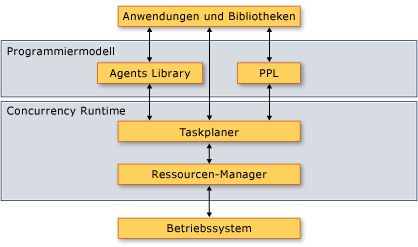

# &#220;bersicht &#252;ber die Concurrency Runtime
[!INCLUDE[vs2017banner](../../assembler/inline/includes/vs2017banner.md)]

Dieses Dokument enthält eine Übersicht über die Concurrency Runtime.  Es beschreibt die Vorteile der Concurrency Runtime, wann sie verwendet wird und wie ihre Komponenten miteinander und mit dem Betriebssystem und den Anwendungen interagieren.  
  
> [!IMPORTANT]
>  In Visual Studio 2015 und höher ist der Concurrency Runtime\-Taskplaner nicht mehr der Planer für die Aufgabenklasse und verwandte Typen in „ppltasks.h“.  Diese Typen verwenden jetzt den Windows\-Threadpool für eine bessere Leistung und Interoperabilität mit Windows\-Synchronisierungsprimitiven.  Parallele Algorithmen, wie z. B. „parallel\_for“ verwenden weiterhin den Concurrency Runtime\-Taskplaner.  
  
##   Abschnitte  
 Dieses Dokument enthält folgende Abschnitte:  
  
-   [Warum eine Laufzeit für die Parallelität wichtig ist](#runtime)  
  
-   [Architektur](#architecture)  
  
-   [C\+\+\-Lambda\-Ausdrücke](#lambda)  
  
-   [Anforderungen](#requirements)  
  
##   Warum eine Laufzeit für die Parallelität wichtig ist  
 Eine Laufzeit für die Parallelität bietet die Einheitlichkeit und Vorhersagbarkeit für Anwendungen und Anwendungskomponenten, die gleichzeitig ausgeführt werden.  Zwei Beispiele für die Vorteile der Concurrency Runtime sind die *kooperative Aufgabenplanung* und die *kooperative Blockierung*.  
  
 Die Concurrency Runtime verwendet einen kooperativen Taskplaner, der einen Arbeitsübernahme\-Algorithmus implementiert, um die Arbeit effizient auf die Computerressourcen zu verteilen.  Betrachten Sie beispielsweise eine Anwendung mit zwei Threads, die beide von der gleichen Laufzeit verwaltet werden.  Wenn ein Thread die geplante Aufgabe abgeschlossen hat, kann dieser die Arbeit des anderen Threads auslagern.  Dieser Mechanismus gleicht die gesamte Arbeitsauslastung der Anwendung aus.  
  
 Die Concurrency Runtime stellt außerdem Synchronisierungsprimitiven zur Verfügung, die die kooperative Blockierung zum Synchronisieren des Zugriffs auf die Ressourcen nutzen.  Betrachten Sie z. B. eine Aufgabe, bei der der exklusive Zugriff auf eine freigegebene Ressource gewährleistet sein muss.  Durch die kooperative Blockierung kann die Laufzeit das verbleibende Quantum verwenden, um eine andere Aufgabe ausführen, während die erste Aufgabe auf die Ressource wartet.  Durch diesen Mechanismus wird die maximale Auslastung der Computerressourcen hochgestuft.  
  
 \[[Nach oben](#top)\]  
  
##   Architektur  
 Die Concurrency Runtime ist in vier Komponenten unterteilt: die Parallel Patterns Library \(PPL\), die Asynchronous Agents Library, der Taskplaner und der Ressourcen\-Manager.  Diese Komponenten befinden sich zwischen dem Betriebssystem und den Anwendungen.  Die folgende Abbildung zeigt, wie die Concurrency Runtime\-Komponenten zwischen dem Betriebssystem und den Anwendungen interagieren:  
  
 **Architektur von Concurrency Runtime**  
  
   
  
> [!IMPORTANT]
>  Die Taskplaner\- und die Ressourcen\-Manager\-Komponenten sind nicht über eine [!INCLUDE[win8_appname_long](../../build/includes/win8_appname_long_md.md)]\-App verfügbar oder wenn Sie die Aufgabenklasse oder andere Typen in „ppltasks.h“ verwenden.  
  
 Die Concurrency Runtime ist hochgradig *zusammensetzbar*, das heißt, dass Sie die vorhandene Funktionalität kombinieren können, um weitere Funktionen zu nutzen.  Die Concurrency Runtime kombiniert viele Funktionen aus Komponenten auf niedrigerer Ebene, wie z. B. parallele Algorithmen.  
  
 Die Concurrency Runtime stellt außerdem Synchronisierungsprimitiven zur Verfügung, die die kooperative Blockierung zum Synchronisieren des Zugriffs auf die Ressourcen nutzen.  Weitere Informationen zu diesen Synchronisierungsprimitiven finden Sie unter [Synchronisierungsdatenstrukturen](../../parallel/concrt/synchronization-data-structures.md).  
  
 Die folgenden Abschnitte bieten einen kurzen Überblick über die jeweilige Komponente und deren Verwendung.  
  
### Parallel Patterns Library  
 Die Parallel Patterns Library \(PPL\) bietet allgemeine Container und Algorithmen zum Ausführen der differenzierten Parallelität.  Die PPL aktiviert die *imperative Datenparallelität* mithilfe paralleler Algorithmen, die die Berechnungen in Auflistungen oder Datensätzen auf die Computerressourcen verteilen.  Darüber hinaus wird auch die *Aufgabenparallelität* durch die Bereitstellung von Aufgabenobjekten aktiviert, die mehrere unabhängige Vorgänge auf die Computerressourcen verteilen.  
  
 Verwenden Sie die Parallel Patterns Library bei lokalen Berechnungen, die von der parallelen Ausführung profitieren können.  Beispielsweise können Sie den Algorithmus [concurrency::parallel\_for](../Topic/parallel_for%20Function.md) zum Transformieren einer vorhandenen `for`\-Schleife für die parallele Ausführung verwenden.  
  
 Weitere Informationen zur Parallel Patterns Library finden Sie unter [Parallel Patterns Library \(PPL\)](../../parallel/concrt/parallel-patterns-library-ppl.md).  
  
### Asynchronous Agents Library  
 Die Asynchronous Agents Library \(oder einfach nur *Agents Library*\) ist ein akteurbasiertes Programmiermodell und bietet Schnittstellen zum Übergeben von Meldungen für simple Datenfluss\- und Pipelineaufgaben.  Asynchrone Agents ermöglichen es Ihnen, die Latenz produktiv zu nutzen, indem Sie Arbeiten ausführen, während andere Komponenten auf die Daten warten.  
  
 Verwenden Sie die Agents Library, wenn Sie über mehrere Entitäten verfügen, die miteinander asynchron kommunizieren.  Beispielsweise können Sie einen Agent erstellen, der die Daten aus einer Datei oder einer Netzwerkverbindung liest und anschließend die Schnittstellen der Meldungsübergabe verwendet, um diese Daten an einen anderen Agent zu senden.  
  
 Weitere Informationen zur Agents Library finden Sie unter [Asynchronous Agents Library](../../parallel/concrt/asynchronous-agents-library.md).  
  
### Taskplaner  
 Der Taskplaner plant und koordiniert die Aufgaben zur Laufzeit.  Der Taskplaner ist kooperativ und verwendet einen Arbeitsübernahme\-Algorithmus, um die maximale Auslastung der Verarbeitungsressourcen zu erreichen.  
  
 Die Concurrency Runtime stellt einen Standardplaner bereit, sodass Sie keine Infrastrukturdetails verwalten müssen.  Um die Qualitätsanforderungen Ihrer Anwendung zu erfüllen, können Sie jedoch auch Ihre eigene Planungsrichtlinie zur Verfügung stellen oder bestimmten Planern bestimmte Aufgaben zuordnen.  
  
 Weitere Informationen zum Taskplaner finden Sie unter [Taskplaner](../../parallel/concrt/task-scheduler-concurrency-runtime.md).  
  
### Ressourcen\-Manager  
 Die Aufgabe des Ressourcen\-Managers besteht darin, die Computerressourcen, wie beispielsweise Prozessoren und Arbeitsspeicher, zu verwalten.  Der Ressourcen\-Manager reagiert auf Arbeitslasten, die sich zur Laufzeit ändern, indem die Ressourcen dorthin zugewiesen werden, wo sie am effektivsten sind.  
  
 Der Ressourcen\-Manager stellt eine Abstraktionsebene für die Computerressourcen dar und interagiert in erster Linie mit dem Taskplaner.  Obwohl Sie den Ressourcen\-Manager zur Optimierung der Leistung Ihrer Bibliotheken und Anwendungen verwenden können, verwenden Sie in der Regel die Funktionalität, die von der Parallel Patterns Library, der Agents Library und dem Taskplaner bereitgestellt wird.  Diese Bibliotheken verwenden den Ressourcen\-Manager, um die Ressourcen dynamisch neu zu verteilen, wenn sich die Arbeitslasten ändern.  
  
 \[[Nach oben](#top)\]  
  
##   C\+\+\-Lambda\-Ausdrücke  
 Viele der Typen und Algorithmen, die von der Concurrency Runtime definiert werden, werden als C\+\+\-Vorlagen implementiert.  Einige dieser Typen und Algorithmen nehmen als Parameter eine Routine an, die die Arbeit ausführt.  Dieser Parameter kann eine Lambda\-Funktion, ein Funktionsobjekt oder ein Funktionszeiger sein.  Diese Entitäten werden auch als *Arbeitsfunktionen* oder *Arbeitsroutinen* bezeichnet.  
  
 Die Lambda\-Ausdrücke sind eine wichtige neue Sprachfunktion in Visual C\+\+, da sie eine kompakte Art und Weise zum Definieren von Arbeitsfunktionen für die Parallelverarbeitung bieten.  Funktionsobjekte und Funktionszeiger ermöglichen Ihnen die Verwendung der Concurrency Runtime mit dem vorhandenen Code.  Microsoft empfiehlt jedoch, Lambda\-Ausdrücke beim Schreiben von neuem Code zu verwenden, da diese bezüglich der Sicherheit und Produktivität viele Vorteile bieten.  
  
 Im folgenden Beispiel wird die Syntax von Lambda\-Funktionen, Funktionsobjekten und Funktionszeigern in mehreren Aufrufen des Algorithmus [concurrency::parallel\_for\_each](../Topic/parallel_for_each%20Function.md) verglichen.  Für jeden Aufruf von `parallel_for_each` wird eine andere Technik verwendet, um das Quadrat jedes Elements in einem [std::array](../../standard-library/array-class-stl.md)\-Objekt zu berechnen.  
  
 [!CODE [concrt-comparing-work-functions#1](../CodeSnippet/VS_Snippets_ConcRT/concrt-comparing-work-functions#1)]  
  
 **Ausgabe**  
  
  **1**  
**256**  
**6561**  
**65536**  
**390625** Weitere Informationen zu Lambda\-Funktionen in C\+\+ finden Sie unter [Lambda\-Ausdrücke](../../cpp/lambda-expressions-in-cpp.md).  
  
 \[[Nach oben](#top)\]  
  
##   Anforderungen  
 Die folgende Tabelle zeigt die Headerdateien, die jeder einzelnen Komponente der Concurrency Runtime zugeordnet sind:  
  
|Komponente|Headerdateien|  
|----------------|-------------------|  
|Parallel Patterns Library \(PPL\)|ppl.h   concurrent\_queue.h   concurrent\_vector.h|  
|Asynchronous Agents Library|agents.h|  
|Taskplaner|concrt.h|  
|Ressourcen\-Manager|concrtrm.h|  
  
 Die Concurrency Runtime wird im Namespace [Parallelität](../../parallel/concrt/reference/concurrency-namespace.md) deklariert.  \(Sie können auch [Parallelität](../../parallel/concrt/reference/concurrency-namespace.md) verwenden, wobei es sich um ein Alias für diesen Namespace handelt.\) Der Namespace `concurrency::details` unterstützt das Concurrency Runtime\-Framework und ist nicht für die direkte Verwendung im Code vorgesehen.  
  
 Die Concurrency Runtime wird als Teil der C\-Laufzeitbibliothek \(CRT\) bereitgestellt.  Weitere Informationen zum Erstellen einer Anwendung, die die CRT verwendet, finden Sie unter [CRT\-Bibliotheksfunktionen](../../c-runtime-library/crt-library-features.md).  
  
 \[[Nach oben](#top)\]