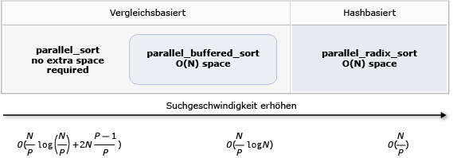

# <a name="parallel-algorithms"></a>Parallele Algorithmen

Die Parallel Patterns Library (PPL) stellt die Algorithmen, die Auflistungen von Daten gleichzeitig Vorgänge bereit. Diese Algorithmen ähneln denen der C++-Standardbibliothek.

Die parallelen Algorithmen bestehen aus vorhandenen Funktionen in der Concurrency Runtime. Z. B. die [Concurrency:: parallel_for](reference/concurrency-namespace-functions.md#parallel_for) -Algorithmus verwendet eine [Concurrency:: structured_task_group](../../parallel/concrt/reference/structured-task-group-class.md) Objekt, um die parallelen Schleifeniterationen auszuführen. Die `parallel_for` Algorithmus Partitionen zu arbeiten, erhalten die verfügbare Anzahl der COMPUTE-Ressourcen auf optimale Weise.

##  <a name="top"></a> Abschnitte

- [Der Parallel_for-Algorithmus](#parallel_for)

- [Der Parallel_for_each-Algorithmus](#parallel_for_each)

- [Der Parallel_invoke-Algorithmus](#parallel_invoke)

- [Die Parallel_transform- und Parallel_reduce-Algorithmen](#parallel_transform_reduce)

    - [Der Parallel_transform-Algorithmus](#parallel_transform)

    - [Der Parallel_reduce-Algorithmus](#parallel_reduce)

    - [Beispiel: Map- und Reduce-parallel ausführen](#map_reduce_example)

- [Funktioniert die Partitionierung](#partitions)

- [Parallele Sortierung](#parallel_sorting)

    - [Auswählen eines Sortieralgorithmus](#choose_sort)

##  <a name="parallel_for"></a> Der Parallel_for-Algorithmus

Die [Concurrency:: parallel_for](reference/concurrency-namespace-functions.md#parallel_for) Algorithmus wiederholt dieselbe Aufgabe parallel ausgeführt. Jede dieser Aufgaben wird durch einen Iterationswert parametrisiert. Dieser Algorithmus ist nützlich, wenn ein Schleifenkörper vorliegen, die Ressourcen von Iterationen der Schleife nicht gemeinsam verwendet wird.

Die `parallel_for` -Algorithmus verteilt die Aufgaben auf optimale Weise für die parallele Ausführung. Er verwendet einen Arbeitsübernahme-Algorithmus und ein Bereich, um diese Partitionen zu verteilen, wenn arbeitsauslastungen nicht ausgeglichen sind stehlen. Wenn eine Iteration der Schleife kooperativ blockiert wird, verteilt die Laufzeit des Bereichs von Iterationen, die der aktuelle Thread eine andere Threads oder Prozessoren zugewiesen ist. Wenn ein Thread einen Bereich von Iterationen abgeschlossen ist, verteilt die Laufzeit auf ähnliche Weise Arbeit von anderen Threads in diesem Thread. Die `parallel_for` Algorithmus unterstützt auch *geschachtelte Parallelität*. Wenn eine parallele Schleife eine andere parallele Schleife enthält, koordiniert die Runtime Verarbeitungsressourcen zwischen der Schleifenkörpern auf effiziente Weise für die parallele Ausführung.

Die `parallel_for` Algorithmus hat mehrere überladene Versionen. Die erste Version akzeptiert einen Startwert, einen Endwert und eine Arbeitsfunktion (Lambda-Ausdruck, Function-Objekt, oder Funktionszeiger). Die zweite Version dauert ein Start-Wert, der einen Endwert, der einen Wert mit dem Schritt, und eine Arbeitsfunktion. Die erste Version dieser Funktion verwendet 1 als Wert an. Die übrigen-Versionen nutzen Partitionierer-Objekte, die Sie angeben können, wie `parallel_for` sollten Adressbereiche zwischen Threads partitionieren. Partitionierer werden ausführlicher im Abschnitt [Partitionierung Arbeit](#partitions) in diesem Dokument.

Sie können viele konvertieren `for` Schleifen mit `parallel_for`. Allerdings die `parallel_for` Algorithmus unterscheidet sich von der `for` Anweisung auf folgende Weise:

- Die `parallel_for` Algorithmus `parallel_for` die Aufgaben in einer vordefinierten Reihenfolge wird nicht ausgeführt.

- Die `parallel_for` Algorithmus beliebige Beendigung Bedingungen nicht unterstützt. Die `parallel_for` Algorithmus wird beendet, wenn der aktuelle Wert der Iterationsvariablen, die eine ist kleiner als `last`.

- Die `_Index_type` Typparameter muss ein ganzzahliger Typ sein. Dieser ganzzahlige Typ kann mit oder ohne Vorzeichen sein.

- Die Iteration der Schleife muss weiterleiten. Die `parallel_for` Algorithmus löst eine Ausnahme vom Typ [Std:: invalid_argument](../../standard-library/invalid-argument-class.md) Wenn die `_Step` -Parameter ist kleiner als 1.

- Der Mechanismus für die Ausnahmebehandlung für die `parallel_for` Algorithmus unterscheidet sich von der eine `for` Schleife. Wenn mehrere Ausnahmen gleichzeitig in einer parallelen Schleife auftreten, die Laufzeit nur eine der Ausnahmen an den Thread, der aufgerufen `parallel_for`. Darüber hinaus, wenn eine Iteration der Schleife eine Ausnahme auslöst, wird die Runtime nicht sofort die gesamte Schleife beendet. Stattdessen wird die Schleife befindet sich im Zustand "abgebrochen", und verwirft die Runtime alle Aufgaben, die noch nicht gestartet wurden. Weitere Informationen zur Behandlung von Ausnahmen und parallele Algorithmen finden Sie unter [Exception Handling](../../parallel/concrt/exception-handling-in-the-concurrency-runtime.md).

Obwohl die `parallel_for` Algorithmus beliebige Beendigung Bedingungen nicht unterstützt, können Sie Abbruch verwenden, um alle Aufgaben zu beenden. Weitere Informationen über Abbrüche finden Sie unter [Abbruch in der PPL](cancellation-in-the-ppl.md).

> [!NOTE]
>  Die zeitplanung Kosten, dass die Ergebnisse aus den Lastenausgleich und die Unterstützung für Features wie der Abbruch nicht die Vorteile der Textkörper der Schleife parallel ausgeführten überwinden können, ist besonders beim Schleifentext relativ gering. Sie können diesen zusätzlichen Aufwand minimieren, indem Sie einen Partitionierer verwenden, in der parallel-Schleife. Weitere Informationen finden Sie unter [Partitionierung Arbeit](#partitions) weiter unten in diesem Dokument.

### <a name="example"></a>Beispiel

Das folgende Beispiel zeigt die grundlegende Struktur der `parallel_for` Algorithmus. In diesem Beispiel gibt jeden Wert im Bereich [1, 5] parallel an der Konsole aus.

[!code-cpp[concrt-parallel-for-structure#1](../../parallel/concrt/codesnippet/cpp/parallel-algorithms_1.cpp)]

Dieses Beispiel erzeugt die folgende Beispielausgabe:

```Output
1 2 4 3 5
```

Da die `parallel_for` Algorithmus für jedes Element in parallelen fungiert, die Reihenfolge, in dem die Werte in der Konsole ausgegeben werden, variiert.

Für ein vollständiges Beispiel, verwendet der `parallel_for` -Algorithmus finden Sie unter [Vorgehensweise: Schreiben einer Parallel_for-Schleife](../../parallel/concrt/how-to-write-a-parallel-for-loop.md).

[[Nach oben](#top)]

##  <a name="parallel_for_each"></a> Der Parallel_for_each-Algorithmus

Die [Concurrency:: parallel_for_each](reference/concurrency-namespace-functions.md#parallel_for_each) Algorithmus führt Aufgaben für einen iterativen Container, z. B. die von der C++-Standardbibliothek, parallel bereitgestellt. Er verwendet die gleiche Partitionierungslogik wie der `parallel_for`-Algorithmus.

Die `parallel_for_each` -Algorithmus ähnelt der C++-Standardbibliothek [Std:: for_each](../../standard-library/algorithm-functions.md#for_each) -Algorithmus, außer dass die `parallel_for_each` -Algorithmus die Aufgaben gleichzeitig ausführt. Wie andere parallelen Algorithmen `parallel_for_each` die Aufgaben in einer bestimmten Reihenfolge wird nicht ausgeführt.

Obwohl die `parallel_for_each` Algorithmus funktioniert sowohl für forward-Iteratoren Iteratoren mit zufälligem Zugriff, es bietet eine bessere Leistung mit Iteratoren mit zufälligem Zugriff.

### <a name="example"></a>Beispiel

Das folgende Beispiel zeigt die grundlegende Struktur der `parallel_for_each` Algorithmus. In diesem Beispiel gibt, an der Konsole jeden Wert in eine [Std:: Array](../../standard-library/array-class-stl.md) -Objekt parallel.

[!code-cpp[concrt-parallel-for-each-structure#1](../../parallel/concrt/codesnippet/cpp/parallel-algorithms_2.cpp)]

Dieses Beispiel erzeugt die folgende Beispielausgabe:

```Output
4 5 1 2 3
```

Da die `parallel_for_each` Algorithmus für jedes Element in parallelen fungiert, die Reihenfolge, in dem die Werte in der Konsole ausgegeben werden, variiert.

Für ein vollständiges Beispiel, verwendet der `parallel_for_each` -Algorithmus finden Sie unter [Vorgehensweise: Schreiben einer Parallel_for_each-Schleife](../../parallel/concrt/how-to-write-a-parallel-for-each-loop.md).

[[Nach oben](#top)]

##  <a name="parallel_invoke"></a> Der Parallel_invoke-Algorithmus

Die [Concurrency:: parallel_invoke](reference/concurrency-namespace-functions.md#parallel_invoke) Algorithmus führt eine Reihe von Aufgaben gleichzeitig. Es gibt keine zurück, bis jede Aufgabe abgeschlossen ist. Dieser Algorithmus ist nützlich, wenn Sie mehrere unabhängige Aufgaben verfügen, die zur gleichen Zeit ausgeführt werden soll.

Die `parallel_invoke` Algorithmus verwendet als Parameter eine Reihe von Arbeitsfunktionen (Lambda-Funktionen, Funktionsobjekten und Funktionszeigern). Die `parallel_invoke` Algorithmus ist überladen, um zwischen zwei und zehn Parameter zu nutzen. Jede Funktion, die Sie übergeben `parallel_invoke` muss keine Parameter annehmen.

Wie andere parallelen Algorithmen `parallel_invoke` die Aufgaben in einer bestimmten Reihenfolge wird nicht ausgeführt. Das Thema [Aufgabenparallelität](../../parallel/concrt/task-parallelism-concurrency-runtime.md) wird erläutert, wie die `parallel_invoke` Algorithmus bezieht sich auf Aufgaben und Aufgabengruppen.

### <a name="example"></a>Beispiel

Das folgende Beispiel zeigt die grundlegende Struktur der `parallel_invoke` Algorithmus. Dieses Beispiel gleichzeitig Ruft die `twice` Funktion auf drei lokale Variablen und gibt das Ergebnis an die Konsole.

[!code-cpp[concrt-parallel-invoke-structure#1](../../parallel/concrt/codesnippet/cpp/parallel-algorithms_3.cpp)]

Dieses Beispiel erzeugt die folgende Ausgabe:

```Output
108 11.2 HelloHello
```

Vollständige Beispiele für die Verwendung der `parallel_invoke` -Algorithmus finden Sie unter [wie: mithilfe von Parallel_invoke zum parallele Sortierung Schreiben einer](../../parallel/concrt/how-to-use-parallel-invoke-to-write-a-parallel-sort-routine.md) und [Vorgehensweise: mithilfe von Parallel_invoke zum Ausführen von parallelen Vorgängen](../../parallel/concrt/how-to-use-parallel-invoke-to-execute-parallel-operations.md).

[[Nach oben](#top)]

##  <a name="parallel_transform_reduce"></a> Die Parallel_transform- und Parallel_reduce-Algorithmen

Die [Concurrency:: parallel_transform](reference/concurrency-namespace-functions.md#parallel_transform) und [Concurrency:: parallel_reduce](reference/concurrency-namespace-functions.md#parallel_reduce) Algorithmen sind parallele Versionen einer C++-standardbibliotheksalgorithmen [Std](../../standard-library/algorithm-functions.md#transform)und [Std:: Accumulate](../../standard-library/numeric-functions.md#accumulate)bzw. Die Concurrency Runtime-Versionen verhalten sich wie die C++-Standardbibliothek-Versionen, außer dass die Reihenfolge der Vorgang nicht bestimmt wird, da sie parallel ausgeführt werden. Verwenden Sie diese Algorithmen, bei der Arbeit mit einem Satz, der groß genug, um Leistungs-und Skalierbarkeitsvorteile aus, die parallel verarbeitet werden.

> [!IMPORTANT]
>  Die `parallel_transform` und `parallel_reduce` Algorithmen unterstützen nur, bidirektionale und weiterleiten, Iteratoren mit zufälligem Zugriff, da diese Iteratoren die stabile Speicheradressen erzeugen. Darüber hinaus diese Iteratoren müssen erzeugen nicht`const` l-Werte.

###  <a name="parallel_transform"></a> Der Parallel_transform-Algorithmus

Sie können die `parallel transform` Algorithmus viele Parallelisierung-Datenvorgänge ausführt. Sie haben unter anderem folgende Möglichkeiten:

- Die Helligkeit ein Bild aus, und führen Sie andere Verarbeitungsvorgänge Image.

- Die Summe oder nutzen Sie das Skalarprodukt zwischen beiden Vektoren, und andere numerische Berechnungen für Vektoren.

- Führen Sie die 3-d-Ray-Ablaufverfolgung, wobei jede Iteration ein Pixel bezeichnet, die gerendert werden muss.

Das folgende Beispiel zeigt die grundlegende Struktur, die verwendet wird, zum Aufrufen der `parallel_transform` Algorithmus. In diesem Beispiel negiert jedes Element eine std::[Vektor](../../standard-library/vector-class.md) Objekt gibt es zwei Möglichkeiten. Die erste Methode verwendet einen Lambda-Ausdruck. Die zweite Methode verwendet [std::negate](../../standard-library/negate-struct.md), die sich daraus ableitet [std::unary_function](../../standard-library/unary-function-struct.md).

[!code-cpp[concrt-basic-parallel-transform#1](../../parallel/concrt/codesnippet/cpp/parallel-algorithms_4.cpp)]

> [!WARNING]
>  In diesem Beispiel wird veranschaulicht, die grundlegende Verwendung von `parallel_transform`. Da die Arbeitsfunktion keine erhebliche Menge an Arbeit ausführt, wird eine erhebliche Leistungssteigerung erzielt nicht in diesem Beispiel erwartet.

Die `parallel_transform` Algorithmus verfügt über zwei Überladungen. Die erste Überladung akzeptiert einen Bereich für die Eingabe und einer unären Funktion. Die unäre Funktion kann ein Lambda-Ausdruck, der akzeptiert ein Argument, ein Funktionsobjekt oder ein Typ, der abgeleitet werden `unary_function`. Die zweite Überladung nimmt zwei Eingabe-Bereiche und eine binäre Funktion. Die binäre Funktion kann ein Lambda-Ausdruck, die akzeptiert zwei Argumente, ein Funktionsobjekt oder ein Typ, der abgeleitet sein [std::binary_function](../../standard-library/binary-function-struct.md). Das folgende Beispiel zeigt diese Unterschiede.

[!code-cpp[concrt-parallel-transform-vectors#2](../../parallel/concrt/codesnippet/cpp/parallel-algorithms_5.cpp)]

> [!IMPORTANT]
>  Der Iterator, der für die Ausgabe des bereitgestellten `parallel_transform` muss vollständig überlappen der eingabeiterator oder überhaupt nicht überlappen. Das Verhalten dieses Algorithmus ist nicht angegeben, wenn sich die Eingabe- und Iteratoren teilweise überlappen.

###  <a name="parallel_reduce"></a> Der Parallel_reduce-Algorithmus

Die `parallel_reduce` Algorithmus ist nützlich, wenn man eine Sequenz von Vorgängen, die die assoziative-Eigenschaft zu erfüllen. (Dieser Algorithmus ist nicht kommutativ Eigenschaft erforderlich.) Hier sind einige der Vorgänge, die Sie auch `parallel_reduce`:

- Multiplizieren Sie Sequenzen von Matrizen bis hin zu eine Matrix zu erzeugen.

- Multipliziert einen Vektor von einer Sequenz von Matrizen bis hin zu einen Vektor zu erzeugen.

- Die Länge einer Sequenz von Zeichenfolgen zu berechnen.

- Kombinieren Sie eine Liste der Elemente, z. B. Zeichenfolgen, in ein Element an.

Das folgende grundlegende Beispiel zeigt, wie Sie mit der `parallel_reduce` Algorithmus, um eine Sequenz von Zeichenfolgen in einer Zeichenfolge zu kombinieren. Wie bei den Beispielen für `parallel_transform`, leistungsverbesserungen in diesem einfachen Beispiel nicht erwartet werden.

[!code-cpp[concrt-basic-parallel-reduce#1](../../parallel/concrt/codesnippet/cpp/parallel-algorithms_6.cpp)]

In vielen Fällen können Sie sich vorstellen `parallel_reduce` als Kurzform für die Verwendung der `parallel_for_each` Algorithmus zusammen mit den [Concurrency:: combinable](../../parallel/concrt/reference/combinable-class.md) Klasse.

###  <a name="map_reduce_example"></a> Beispiel: Map- und Reduce-parallel ausführen

Ein *Zuordnung* wendet eine Funktion auf jeden Wert in einer Sequenz. Ein *reduzieren* kombiniert die Elemente einer Sequenz in einen Wert. Sie können die C++-Standardbibliothek [Std](../../standard-library/algorithm-functions.md#transform) und [Std:: Accumulate](../../standard-library/numeric-functions.md#accumulate) Funktionen zum Ausführen von Zuordnungs- und reduzierungsvorgänge. Für viele Probleme auf, Sie können jedoch die `parallel_transform` -Algorithmus parallel den Zuordnungsvorgang ausgeführt und die `parallel_reduce` Algorithmus verwendet wird, um den Reduce-Vorgang parallel auszuführen.

Im folgenden Beispiel wird die Zeit, die die Summe von Primzahlen seriell sowie parallel berechnet. Map-Phase transformiert nicht Prime-Werte auf 0 und die Reduce-Phase Summen, die Werte an.

[!code-cpp[concrt-parallel-map-reduce-sum-of-primes#1](../../parallel/concrt/codesnippet/cpp/parallel-algorithms_7.cpp)]

Ein weiteres Beispiel, das eine Zuordnung führt und Betrieb parallel zu reduzieren, finden Sie unter [Vorgehensweise: auszuführen Map und Vorgänge zu reduzieren, parallel](../../parallel/concrt/how-to-perform-map-and-reduce-operations-in-parallel.md).

[[Nach oben](#top)]

##  <a name="partitions"></a> Funktioniert die Partitionierung

Um einen Vorgang für eine Datenquelle zu parallelisieren, besteht ein wichtiger Schritt darin *Partition* der Quelle in mehrere Abschnitte, die von mehreren Threads gleichzeitig zugegriffen werden kann. Ein Partitionierer gibt an, wie ein paralleler Algorithmus Bereiche zwischen Threads partitionieren sollten. Wie zuvor in diesem Dokument erläutert wird, verwendet die PPL eine Partitionierung der Mechanismus, der einen anfänglichen Workloads erstellt und verwendet dann einen Arbeitsübernahme-Algorithmus und ein Bereich, um diese Partitionen zu verteilen, wenn arbeitsauslastungen nicht ausgeglichen sind stehlen. Wenn eine Iteration der Schleife einen Bereich von Iterationen abgeschlossen ist, verteilt die Laufzeit z. B. Arbeit von anderen Threads in diesem Thread. Allerdings kann für einige Szenarien, einen anderen Mechanismus für die Partitionierung angeben möchten, der besser für Ihr Problem geeignet ist.

Die `parallel_for`, `parallel_for_each`, und `parallel_transform` Algorithmen bieten überladene Versionen, die einen zusätzlichen Parameter, `_Partitioner`. Dieser Parameter definiert, den Partitionierer-Typ, der Arbeit dividiert wird. Hier sind die Arten der Partitionierer bereit, die die PPL definiert:

[Concurrency::affinity_partitioner](../../parallel/concrt/reference/affinity-partitioner-class.md)<br/>
Dividiert arbeiten in einer festen Anzahl von Bereichen (in der Regel die Anzahl der Arbeitsthreads, die für die Arbeit in der Schleife verfügbar sind). Diese Art der Partitionierer ähnelt `static_partitioner`, sondern verbessert die Affinität zwischen Cache und die Art und Weise, wie Bereiche Arbeitsthreads zugeordnet. Diese Art der Partitionierer kann die Leistung verbessern, wenn eine Schleife über das gleiche Dataset mehrere Male (z. B. eine Schleife in einer Schleife) ausgeführt wird, und passen die Daten im Cache. Diese Partitionierer nicht vollständig an Abbruch teilnehmen. Es wird auch nicht kooperative Blockieren Semantik verwendet und daher nicht verwendet werden, mit parallelen Schleifen, die eine forward-Abhängigkeit verfügen.

[Concurrency::auto_partitioner](../../parallel/concrt/reference/auto-partitioner-class.md)<br/>
Dividiert arbeiten in eine anfängliche Anzahl von Bereichen (in der Regel die Anzahl der Arbeitsthreads, die für die Arbeit in der Schleife verfügbar sind). Die Runtime verwendet dieses Typs werden standardmäßig, wenn Sie einen überladenen parallelen Algorithmus nicht aufrufen, die akzeptiert eine `_Partitioner` Parameter. Jeder Bereich kann in Teilbereiche aufgeteilt werden, und dadurch ermöglicht Lastenausgleich erfolgen. Wenn Sie ein Bereich von Arbeit abgeschlossen ist, verteilt die Runtime Teilbereiche von Arbeit von anderen Threads in diesem Thread an. Verwenden Sie diese Partitionierer, wenn Ihre Workload nicht unter einem der anderen Kategorien fällt, oder Sie vollständige Unterstützung für die Abbruch- noch die Kooperative Blockierung benötigen.

[Concurrency::simple_partitioner](../../parallel/concrt/reference/simple-partitioner-class.md)<br/>
Dividiert funktionieren in Bereiche, damit jeder Bereich mindestens der Anzahl von Iterationen enthält, die von der angegebenen Segmentgröße angegeben werden. Diese Art der Partitionierer ist Teil des Lastenausgleichs; jedoch ist die Runtime nicht Bereiche in untergeordnete Bereiche unterteilen. Für jeden Worker die Laufzeit nach einem Abbruchvorgang gesucht, und führt den Lastenausgleich nach `_Chunk_size` Iterationen abgeschlossen.

[Concurrency::static_partitioner](../../parallel/concrt/reference/static-partitioner-class.md)<br/>
Dividiert arbeiten in einer festen Anzahl von Bereichen (in der Regel die Anzahl der Arbeitsthreads, die für die Arbeit in der Schleife verfügbar sind). Diese Art der Partitionierer kann die Leistung verbessern, denn es Arbeitsübernahme-nicht verwendet und daher weniger Aufwand hat. Verwenden Sie diese Art der Partitionierer bei jeder Iteration einer parallelen Schleife eine feste und einheitliche Menge an Arbeit führt und abbruchunterstützung erforderlich ist bzw. keine weiterleiten Kooperative Blockierung.

> [!WARNING]
>  Die `parallel_for_each` und `parallel_transform` Algorithmen unterstützen nur die Container, die Iteratoren mit zufälligem Zugriff zu verwenden (z. B. std::[Vektor](../../standard-library/vector-class.md)) für den statischen, einfache und Affinität Partitionierer. Die Verwendung von Containern, die bidirektionale und forward-Iteratoren verwenden erzeugt einen Fehler während der Kompilierung. Dem Standardpartitionierer `auto_partitioner`, alle drei dieser Iterator-Typen unterstützt.

Diese Partitionierer werden normalerweise verwendet auf die gleiche Weise, mit Ausnahme von `affinity_partitioner`. Die meisten Typen von Partitionierer Zustand nicht beibehalten und nicht von der Laufzeit geändert werden. Aus diesem Grund können Sie diese Objekte kann an der Aufrufsite erstellen, wie im folgenden Beispiel gezeigt.

[!code-cpp[concrt-static-partitioner#1](../../parallel/concrt/codesnippet/cpp/parallel-algorithms_8.cpp)]

Allerdings müssen Sie übergeben eine `affinity_partitioner` -Objekt als nicht`const`, l-Wert verweisen, damit der Algorithmus die Status für zukünftige Schleifen auf, um die Wiederverwendung speichern kann. Das folgende Beispiel zeigt eine einfache Anwendung, die den gleichen Vorgang auf einem DataSet parallel mehrmals ausgeführt. Die Verwendung von `affinity_partitioner` kann die Leistung verbessern, da das Array in den Cache passen, wahrscheinlich ist.

[!code-cpp[concrt-affinity-partitioner#1](../../parallel/concrt/codesnippet/cpp/parallel-algorithms_9.cpp)]

> [!CAUTION]
>  Vorsichtig, wenn Sie vorhandenen Code, die auf kooperative Blockieren Semantik ändern mit beruht `static_partitioner` oder `affinity_partitioner`. Diese Partitionierer Typen können nicht verwendet werden, den Lastenausgleich oder Bereich zu stehlen und aus diesem Grund können das Verhalten Ihrer Anwendung ändern.

Die beste Möglichkeit, festzustellen, ob einen Partitionierer in einem gegebenen Szenario verwendet wird, experimentieren und messen, wie lange es Vorgängen unter repräsentativen Lasten und Computerkonfigurationen dauert. Die statische Partitionierung könnte z.B. möglicherweise auf einem Mehrkerncomputer mit nur wenigen Kernen für erhebliche Beschleunigung sorgen, doch bei Computern mit relativ vielen Kernen zu Verlangsamungen führen.

[[Nach oben](#top)]

##  <a name="parallel_sorting"></a> Parallele Sortierung

Die PPL bietet drei Sortieralgorithmen: [Concurrency:: parallel_sort](reference/concurrency-namespace-functions.md#parallel_sort), [Concurrency:: parallel_buffered_sort](reference/concurrency-namespace-functions.md#parallel_buffered_sort), und [Concurrency:: parallel_radixsort](reference/concurrency-namespace-functions.md#parallel_radixsort). Diese Sortieralgorithmen sind nützlich, wenn Sie ein Dataset verfügen, die von der parallel zu sortierenden profitieren können. Parallele Sortierung ist insbesondere nützlich, wenn Sie ein großes Dataset haben oder wenn Sie einem-rechenintensiv Vergleichsvorgang verwenden, um Ihre Daten zu sortieren. Jeder dieser Algorithmen sortiert die Elemente vorhanden.

Die `parallel_sort` und `parallel_buffered_sort` Algorithmen sind beide Algorithmen vergleichsbasierte. D. h. Vergleichen sie Elemente nach Wert. Die `parallel_sort` Algorithmus verfügt über keine zusätzlichen arbeitsspeicheranforderungen und eignet sich für allgemeine Zwecke sortieren. Die `parallel_buffered_sort` kann es sich um eine Ausführung des Algorithmus besser als `parallel_sort`, abererfordert O(N) Speicherplatz.

Die `parallel_radixsort` Algorithmus basiert auf der Hash. D. h. verwendet ganzzahligen Schlüssel, um die Elemente zu sortieren. Mithilfe eines Schlüssels, kann diesen Algorithmus direkt berechnen, das Ziel eines Elements statt Vergleiche zu verwenden. Wie `parallel_buffered_sort`, dieser Algorithmus ist O(N) Speicherplatz erforderlich.

In der folgende Tabelle werden die wichtigen Eigenschaften der drei parallele Sortieralgorithmen zusammengefasst.

|Algorithmus|Beschreibung|Sortiermechanismus|Stabilität der Sortierung|Anforderungen an den Arbeitsspeicher|Zeit.|Iteratorzugriff|
|---------------|-----------------|-----------------------|--------------------|-------------------------|---------------------|---------------------|
|`parallel_sort`|Allgemeine vergleichsbasierte sortieren.|Vergleichsbasierte (aufsteigend)|Instabile|Keiner|O((N/P)Log(N/P) + 2N((P-1)/P))|Random|
|`parallel_buffered_sort`|Schneller allgemeine vergleichsbasierte sortieren, die O(N) Speicherplatz benötigt.|Vergleichsbasierte (aufsteigend)|Instabile|Erfordert zusätzlichen O(N) Speicherplatz|O((N/P)Log(N))|Random|
|`parallel_radixsort`|Ganze Zahl schlüsselbasierten sortieren, die O(N) Speicherplatz benötigt.|Hashbasierter|Stable|Erfordert zusätzlichen O(N) Speicherplatz|O(N/P)|Random|

Die folgende Abbildung zeigt die wichtigen Eigenschaften der drei parallele Sortieralgorithmen mehr grafisch an.



Diese parallele Sortieralgorithmen führen Sie die Regeln für Abbruch und Ausnahmebehandlung. Weitere Informationen zu den Abbruch und Ausnahmebehandlung in der Concurrency Runtime, finden Sie unter [Abbrechen von parallelen Algorithmen](../../parallel/concrt/cancellation-in-the-ppl.md#algorithms) und [Exception Handling](../../parallel/concrt/exception-handling-in-the-concurrency-runtime.md).

> [!TIP]
>  Diese Sortierung parallele Algorithmen unterstützen die Move-Semantik. Sie können einen bewegungszuweisungsoperator zum Aktivieren von Swap-Vorgänge effizienter erfolgen definieren. Weitere Informationen zu Move-Semantiken und der bewegungszuweisungsoperator, finden Sie unter [Rvalue-Verweisdeklarator: & &](../../cpp/rvalue-reference-declarator-amp-amp.md), und [Bewegungskonstruktoren und Bewegungszuweisungsoperatoren (C++)](../../cpp/move-constructors-and-move-assignment-operators-cpp.md). Wenn Sie keinen bewegungszuweisungsoperator oder Swap-Funktion bereitstellen, verwenden die Sortieralgorithmen den Copy-Konstruktor.

Das folgende grundlegende Beispiel zeigt, wie Sie mit `parallel_sort` zum Sortieren einer `vector` von `int` Werte. In der Standardeinstellung `parallel_sort` verwendet [Std:: less](../../standard-library/less-struct.md) zum Vergleichen von Werten.

[!code-cpp[concrt-basic-parallel-sort#1](../../parallel/concrt/codesnippet/cpp/parallel-algorithms_10.cpp)]

Dieses Beispiel zeigt, wie Sie eine benutzerdefinierte Vergleichsfunktion bereitstellen. Er verwendet den [Std::complex::real](../../standard-library/complex-class.md#real) Methode sortiert [Std:: Complex\<double >](../../standard-library/complex-double.md) Werte in aufsteigender Reihenfolge.

[!code-cpp[concrt-basic-parallel-sort#2](../../parallel/concrt/codesnippet/cpp/parallel-algorithms_11.cpp)]

Dieses Beispiel zeigt, wie eine Hashfunktion, die `parallel_radixsort` Algorithmus. In diesem Beispiel sortiert 3D-Punkten an. Die Punkte, werden basierend auf ihrer Entfernung von einem Bezugspunkt sortiert.

[!code-cpp[concrt-parallel-sort-points#1](../../parallel/concrt/codesnippet/cpp/parallel-algorithms_12.cpp)]

Zur Veranschaulichung verwendet dieses Beispiel ein relativ kleines Dataset. Sie können die ursprüngliche Größe des Vektors mit leistungsverbesserungen über größere Mengen von Daten zu experimentieren erhöhen.

Dieses Beispiel verwendet einen Lambda-Ausdruck als Hashfunktion. Sie können auch eine der integrierten Implementierungen von dem std::[hash-Klasse](../../standard-library/hash-class.md) oder Ihre eigenen Spezialisierung zu definieren. Sie können auch ein benutzerdefiniertes hashfunktionsobjekt verwenden, wie im folgenden Beispiel gezeigt:

[!code-cpp[concrt-parallel-sort-points#2](../../parallel/concrt/codesnippet/cpp/parallel-algorithms_13.cpp)]

[!code-cpp[concrt-parallel-sort-points#3](../../parallel/concrt/codesnippet/cpp/parallel-algorithms_14.cpp)]

Die Hash-Funktion muss einen ganzzahligen Typ zurückgeben ([Std::is_integral::value](../../standard-library/is-integral-class.md) muss **"true"**). Dieser ganzzahlige Typ muss in den Typ konvertiert werden können `size_t`.

###  <a name="choose_sort"></a> Auswählen eines Sortieralgorithmus

In vielen Fällen `parallel_sort` bietet den besten Kompromiss zwischen Geschwindigkeit und Leistung. Jedoch, wie Sie erhöhen die Größe des Datasets, die Anzahl der verfügbaren Prozessoren und die Komplexität Ihrer Compare-Funktion, `parallel_buffered_sort` oder `parallel_radixsort` bieten eine bessere Leistung. Die beste Möglichkeit, um zu bestimmen, welche Sortieralgorithmus für die Verwendung in einem gegebenen Szenario ist zum experimentieren und messen, wie lange es dauert, um typische Daten unter repräsentativen Computerkonfigurationen zu sortieren. Bedenken Sie die folgenden Richtlinien bei der Auswahl einer Strategie für die Sortierung.

- Die Größe des Datasets. In diesem Dokument eine *kleine* Dataset weniger als 1.000 Elemente enthält, eine *Mittel* Dataset zwischen 10.000 und 100.000 Elementen enthält und eine *große* Dataset enthält mehr als 100.000 Elemente.

- Die Menge der Arbeit, die Ihre Compare-Funktion oder einen Hash-Funktion ausführt.

- Die Menge des verfügbaren Computerressourcen.

- Die Merkmale des Datasets. Beispielsweise kann ein Algorithmus ausführen, gut für Daten, die bereits nahezu sortiert ist, aber nicht so gut für Daten, die nicht vollständig sortiert sind.

- Die Segmentgröße. Der optionale `_Chunk_size` Argument gibt an, wenn der Algorithmus aus einer parallelen an eine Implementierung für die serielle Sortierung wechselt, da es die gesamte Sortierung in kleinere Arbeitseinheiten unterteilt. Z. B. Wenn Sie auf "512" angeben, wechselt der Algorithmus zu seriellen Implementierung, wenn eine Arbeitseinheit 512 oder weniger Elemente enthält. Eine serielle Implementierung kann die gesamtleistung verbessern, da es sich um den Mehraufwand entfällt, der zum Verarbeiten von Daten parallel erforderlich ist.

Es ist möglicherweise nicht sinnvoll, um ein kleines Dataset parallel zu sortieren, selbst wenn Sie über eine große Anzahl von verfügbaren Computerressourcen oder Ihre Compare-Funktion oder einen Hash-Funktion eine relativ große Menge an Arbeit führt. Sie können [Std:: Sort](../../standard-library/algorithm-functions.md#sort) Funktion, um kleine Datasets zu sortieren. (`parallel_sort` und `parallel_buffered_sort` Aufrufen `sort` bei der Angabe einer Blockgröße, die größer ist als das Dataset; allerdings `parallel_buffered_sort` müssten zum Zuweisen von O(N) Speicherplatz, die zusätzliche Zeit aufgrund von Sperren Konflikte oder speicherzuweisung dauern können.)

Wenn Sie Speicher freigeben müssen, oder Ihre Speicherbelegungsfunktion Sperrkonflikte unterliegt, verwenden `parallel_sort` um ein Dataset mit mittlerer Größe zu sortieren. `parallel_sort` ist kein zusätzlichen Speicherplatz erforderlich; die andere Algorithmen, O(N) Speicherplatz erfordern.

Verwendung `parallel_buffered_sort` sortieren mittelgroße Datasets und wenn Ihre Anwendung die zusätzliche O(N) speicherplatzanforderungen erfüllt. `parallel_buffered_sort` können besonders hilfreich sein, wenn Sie eine große Anzahl von Compute-Ressourcen oder eine teure Compare-Funktion oder einen Hash-Funktion haben.

Verwendung `parallel_radixsort` sortieren großer Datasets und wenn Ihre Anwendung die zusätzliche O(N) speicherplatzanforderungen erfüllt. `parallel_radixsort` können besonders hilfreich sein, wenn der entsprechende Vergleichsvorgang teurer ist oder wenn beide Vorgänge teuer sind.

> [!CAUTION]
>  Implementieren einer guten Hashfunktion erfordert, dass Sie wissen, Bereich von Dataset und wie jedes Element in das Dataset in einen entsprechenden nicht signierten Wert transformiert wird. Da die Hash-Operation für Werte ohne Vorzeichen verwendet werden kann, sollten Sie eine andere Strategie für die Sortierung, wenn nicht signierte Hashwerte können nicht erstellt werden.

Im folgenden Beispiel wird die Leistung der `sort`, `parallel_sort`, `parallel_buffered_sort`, und `parallel_radixsort` für dieselbe große Menge von Zufallsdaten.

[!code-cpp[concrt-choosing-parallel-sort#1](../../parallel/concrt/codesnippet/cpp/parallel-algorithms_15.cpp)]

In diesem Beispiel, bei dem angenommen wird, dass es akzeptabel O(N)-Speicherplatz während der Sortierung zugeordnet ist, `parallel_radixsort` erbringt beste Leistung für dieses Dataset auf diesem Computerkonfiguration.

[[Nach oben](#top)]

## <a name="related-topics"></a>Verwandte Themen

|Titel|Beschreibung|
|-----------|-----------------|
|[Vorgehensweise: Schreiben einer parallel_for-Schleife](../../parallel/concrt/how-to-write-a-parallel-for-loop.md)|Zeigt, wie die `parallel_for` Algorithmus die Matrixmultiplikation ausführen.|
|[Vorgehensweise: Schreiben einer parallel_for_each-Schleife](../../parallel/concrt/how-to-write-a-parallel-for-each-loop.md)|Zeigt, wie die `parallel_for_each` Algorithmus zum Berechnen der Anzahl von Primzahlen in einem [Std:: Array](../../standard-library/array-class-stl.md) -Objekt parallel.|
|[Vorgehensweise: Verwenden von parallel_invoke zum Schreiben einer Runtime für paralleles Sortieren](../../parallel/concrt/how-to-use-parallel-invoke-to-write-a-parallel-sort-routine.md)|Erläutert, wie die Leistung des bitonischen Sortieralgorithmus mit dem `parallel_invoke`-Algorithmus verbessert werden.|
|[Vorgehensweise: Ausführen von parallelen Vorgängen mithilfe von parallel_invoke](../../parallel/concrt/how-to-use-parallel-invoke-to-execute-parallel-operations.md)|Erläutert, wie die Leistung eines Programms mit dem `parallel_invoke`-Algorithmus verbessert werden kann, das mehrere Vorgänge in einer freigegebenen Datenquelle ausführt.|
|[Vorgehensweise: Paralleles Ausführen von Zuordnungs- und Reduzierungsoperationen](../../parallel/concrt/how-to-perform-map-and-reduce-operations-in-parallel.md)|Zeigt, wie die `parallel_transform` und `parallel_reduce` Algorithmen zum Ausführen einer Zuordnung und Betrieb, die zählt die Vorkommen von Wörtern in Dateien zu reduzieren.|
|[Parallel Patterns Library (PPL)](../../parallel/concrt/parallel-patterns-library-ppl.md)|Beschreibt die PPL, die ein obligatorisches Programmiermodell bereitstellt, das Skalierbarkeit und einfache Handhabung beim Entwickeln gleichzeitige Anwendungen fördert.|
|[Abbruch in der PPL](cancellation-in-the-ppl.md)|Erläutert die Rolle des Abbruchs in der PPL, wie Sie parallele Arbeitsvorgänge abzubrechen und bestimmen, wann eine Aufgabengruppe abgebrochen wird.|
|[Ausnahmebehandlung](../../parallel/concrt/exception-handling-in-the-concurrency-runtime.md)|Erläutert die Rolle der Ausnahmebehandlung in der Concurrency Runtime.|

## <a name="reference"></a>Referenz

[Parallel_for-Funktion](reference/concurrency-namespace-functions.md#parallel_for)

[Parallel_for_each-Funktion](reference/concurrency-namespace-functions.md#parallel_for_each)

[Parallel_invoke-Funktion](reference/concurrency-namespace-functions.md#parallel_invoke)

[affinity_partitioner-Klasse](../../parallel/concrt/reference/affinity-partitioner-class.md)

[auto_partitioner-Klasse](../../parallel/concrt/reference/auto-partitioner-class.md)

[simple_partitioner-Klasse](../../parallel/concrt/reference/simple-partitioner-class.md)

[static_partitioner-Klasse](../../parallel/concrt/reference/static-partitioner-class.md)

[Parallel_sort-Funktion](reference/concurrency-namespace-functions.md#parallel_sort)

[Parallel_buffered_sort-Funktion](reference/concurrency-namespace-functions.md#parallel_buffered_sort)

[Parallel_radixsort-Funktion](reference/concurrency-namespace-functions.md#parallel_radixsort)

