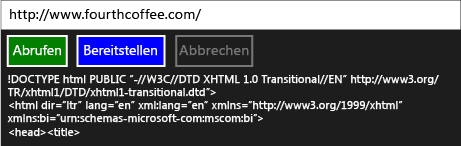

# Exemplarische Vorgehensweise: Verbinden von Verwendungsaufgaben und XML-HTTP-Anforderungen

Dieses Beispiel zeigt, wie Sie mit der [IXMLHTTPRequest2](/windows/desktop/api/msxml6/nn-msxml6-ixmlhttprequest2) und [IXMLHTTPRequest2Callback](/windows/desktop/api/msxml6/nn-msxml6-ixmlhttprequest2callback) -Schnittstellen zusammen mit Aufgaben, die zum Senden von HTTP GET- und POST-Anforderungen an einen Webdienst in einer universellen Windows-Plattform (UWP ) app. Beim Kombinieren von `IXMLHTTPRequest2` mit Aufgaben können Sie Code schreiben, der mit anderen Aufgaben zusammen erstellt wird. Beispielsweise können Sie die Downloadaufgabe als Teil einer Kette von Aufgaben verwenden. Wenn Arbeit abgebrochen wird, kann die Downloadaufgabe auch weiterhin antworten.

> [!TIP]
>  Sie können auch das C++ REST SDK verwenden, HTTP-Anforderungen aus einer UWP-app mit C++-app oder eine Desktop-C++-app ausführen. Weitere Informationen finden Sie unter [C++ REST SDK (Codename "Casablanca")](https://github.com/Microsoft/cpprestsdk).

Weitere Informationen zu Aufgaben, finden Sie unter [Aufgabenparallelität](../../parallel/concrt/task-parallelism-concurrency-runtime.md). Weitere Informationen zur Verwendung von Aufgaben in einer UWP-app finden Sie unter [asynchrone Programmierung in C++](/windows/uwp/threading-async/asynchronous-programming-in-cpp-universal-windows-platform-apps) und [Erstellen von asynchronen Vorgängen in C++ für UWP-Apps](../../parallel/concrt/creating-asynchronous-operations-in-cpp-for-windows-store-apps.md).

Dieses Dokument erläutert zunächst, wie die `HttpRequest`-Klasse und unterstützende Klassen erstellt werden. Anschließend wird veranschaulicht, wie diese Klasse aus einer UWP-app zu verwenden, die C++ und XAML verwendet wird.

Ein Beispiel für die Verwendung `IXMLHTTPRequest2` , aber nicht Aufgaben verwenden, finden Sie unter [Schnellstart: Herstellen einer Verbindung mit der XML-HTTP-Anforderung (IXMLHTTPRequest2)](/previous-versions/windows/apps/hh770550\(v=win.10\)).

> [!TIP]
>  `IXMLHTTPRequest2` und `IXMLHTTPRequest2Callback` sind die Schnittstellen, die wir, für die Verwendung in einer UWP-app empfehlen. Darüber hinaus können Sie dieses Beispiel auch für die Verwendung in einer Desktop-App anpassen.

## Vorraussetzungen

## Definieren der HttpRequest-, HttpRequestBuffersCallback- und HttpRequestStringCallback-Klassen

Wenn Sie die `IXMLHTTPRequest2`-Schnittstelle verwenden, um Webanforderungen über HTTP zu erstellen, implementieren Sie die `IXMLHTTPRequest2Callback`-Schnittstelle, um die Serverantwort zu empfangen und auf andere Ereignisse zu reagieren. In diesem Beispiel werden die `HttpRequest`-Klasse zum Erstellen von Webanforderungen und die Klassen `HttpRequestBuffersCallback` und `HttpRequestStringCallback` zum Verarbeiten der Antworten definiert. Die `HttpRequestBuffersCallback`-Klasse und die `HttpRequestStringCallback`-Klasse unterstützen die `HttpRequest`-Klasse; Sie arbeiten im Anwendungscode nur mit der `HttpRequest`-Klasse.

Die `GetAsync`-Methode und die `PostAsync`-Methode der `HttpRequest`-Klasse ermöglichen Ihnen das Durchführen von HTTP-Anforderungen (GET, POST). Diese Methoden verwenden die `HttpRequestStringCallback`-Klasse, um die Serverantwort als Zeichenfolge zu lesen. Die `SendAsync`-Methode und die `ReadAsync`-Methode ermöglichen das Übertragen von umfangreichen Inhalten in Blöcken. Jede dieser Methoden zurückgeben [Concurrency:: Task](../../parallel/concrt/reference/task-class.md) um den Vorgang darzustellen. Die `GetAsync`-Methode und die `PostAsync`-Methode generieren `task<std::wstring>`-Wert, wobei der `wstring`-Teil die Antwort des Servers darstellt. Die `SendAsync`-Methode und die `ReadAsync`-Methode generieren `task<void>`-Werte. Diese Aufgaben werden abgeschlossen, wenn die „Send“- und „Read“-Vorgänge abgeschlossen werden.

Da die `IXMLHTTPRequest2` -Schnittstellen sich asynchron Verhalten, das in diesem Beispiel verwendet [Concurrency:: task_completion_event](../../parallel/concrt/reference/task-completion-event-class.md) zum Erstellen einer Aufgabe, die abgeschlossen wird, nachdem das Rückrufobjekt abgeschlossen oder bricht den Ladevorgang ab. Die `HttpRequest`-Klasse erstellt eine aufgabenbasierte Fortsetzung aus dieser Aufgabe, um das Endergebnis festzulegen. Die `HttpRequest`-Klasse verwendet eine aufgabenbasierte Fortsetzung, um sicherzustellen, dass die Fortsetzungsaufgabe ausgeführt wird, auch wenn die vorherige Aufgabe einen Fehler erzeugt oder abgebrochen wird. Weitere Informationen zu aufgabenbasierten Fortsetzungen finden Sie unter [Aufgabenparallelität](../../parallel/concrt/task-parallelism-concurrency-runtime.md)

Um ein Abbrechen zu unterstützen, verwenden die Klassen `HttpRequest`, `HttpRequestBuffersCallback` und `HttpRequestStringCallback` Abbruchtoken. Die `HttpRequestBuffersCallback` und `HttpRequestStringCallback` Klassen geben mit der [Concurrency::cancellation_token::register_callback](reference/cancellation-token-class.md#register_callback) Methode zum Aktivieren von des aufgabenabschlussereignis auf den Abbruch zu reagieren. Dieser Abbruchsrückruf bricht den Download ab. Weitere Informationen über Abbrüche finden Sie unter [Abbruch](../../parallel/concrt/exception-handling-in-the-concurrency-runtime.md#cancellation).

#### So definieren Sie die HttpRequest-Klasse

1. Verwenden Sie die Visual C++ **leere App (XAML)** Vorlage, um ein leeres XAML-app-Projekt zu erstellen. In diesem Beispiel wird das Projekt `UsingIXMLHTTPRequest2`genannt.

1. Fügen Sie dem Projekt eine Headerdatei mit dem Namen "HttpRequest.h" und eine Quelldatei mit dem Namen "HttpRequest.cpp" hinzu.

1. Fügen Sie "pch.h" diesen Code hinzu:

   [!code-cpp[concrt-using-ixhr2#1](../../parallel/concrt/codesnippet/cpp/walkthrough-connecting-using-tasks-and-xml-http-requests_1.h)]

1. Fügen Sie "HttpRequest.h" diesen Code hinzu:

   [!code-cpp[concrt-using-ixhr2#2](../../parallel/concrt/codesnippet/cpp/walkthrough-connecting-using-tasks-and-xml-http-requests_2.h)]

1. Fügen Sie "HttpRequest.cpp" diesen Code hinzu:

   [!code-cpp[concrt-using-ixhr2#3](../../parallel/concrt/codesnippet/cpp/walkthrough-connecting-using-tasks-and-xml-http-requests_3.cpp)]

## Verwenden der HttpRequest-Klasse in einer UWP-App

In diesem Abschnitt wird veranschaulicht, wie Sie mit der `HttpRequest` Klasse in einer UWP-app. Die App enthält ein Eingabefeld, das eine URL-Ressource definiert, und Schaltflächen zum Durchführen von GET- und POST-Anforderungen und zum Abbrechen des aktuellen Vorgangs.

#### So verwenden Sie die HttpRequest-Klasse

1. In "MainPage.xaml" definieren die [StackPanel](https://msdn.microsoft.com/library/windows/apps/xaml/windows.ui.xaml.controls.stackpanel.aspx) -Element wie folgt.

   [!code-xml[concrt-using-ixhr2#A1](../../parallel/concrt/codesnippet/xaml/walkthrough-connecting-using-tasks-and-xml-http-requests_4.xaml)]

2. In "MainPage.xaml.h" fügen Sie diese `#include`-Anweisung hinzu:

   [!code-cpp[concrt-using-ixhr2#A2](../../parallel/concrt/codesnippet/cpp/walkthrough-connecting-using-tasks-and-xml-http-requests_5.h)]

3. Fügen Sie diese `private`-Membervariablen der `MainPage`-Klasse in "MainPage.xaml.h" hinzu:

   [!code-cpp[concrt-using-ixhr2#A3](../../parallel/concrt/codesnippet/cpp/walkthrough-connecting-using-tasks-and-xml-http-requests_6.h)]

4. Deklarieren Sie in "MainPage.xaml.h" die `private`-Methode `ProcessHttpRequest`:

   [!code-cpp[concrt-using-ixhr2#A4](../../parallel/concrt/codesnippet/cpp/walkthrough-connecting-using-tasks-and-xml-http-requests_7.h)]

5. Fügen Sie "MainPage.xaml.cpp" diese `using`-Anweisungen hinzu:

   [!code-cpp[concrt-using-ixhr2#A5](../../parallel/concrt/codesnippet/cpp/walkthrough-connecting-using-tasks-and-xml-http-requests_8.cpp)]

6. Implementieren Sie in "MainPage.xaml.cpp" die Methoden `GetButton_Click`, `PostButton_Click` und `CancelButton_Click` aus der `MainPage`-Klasse.

   [!code-cpp[concrt-using-ixhr2#A6](../../parallel/concrt/codesnippet/cpp/walkthrough-connecting-using-tasks-and-xml-http-requests_9.cpp)]

   > [!TIP]
   > Wenn Ihre app keine Unterstützung für den Abbruch erfordert, übergeben Sie [Concurrency:: cancellation_token:: none](reference/cancellation-token-class.md#none) auf die `HttpRequest::GetAsync` und `HttpRequest::PostAsync` Methoden.

1. Implementieren Sie die `MainPage::ProcessHttpRequest`-Methode in "MainPage.xaml.cpp".

   [!code-cpp[concrt-using-ixhr2#A7](../../parallel/concrt/codesnippet/cpp/walkthrough-connecting-using-tasks-and-xml-http-requests_10.cpp)]

8. In den Projekteigenschaften unter **Linker**, **Eingabe**, geben Sie `shcore.lib` und `msxml6.lib`.

Hier ist die ausgeführte App:

## Nächste Schritte

[Exemplarische Vorgehensweisen für die Concurrency Runtime](../../parallel/concrt/concurrency-runtime-walkthroughs.md)

## Siehe auch

[Aufgabenparallelität](../../parallel/concrt/task-parallelism-concurrency-runtime.md) 
[Abbruch in der PPL](cancellation-in-the-ppl.md) 
[Asynchrone Programmierung in C++](/windows/uwp/threading-async/asynchronous-programming-in-cpp-universal-windows-platform-apps) 
[Erstellen von asynchronen Vorgängen in C++ für UWP-Apps](../../parallel/concrt/creating-asynchronous-operations-in-cpp-for-windows-store-apps.md) 
[Schnellstart: Herstellen einer Verbindung mit der XML-HTTP-Anforderung (IXMLHTTPRequest2)](/previous-versions/windows/apps/hh770550\(v=win.10\))
[task-Klasse (Concurrency Runtime)](../../parallel/concrt/reference/task-class.md) 
[task_completion_event-Klasse](../../parallel/concrt/reference/task-completion-event-class.md)
