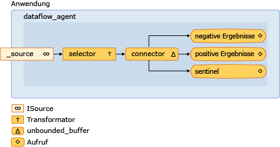

# <a name="walkthrough-creating-a-dataflow-agent"></a>Exemplarische Vorgehensweise: Erstellen eines Datenfluss-Agent

In diesem Dokument wird das Erstellen von agentbasierten Anwendungen auf Basis eines Datenflusses anstelle eines Kontrollflusses veranschaulicht.

*Ablaufsteuerung* bezieht sich auf die Ausführungsreihenfolge von Vorgängen in einem Programm. Die Ablaufsteuerung wird mit Steuerungsstrukturen, z. B. Bedingungsanweisungen, Schleifen usw., geregelt. Sie können auch *Datenfluss* bezieht sich auf ein Programmiermodell, das in der Berechnungen erstellt werden, nur wenn alle erforderliche Daten verfügbar ist. Das Datenflussprogrammiermodell bezieht sich auf das Konzept der Nachrichtenübergabe, bei dem unabhängige Komponenten eines Programms miteinander kommunizieren, indem sie Nachrichten senden.

Asynchrone Agents unterstützen sowohl das Ablaufsteuerungs- als auch das Datenflussprogrammiermodell. Das Ablaufsteuerungsmodell eignet sich in vielen Fällen, jedoch ist in anderen Fällen das Datenflussmodell angemessen, z. B. wenn ein Agent Daten empfängt und eine Aktion ausführt, die auf der Nutzlast dieser Daten basiert.

## <a name="prerequisites"></a>Vorraussetzungen

Lesen Sie die folgenden Dokumente, bevor Sie mit dieser exemplarischen Vorgehensweise beginnen:

- [Asynchrone Agents](../../parallel/concrt/asynchronous-agents.md)

- [Asynchrone Nachrichtenblöcke](../../parallel/concrt/asynchronous-message-blocks.md)

- [Vorgehensweise: Verwenden eines Nachrichtenblockfilters](../../parallel/concrt/how-to-use-a-message-block-filter.md)

##  <a name="top"></a> Abschnitte

Diese exemplarische Vorgehensweise enthält folgende Abschnitte:

- [Erstellen eines einfachen Ablaufsteuerungs-Agents](#control-flow)

- [Erstellen eines einfachen Datenfluss-Agents](#dataflow)

- [Erstellen eines Nachrichtenprotokollierungs-Agents](#logging)

##  <a name="control-flow"></a> Erstellen eines einfachen Ablaufsteuerungs-Agents

Betrachten Sie das folgende Beispiel, in dem die `control_flow_agent`-Klasse definiert wird. Die `control_flow_agent`-Klasse wird auf drei Nachrichtenpuffer angewendet: einen Eingabepuffer und zwei Ausgabepuffer. Die `run`-Methode liest in einer Schleife aus dem Quellnachrichtenpuffer und steuert den Fluss der Programmausführung mit einer Bedingungsanweisung. Der Agent erhöht einen Zähler für negative Werte ungleich 0 (null) und einen anderen Zähler für positive Werte ungleich 0 (null). Nachdem der Agent den Sentinelwert 0 (null) empfangen hat, sendet er die Werte der Zähler an die Ausgabenachrichtenpuffer. Die `negatives`-Methode und die `positives`-Methode ermöglichen es der Anwendung, die Anzahl der negativen und positiven Werte aus dem Agent zu lesen.

[!code-cpp[concrt-dataflow-agent#1](../../parallel/concrt/codesnippet/cpp/walkthrough-creating-a-dataflow-agent_1.cpp)]

In diesem Beispiel wird zwar nur eine einfache Ablaufsteuerung in einem Agent verwendet, es veranschaulicht jedoch, dass die Programmierung mit Ablaufsteuerung serielle Vorgänge regelt. Die einzelnen Nachrichten müssen nacheinander verarbeitet werden, auch wenn im Eingabenachrichtenpuffer mehrere Nachrichten verfügbar sind. Das Datenflussmodell ermöglicht die gleichzeitige Auswertung beider Verzweigungen der Bedingungsanweisung. Das Datenflussmodell ermöglicht Ihnen außerdem das Erstellen von komplexeren Nachrichtennetzwerken, die auf Daten angewendet werden, sobald sie verfügbar sind.

[[Nach oben](#top)]

##  <a name="dataflow"></a> Erstellen eines einfachen Datenfluss-Agents

In diesem Abschnitt wird gezeigt, wie die `control_flow_agent`-Klasse konvertiert wird, um die gleiche Aufgabe mit dem Datenflussmodell auszuführen.

Der Datenfluss-Agent erstellt ein Netzwerk von Nachrichtenpuffern, die jeweils einem bestimmten Zweck dienen. Bestimmte Nachrichtenblöcke verwenden eine Filterfunktion, um eine Nachricht auf Grundlage ihrer Nutzlast anzunehmen oder abzulehnen. Eine Filterfunktion stellt sicher, dass ein Nachrichtenblock nur bestimmte Werte empfängt.

#### <a name="to-convert-the-control-flow-agent-to-a-dataflow-agent"></a>So konvertieren Sie einen Ablaufsteuerungs-Agent in einen Datenfluss-Agent

1. Kopieren Sie den Text der `control_flow_agent`-Klasse in eine andere Klasse, z. B. `dataflow_agent`. Alternativ können Sie die `control_flow_agent`-Klasse umbenennen.

1. Entfernen Sie den Text der Schleife, die in der `receive`-Methode `run` aufruft.

[!code-cpp[concrt-dataflow-agent#2](../../parallel/concrt/codesnippet/cpp/walkthrough-creating-a-dataflow-agent_2.cpp)]

1. Fügen Sie in der `run`-Methode nach der Initialisierung der Variablen `negative_count` und `positive_count` ein `countdown_event`-Objekt hinzu, das die Anzahl der aktiven Vorgänge nachverfolgt.

[!code-cpp[concrt-dataflow-agent#6](../../parallel/concrt/codesnippet/cpp/walkthrough-creating-a-dataflow-agent_3.cpp)]

   Die `countdown_event`-Klasse wird weiter unten in diesem Thema dargestellt.

1. Erstellen Sie die Nachrichtenpufferobjekte, die am Datenflussnetzwerk beteiligt sind.

[!code-cpp[concrt-dataflow-agent#3](../../parallel/concrt/codesnippet/cpp/walkthrough-creating-a-dataflow-agent_4.cpp)]

1. Verbinden Sie die Nachrichtenpuffer zu einem Netzwerk.

[!code-cpp[concrt-dataflow-agent#4](../../parallel/concrt/codesnippet/cpp/walkthrough-creating-a-dataflow-agent_5.cpp)]

1. Warten Sie, bis das `event`-Objekt und das `countdown event`-Objekt festgelegt sind. Diese Ereignisse signalisieren, dass der Agent den Sentinelwert empfangen hat und alle Vorgänge abgeschlossen wurden.

[!code-cpp[concrt-dataflow-agent#5](../../parallel/concrt/codesnippet/cpp/walkthrough-creating-a-dataflow-agent_6.cpp)]

Das folgende Diagramm zeigt das gesamte Datenflussnetzwerk für die `dataflow_agent`-Klasse:



In der folgenden Tabelle werden die Member des Netzwerks beschrieben.

|Member|Beschreibung|
|------------|-----------------|
|`increment_active`|Ein [Concurrency:: transformer](../../parallel/concrt/reference/transformer-class.md) Objekt, das den aktiven Ereigniszähler erhöht und den Eingabewert für den Rest des Netzwerks übergibt.|
|`negatives`, `positives`|[Concurrency:: Call](../../parallel/concrt/reference/call-class.md) Objekte, die der Anzahl und den aktiven Ereigniszähler erhöht. Die einzelnen Objekte verwenden einen Filter, um entweder positive Zahlen oder negative Zahlen zu akzeptieren.|
|`sentinel`|Ein [Concurrency:: Call](../../parallel/concrt/reference/call-class.md) Objekt, das nur dem Sentinelwert 0 (null) und verringert den aktiven Ereigniszähler akzeptiert.|
|`connector`|Ein [Concurrency:: unbounded_buffer](reference/unbounded-buffer-class.md) -Objekt, das den Quellnachrichtenpuffer mit dem internen Netzwerk verbunden.|

Da die `run`-Methode in einem eigenen Thread aufgerufen wird, können andere Threads Nachrichten an das Netzwerk senden, bevor dieses vollständig verbunden ist. Der `_source`-Datenmember ist ein `unbounded_buffer`-Objekt, das alle Eingaben puffert, die von der Anwendung an den Agent gesendet werden. Um sicherzustellen, dass das Netzwerk alle Eingabenachrichten verarbeitet, verknüpft der Agent zunächst die internen Knoten des Netzwerks, und anschließend verknüpft er den Anfang dieses Netzwerk (`connector`) mit dem `_source`-Datenmember. Dies stellt sicher, dass keine Nachrichten verarbeitet werden, während das Netzwerk erstellt wird.

Da das Netzwerk in diesem Beispiel auf Datenfluss und nicht auf Ablaufsteuerung basiert, muss es dem Agent mitteilen, dass die Verarbeitung der einzelnen Eingabewerte abgeschlossen wurde und der Sentinelknoten den entsprechenden Wert empfangen hat. Dieses Beispiel verwendet eine `countdown_event` -Objekt signalisiert, dass alle Eingabewerte verarbeitet wurden und ein [Concurrency:: Event](../../parallel/concrt/reference/event-class.md) Objekt, um anzugeben, dass der Sentinelknoten den entsprechenden Wert empfangen hat. Die `countdown_event`-Klasse signalisiert mit einem `event`-Objekt, dass ein Zähler den Wert 0 (null) erreicht hat. Der Anfang des Datenflussnetzwerks erhöht den Zähler jedes Mal, wenn bei ihm ein Wert empfangen wird. Jeder Terminalknoten des Netzwerks verringert den Zähler, nachdem er den Eingabewert verarbeitet hat. Nachdem der Agent das Datenflussnetzwerk erstellt hat, wartet er, bis der Sentinelknoten das `event`-Objekt festgelegt und das `countdown_event`-Objekt signalisiert hat, dass sein Zähler 0 (null) erreicht hat.

Im folgenden Beispiel werden die Klassen `control_flow_agent`, `dataflow_agent` und `countdown_event` gezeigt. Die `wmain`-Funktion erstellt ein `control_flow_agent`-Objekt und ein `dataflow_agent`-Objekt und sendet mit der `send_values`-Funktion eine Reihe von Zufallswerten an die Agents.

[!code-cpp[concrt-dataflow-agent#7](../../parallel/concrt/codesnippet/cpp/walkthrough-creating-a-dataflow-agent_7.cpp)]

Dieses Beispiel erzeugt die folgende Beispielausgabe:

```Output
Control-flow agent:
There are 500523 negative numbers.
There are 499477 positive numbers.
Dataflow agent:
There are 500523 negative numbers.
There are 499477 positive numbers.
```

### <a name="compiling-the-code"></a>Kompilieren des Codes

Kopieren Sie den Beispielcode und fügen Sie ihn in ein Visual Studio-Projekt, oder fügen Sie ihn in eine Datei mit dem Namen `dataflow-agent.cpp` und führen Sie dann den folgenden Befehl in einem Fenster von Visual Studio-Eingabeaufforderung.

**CL.exe/EHsc Dataflow-agent.cpp**

[[Nach oben](#top)]

##  <a name="logging"></a> Erstellen eines Nachrichtenprotokollierungs-Agents

Im folgenden Beispiel wird die `log_agent`-Klasse veranschaulicht, die der `dataflow_agent`-Klasse ähnelt. Die `log_agent`-Klasse implementiert einen asynchronen Protokollierungs-Agent, der Protokollmeldungen in eine Datei und an die Konsole ausgibt. Mit der `log_agent`-Klasse kann die Anwendung Nachrichten als Informationsmeldung, Warnmeldung oder Fehlermeldung kategorisieren. Sie ermöglicht es der Anwendung außerdem anzugeben, ob die Protokollmeldungen der jeweiligen Kategorie in eine Datei, an die Konsole oder sowohl in eine Datei als auch an die Konsole ausgegeben werden. In diesem Beispiel werden alle Protokollmeldungen in eine Datei und nur Fehlermeldungen an die Konsole ausgegeben.

[!code-cpp[concrt-log-filter#1](../../parallel/concrt/codesnippet/cpp/walkthrough-creating-a-dataflow-agent_8.cpp)]

In diesem Beispiel wird die folgende Ausgabe in die Konsole geschrieben.

```Output
error: This is a sample error message.
```

In diesem Beispiel wird außerdem die Datei log.txt erzeugt, die den folgenden Text enthält.

```Output
info: ===Logging started.===
warning: This is a sample warning message.
error: This is a sample error message.
info: ===Logging finished.===
```

### <a name="compiling-the-code"></a>Kompilieren des Codes

Kopieren Sie den Beispielcode und fügen Sie ihn in ein Visual Studio-Projekt, oder fügen Sie ihn in eine Datei mit dem Namen `log-filter.cpp` und führen Sie dann den folgenden Befehl in einem Fenster von Visual Studio-Eingabeaufforderung.

**CL.exe/EHsc Log-filter.cpp**

[[Nach oben](#top)]

## <a name="see-also"></a>Siehe auch

[Exemplarische Vorgehensweisen für die Concurrency Runtime](../../parallel/concrt/concurrency-runtime-walkthroughs.md)

