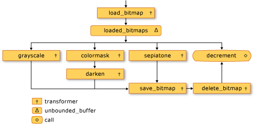
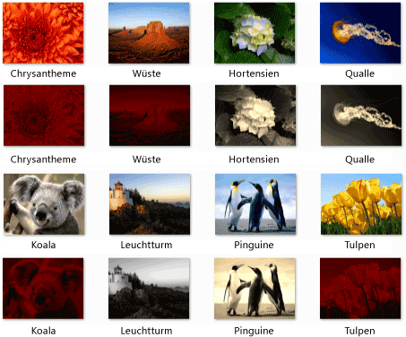

# Exemplarische Vorgehensweise: Erstellen eines Bildverarbeitungsnetzwerks

Dieses Dokument veranschaulicht die Erstellung ein Netzwerks asynchroner Nachrichtenblöcke die bildverarbeitung.

Das Netzwerk bestimmt, welche Vorgänge in einem Bild auf der Grundlage seiner Merkmale ausgeführt wird. Dieses Beispiel verwendet die *Datenfluss* Modell Route-Images über das Netzwerk. Im Datenflussmodell kommunizieren unabhängige Komponenten eines Programms durch Senden von Nachrichten miteinander. Wenn eine Komponente eine Nachricht empfängt, können sie eine Aktion ausführt und dann das Ergebnis der Aktion an eine andere Komponente übergeben. Vergleichen Sie dies mit der *ablaufsteuerung* Modell, in denen verwendet eine Anwendung Steuerungsstrukturen, z. B., bedingungsanweisungen, Schleifen und So weiter, um die Reihenfolge der Vorgänge in einem Programm zu steuern.

Erstellt ein Netzwerk, das basierend auf dem Datenfluss eine *Pipeline* von Aufgaben. Jede Phase der Pipeline führt gleichzeitig Teil des gesamten Tasks. Eine Analogie hierzu ist eine Fertigungsstraße eines Fahrzeugherstellers. Da jedes Fahrzeug durchläuft die Fertigungsstraße einer Station Fahrgestell montiert, in einem anderen installiert die Engine und So weiter. Aktivieren Sie mehrere Fahrzeuge gleichzeitig montiert werden, bietet die Fertigungsstraße einen besseren Durchsatz als eine einzelmontage eines vollständigen Fahrzeugs zu einem Zeitpunkt.

## Vorraussetzungen

Lesen Sie die folgenden Dokumente, bevor Sie mit dieser exemplarischen Vorgehensweise beginnen:

- [Asynchrone Nachrichtenblöcke](../../parallel/concrt/asynchronous-message-blocks.md)

- [Vorgehensweise: Verwenden eines Nachrichtenblockfilters](../../parallel/concrt/how-to-use-a-message-block-filter.md)

- [Exemplarische Vorgehensweise: Erstellen eines Datenfluss-Agent](../../parallel/concrt/walkthrough-creating-a-dataflow-agent.md)

Außerdem wird empfohlen, dass Sie die Grundlagen von GDI + verstehen, bevor Sie in dieser exemplarischen Vorgehensweise beginnen.

##   Abschnitte

Diese exemplarische Vorgehensweise enthält folgende Abschnitte:

- [Definieren von Funktionen für die Bildverarbeitung](#functionality)

- [Erstellen das Bildverarbeitungsnetzwerk](#network)

- [Vollständiges Beispiel](#complete)

##   Definieren von Funktionen für die Bildverarbeitung

Dieser Abschnitt zeigt die Supportfunktionen, die das Bildverarbeitungsnetzwerk verwendet wird, um mit Images zu arbeiten, die vom Datenträger gelesen werden.

Die folgenden Funktionen, `GetRGB` und `MakeColor`, extrahieren und kombinieren Sie jeweils die einzelnen Komponenten der angegebenen Farbe.

[!code-cpp[concrt-image-processing-filter#2](../../parallel/concrt/codesnippet/cpp/walkthrough-creating-an-image-processing-network_1.cpp)]

Die folgende Funktion `ProcessImage`, ruft die angegebenen [Std:: Function](../../standard-library/function-class.md) Objekt, das den Wert der Farbe jedes Pixels in eine GDI + transformiert [Bitmap](/windows/desktop/api/gdiplusheaders/nl-gdiplusheaders-bitmap) Objekt. Die `ProcessImage` Funktion verwendet die [Concurrency:: parallel_for](reference/concurrency-namespace-functions.md#parallel_for) Algorithmus, um jede Zeile der Bitmap in parallelen Verarbeitung.

[!code-cpp[concrt-image-processing-filter#3](../../parallel/concrt/codesnippet/cpp/walkthrough-creating-an-image-processing-network_2.cpp)]

Die folgenden Funktionen, `Grayscale`, `Sepiatone`, `ColorMask`, und `Darken`, rufen Sie die `ProcessImage` Funktion zum Transformieren des Color-Wertes, der jedes Pixel in einem `Bitmap` Objekt. Jede dieser Funktionen verwendet einen Lambda-Ausdruck, um die Transformation Farbe eines Pixels zu definieren.

[!code-cpp[concrt-image-processing-filter#4](../../parallel/concrt/codesnippet/cpp/walkthrough-creating-an-image-processing-network_3.cpp)]

Die folgende Funktion `GetColorDominance`, ruft auch die `ProcessImage` Funktion. Anstatt den Wert jeder Farbe ändern, verwendet diese Funktion jedoch [Concurrency:: combinable](../../parallel/concrt/reference/combinable-class.md) Objekte berechnet, ob die Rot, Grün und Blau-Farbkomponente vorwiegend, das Image ein.

[!code-cpp[concrt-image-processing-filter#5](../../parallel/concrt/codesnippet/cpp/walkthrough-creating-an-image-processing-network_4.cpp)]

Die folgende Funktion `GetEncoderClsid`, ruft die Klassen-ID für den angegebenen MIME-Typ eines Encoders ab. Die Anwendung verwendet diese Funktion, um den Encoder für eine Bitmap abzurufen.

[!code-cpp[concrt-image-processing-filter#6](../../parallel/concrt/codesnippet/cpp/walkthrough-creating-an-image-processing-network_5.cpp)]

[[Nach oben](#top)]

##   Erstellen das Bildverarbeitungsnetzwerk

Dieser Abschnitt beschreibt die Erstellung ein Netzwerks asynchroner Nachrichtenblöcke, die bildverarbeitung für jedes Bild JPEG (JPG) in einem Verzeichnis ausführen. Das Netzwerk führt die folgenden bildverarbeitung Vorgänge aus:

1. Für jedes Bild, das von Peter verfasst wird, eine Umwandlung in Graustufen.

1. Entfernen Sie für jedes Bild, das die dominanten Farbe Rot ist die Komponenten grünen und blauen und Abdunkeln Sie es dann aus.

1. Wenden Sie für alle anderen Bild auch Sepia Ton.

Das Netzwerk gilt nur den ersten bildverarbeitung Vorgang, der eine der folgenden Bedingungen entspricht. Wenn ein Bild von Tom erstellt und die Farbe Rot dominiert, wird das Image beispielsweise nur in Graustufen konvertiert.

Nachdem das Netzwerk jeder bildverarbeitung Vorgang ausführt, speichert das Bild auf den Datenträger als Bitmapdatei (BMP).

Die folgenden Schritte zeigen, wie Sie eine Funktion erstellen, die implementiert dieses Netzwerk für die bildverarbeitung und jedes JPEG-Bild in einem Verzeichnis mit diesem Netzwerk gilt.

#### Zum Erstellen des Netzwerks für die bildverarbeitung

1. Erstellen Sie eine Funktion, `ProcessImages`, die den Namen eines Verzeichnisses auf dem Datenträger belegt.

   [!code-cpp[concrt-image-processing-filter#7](../../parallel/concrt/codesnippet/cpp/walkthrough-creating-an-image-processing-network_6.cpp)]

1. In der `ProcessImages` funktioniert, erstellen Sie eine `countdown_event` Variable. Die `countdown_event` ist weiter unten in dieser exemplarischen Vorgehensweise dargestellt.

   [!code-cpp[concrt-image-processing-filter#8](../../parallel/concrt/codesnippet/cpp/walkthrough-creating-an-image-processing-network_7.cpp)]

1. Erstellen Sie eine [Std:: Map](../../standard-library/map-class.md) -Objekt, das ordnet eine `Bitmap` Objekt mit dem ursprünglichen Dateinamen.

   [!code-cpp[concrt-image-processing-filter#9](../../parallel/concrt/codesnippet/cpp/walkthrough-creating-an-image-processing-network_8.cpp)]

1. Fügen Sie den folgenden Code ein, um die Elemente von der Bildverarbeitungsnetzwerks zu definieren.

   [!code-cpp[concrt-image-processing-filter#10](../../parallel/concrt/codesnippet/cpp/walkthrough-creating-an-image-processing-network_9.cpp)]

1. Fügen Sie den folgenden Code ein, um das Netzwerk zu verbinden.

   [!code-cpp[concrt-image-processing-filter#11](../../parallel/concrt/codesnippet/cpp/walkthrough-creating-an-image-processing-network_10.cpp)]

1. Fügen Sie den folgenden Code zum Senden an den Anfang des Netzwerks des vollständigen Pfads jeder JPEG-Datei im Verzeichnis.

   [!code-cpp[concrt-image-processing-filter#12](../../parallel/concrt/codesnippet/cpp/walkthrough-creating-an-image-processing-network_11.cpp)]

1. Warten, bis die `countdown_event` Variable, die 0 (null) erreicht.

   [!code-cpp[concrt-image-processing-filter#13](../../parallel/concrt/codesnippet/cpp/walkthrough-creating-an-image-processing-network_12.cpp)]

In der folgenden Tabelle werden die Member des Netzwerks beschrieben.

|Member|Beschreibung|
|------------|-----------------|
|`load_bitmap`|Ein [Concurrency:: transformer](../../parallel/concrt/reference/transformer-class.md) -Objekt, das geladen eine `Bitmap` Objekt von einem Datenträger und fügt einen Eintrag aus, um die `map` Objekt, dessen ursprünglicher Dateiname das Abbild zugeordnet werden soll.|
|`loaded_bitmaps`|Ein [Concurrency:: unbounded_buffer](reference/unbounded-buffer-class.md) -Objekt, das die geladenen Bilder an der Verarbeitung Bildfilter sendet.|
|`grayscale`|Ein `transformer` -Objekt, das Bilder konvertiert, die auf der Graustufe von Tom erstellt werden. Er verwendet die Metadaten des Images, um dessen Autor zu bestimmen.|
|`colormask`|Ein `transformer` -Objekt, das der grünen und blauen Farbkomponenten aus Images entfernt werden, die der dominanten Farbe Rot.|
|`darken`|Ein `transformer` -Objekt, das Bilder lässt, die die Farbe Rot dominiert verfügen.|
|`sepiatone`|Ein `transformer` -Objekt, das betrifft Sepia Ton von Images, die nicht von Tom erstellt werden und sind nicht vorwiegend Rot.|
|`save_bitmap`|Ein `transformer` Objekt, das die verarbeiteten speichert `image` auf den Datenträger als Bitmap. `save_bitmap` Ruft den ursprünglichen Dateinamen aus der `map` -Objekt an und ändert die Dateinamenerweiterung, BMP.|
|`delete_bitmap`|Ein `transformer` -Objekt, das den Arbeitsspeicher für die Bilder frei.|
|`decrement`|Ein [Concurrency:: Call](../../parallel/concrt/reference/call-class.md) -Objekt, das als Terminalknoten im Netzwerk fungiert. Es verringert die `countdown_event` Objekt, das der hauptanwendung zu signalisieren, dass ein Bild verarbeitet wurde.|

Die `loaded_bitmaps` Nachrichtenpuffer unbedingt daran, als ein `unbounded_buffer` Objekt, er bietet `Bitmap` Objekte an mehrere Empfänger. Wenn ein Zielblock akzeptiert werden, eine `Bitmap` -Objekt, das `unbounded_buffer` Objekt bietet, die jedoch keine `Bitmap` Objekt, das allen anderen Zielen. Aus diesem Grund Objekte die Reihenfolge, in dem Sie verknüpfen, ein `unbounded_buffer` Objekt ist wichtig. Die `grayscale`, `colormask`, und `sepiatone` Nachricht, die Blöcke, die jeder verwenden Sie einen Filter akzeptieren nur bestimmte `Bitmap` Objekte. Die `decrement` Nachrichtenpuffer ist ein wichtiges Ziel von den `loaded_bitmaps` Nachrichtenpuffer, da es alle akzeptiert `Bitmap` Objekte, die von den anderen Nachrichtenpuffer abgelehnt werden. Ein `unbounded_buffer` ist erforderlich, um Nachrichten in der Reihenfolge weitergegeben werden. Aus diesem Grund eine `unbounded_buffer` Objekt blockiert, bis ein neuer Zielblock wird verknüpft und die Nachricht annimmt, wenn keine aktuelle Zielblock die Nachricht akzeptiert.

Wenn Ihre Anwendung erfordert von mehreren Nachrichtenblöcken Verarbeiten der Nachricht, anstatt nur der Block, der zuerst die Nachricht akzeptiert können eine andere Nachrichtenblocktyp, z. B. `overwrite_buffer`. Die `overwrite_buffer` -Klasse enthält eine Nachricht gleichzeitig, aber es verteilt die Nachricht auf jedes der zugehörigen Ziele.

Die folgende Abbildung zeigt das Bildverarbeitungsnetzwerk:

Die `countdown_event` Objekt in diesem Beispiel ermöglicht das Bildverarbeitungsnetzwerk Hauptdatei der Anwendung zu informieren, wenn alle Bilder verarbeitet wurden. Die `countdown_event` -Klasse verwendet ein [Concurrency:: Event](../../parallel/concrt/reference/event-class.md) -Objekt signalisiert, wenn ein Wert des Leistungsindikators 0 (null) erreicht. Die Hauptassembly der Anwendung erhöht den Zähler jedes Mal, dass die It einen Dateinamen mit dem Netzwerk sendet. Terminalknoten des Netzwerks verringert den Zähler, nachdem jedes Image verarbeitet wurde. Nachdem die hauptanwendung das angegebene Verzeichnis durchsucht, wartet es für die `countdown_event` -Objekt signalisiert, dass sein Zähler 0 (null) erreicht hat.

Das folgende Beispiel zeigt die `countdown_event` Klasse:

[!code-cpp[concrt-image-processing-filter#14](../../parallel/concrt/codesnippet/cpp/walkthrough-creating-an-image-processing-network_13.cpp)]

[[Nach oben](#top)]

##   Das vollständige Beispiel

Der folgende Code veranschaulicht das vollständige Beispiel. Die `wmain` -Funktion verwaltet die GDI +-Bibliothek und ruft die `ProcessImages` Funktion zum Verarbeiten der JPEG-Dateien die `Sample Pictures` Verzeichnis.

[!code-cpp[concrt-image-processing-filter#15](../../parallel/concrt/codesnippet/cpp/walkthrough-creating-an-image-processing-network_14.cpp)]

Die folgende Abbildung zeigt die Ausgabe des Beispiels. Jedes Quellbild liegt über dem entsprechenden geänderten Bild.

`Lighthouse` Tom Alphin erstellt wird und daher in Graustufen konvertiert wird. `Chrysanthemum`, `Desert`, `Koala`, und `Tulips` Rot als der dominanten Farbe haben und daher die grün und Blau-Farbkomponenten entfernt und abgedunkelt werden. `Hydrangeas`, `Jellyfish`, und `Penguins` die Standardkriterien erfüllen, und sind daher Sepia Farbtönen an.

[[Nach oben](#top)]

### Kompilieren des Codes

Kopieren Sie den Beispielcode und fügen Sie ihn in ein Visual Studio-Projekt, oder fügen Sie ihn in eine Datei mit dem Namen `image-processing-network.cpp` und führen Sie dann den folgenden Befehl in einem Fenster von Visual Studio-Eingabeaufforderung.

**CL.exe /DUNICODE/EHsc/Image-Verarbeitung-network.cpp-Link gdiplus.lib**

## Siehe auch

[Exemplarische Vorgehensweisen für die Concurrency Runtime](../../parallel/concrt/concurrency-runtime-walkthroughs.md)
