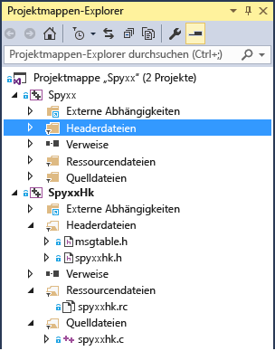

# Leitfaden zum Portieren: Spy++
[!INCLUDE[vs2017banner](../assembler/inline/includes/vs2017banner.md)]

In dieser Portierungsfallstudie erhalten Sie eine Vorstellung über ein typisches Portierungsprojekt, die Problemtypen, die auftreten können, und einige allgemeine Tipps und Tricks zum Beheben von Portierungsproblemen.  Sie stellt keine endgültige Anleitung zum Portieren dar, da das Portieren eines Projekts stark von den Codebesonderheiten abhängig ist.  
  
## Spy\+\+  
 Spy\+\+ ist ein weit verbreitetes GUI\-Diagnosetool für den Windows\-Desktop, das alle möglichen Informationen über Benutzeroberflächenelemente auf dem Windows\-Desktop bereitstellt.  Es stellt die vollständige Fensterhierarchie dar und bietet Zugriff auf Metadaten für jedes Fenster und Steuerelement.  Diese nützliche Anwendung gehört seit vielen Jahren zum Lieferumfang von Visual Studio.  Eine alte zuletzt in Visual Studio\+\+ 6.0 kompilierte Version des Tools wurde in [!INCLUDE[vs_dev14](../ide/includes/vs_dev14_md.md)] portiert.  
  
 Dieser Fall wird als typisch für das Portieren von Windows\-Desktopanwendungen behandelt, die MFC und die Win32\-API verwenden, insbesondere für alte Projekte, die nicht mit jeder Version von Visual C\+\+ seit Visual C\+\+ 6.0 aktualisiert wurden.  
  
### Schritt 1.Konvertieren der Projektdatei  
 Die Projektdatei mit zwei alten DSW\-Dateien aus Visual C\+\+ 6.0 wird problemlos konvertiert.  Ein Projekt ist die Spy\+\+\-Anwendung.  Das andere ist SpyHk, geschrieben in C\#, und stellt eine unterstützende DLL dar.  Für komplexere Projekte ist die Durchführung des Upgrades möglicherweise nicht so einfach wie [hier](../porting/visual-cpp-porting-and-upgrading-guide.md) beschrieben.  Für größere Projekte ist es möglicherweise hilfreich, ein Upgrade für eine Version von Visual Studio durchzuführen.  
  
 Nach dem Upgrade der beiden Projekte sah unsere Projektmappe folgendermaßen aus:  
  
   
  
 Es sind zwei Projekte enthalten, ein mit einer großen Anzahl von C\+\+\-Dateien und ein anderes eine in C geschriebene DLL\-Datei.  
  
### Schritt 2.Probleme mit Headerdateien  
 Eines der häufig auftretenden Probleme beim Erstellen eines neu konvertierten Projekts ist, dass die vom Projekt verwendeten Headerdateien nicht gefunden werden können.  
  
 Eine der Dateien, die nicht in Spy\+\+ gefunden werden konnte, ist verstamp.h.  Durch Internetrecherche konnten ermittelt werden, dass die Ursache für dieses Problem in einem DAO SDK liegt, einer veralteten Technologie.  Wir möchten herausfinden, welche Symbole aus dieser Headerdatei verwendet werden, um herauszufinden, ob die Datei wirklich erforderlich ist, oder ob die Symbole an einer anderen Stelle definiert werden. Dazu wird die Headerdateideklaration auskommentiert und erneut kompiliert.  Dabei stellt sich heraus, dass nur ein Symbol erforderlich ist: VER\_FILEFLAGSMASK.  
  
```  
1>C:\Program Files (x86)\Windows Kits\8.1\Include\shared\common.ver(212): error RC2104: undefined keyword or key name: VER_FILEFLAGSMASK  
```  
  
 Die einfachste Möglichkeit zum Suchen eines Symbols in den verfügbaren Includedateien besteht darin, „In Dateien suchen“ \(STRG\+UMSCHALT\+F\) zu verwenden und **Visual C\+\+\-Includeverzeichnisse** festzulegen.  Dieses befindet sich in unserem Fall in ntverp.h.  Nachdem das verstamp.h\-Include mit ntverp.h ersetzt wurde, tritt dieses Problem nicht mehr auf.  
  
### Schritt 3.OutputFile\-Einstellung des Linkers  
 Ältere Projekte weisen in einigen Fällen Dateien an unkonventionellen Speicherorten auf, was nach dem Upgrade zu Problemen führen kann.  In diesem Fall müssen wir dem Include\-Pfad in den Projekteigenschaften „$\(SolutionDir\)“ hinzufügen, um sicherzustellen, dass Visual Studio die dort platzierten Headerdateien findet, und nicht in einem der Projektordner danach sucht.  
  
 MSBuild meldet, dass die Link.OutputFile\-Eigenschaft nicht mit den TargetPath\- und TargetName\-Werten übereinstimmt und gibt MSB8012 aus.  
  
  **Warnung MSB8012: TargetPath \(...  \\spyxx\\spyxxhk\\.  \\..  \\Debug\\SpyxxHk.dll\) stimmt nicht mit dem Linker\-OutputFile\-Eigenschaftswert \(...  \\spyxx\\Debug\\SpyHk55.dll\) überein.  Das Projekt wird daher möglicherweise nicht ordnungsgemäß erstellt.  Stellen Sie zur Behebung dieses Problems sicher, dass die $\(OutDir\)\-, $\(TargetName\)\- und $\(TargetExt\)\-Eigenschaftswerte mit dem in % \(Link.OutputFile\) angegebenen Wert übereinstimmen.  Warnung MSB8012: TargetName\(SpyxxHk\) stimmt nicht mit dem Linker\-OutputFile\-Eigenschaftswert \(SpyHk55\) überein.  Das Projekt wird daher möglicherweise nicht ordnungsgemäß erstellt.  Stellen Sie zur Behebung dieses Problems sicher, dass die $\(OutDir\)\-, $\(TargetName\)\- und $\(TargetExt\)\-Eigenschaftswerte mit dem in % \(Link.OutputFile\) angegebenen Wert übereinstimmen.**  **Link.OutputFile** ist die Buildausgabe \(z. B. EXE, DLL\) und wird in der Regel aus $\(TargetDir\)$\(TargetName\)$\(TargetExt\) erstellt, d. h. Pfad, Dateiname und Erweiterung.  Dies ist ein häufiger Fehler beim Migrieren von Projekten von dem alten Visual C\+\+\-Buildtool \(vcbuild.exe\) zu dem neuen Buildtool \(MSBuild.exe\).  Seit der Änderung des Buildtools in Visual Studio 2010 tritt dieser Fehler möglicherweise bei jeder Migration einer älteren Projektversion als 2010 zu 2010 oder neuer auf.  Das grundlegende Problem besteht darin, dass der Projektmigrations\-Assistent nicht den **Link.OutputFile**\-Wert aktualisiert, da es auf Grundlage anderer Projekteinstellungen nicht immer möglich ist, diesen Wert zu bestimmen.  Daher müssen Sie diesen in der Regel manuell festlegen.  Weitere Informationen finden Sie in diesem [Beitrag](http://blogs.msdn.com/b/vcblog/archive/2010/03/02/visual-studio-2010-c-project-upgrade-guide.aspx) im Visual C\+\+\-Blog.  
  
 In diesem Beispiel wird die **Link.OutputFile**\-Eigenschaft im konvertierten Projekt je nach Konfiguration auf  \\Debug\\Spyxx.exe und .  \\Release\\Spyxx.exe für das Spy\+\+\-Projekt festgelegt.  Am sinnvollsten ist es diese hartcodierten Werte einfach mit $\(TargetDir\)$\(TargetName\)$\(TargetExt\) für alle Konfigurationen zu ersetzen.  Wenn dies nicht funktioniert, können Sie die Werte von dort aus anpassen oder sie im Abschnitt „Allgemein“ ändern, in dem diese festgelegt werden \(die Eigenschaften sind **Ausgabeverzeichnis**, **Zielname** und **Zielerweiterung**\).  Wenn die angezeigte Eigenschaft Makros verwendet, können Sie in der Dropdownliste **Bearbeiten** auswählen, um ein Dialogfeld zu öffnen, in dem die endgültige Zeichenfolge mit de vorgenommenen Makro\-Ersetzungen angezeigt wird.  Sie können alle verfügbaren Makros mit den zugehörigen aktuellen Werten anzeigen, indem Sie die Schaltfläche **Makros** wählen.  
  
### Schritt 4.Aktualisieren die Windows\-Zielversion  
 Der folgende Fehler gibt an, dass WINVER\-Version nicht länger in MFC unterstützt wird.  WINVER für Windows XP ist 0x0501.  
  
  **C:\\Programme \(x86\)\\Microsoft Visual Studio 14.0\\VC\\atlmfc\\include\\afxv\_w32.h\(40\): Schwerwiegender Fehler C1189: \#error: WINVER niedriger als 0x0501 wird nicht in MFC unterstützt.  Ändern Sie die Definition von WINVER in den Projekteigenschaften oder im vorkompilierten Header.**  Windows XP wird nicht länger von Microsoft unterstützt. Aus diesem Grund sollten Sie die Windows XP\-Unterstützung in Ihren Anwendungen auslaufen lassen und die Verwendung neuer Windows\-Versionen bei den Benutzern fördern, auch wenn Windows XP als Zielversion in [!INCLUDE[vs_dev14](../ide/includes/vs_dev14_md.md)] zulässig ist.  
  
 Definieren Sie zur Behebung dieses Fehlers WINVER, indem Sie die Einstellung **Projekteigenschaften** auf die niedrigste Version von Windows festlegen, die Sie als Zielversion verwenden möchten.  Eine Tabelle mit Werten für verschiedene Windows\-Versionen finden Sie [hier](http://msdn.microsoft.com/library/windows/desktop/aa383745.aspx).  
  
 Die Datei „stdafx.h“ enthält einige dieser Makrodefinitionen.  
  
```  
#define WINVER       0x0500  // these defines are set so that we get the  
#define _WIN32_WINNT 0x0500  // maximum set of message/flag definitions,  
#define _WIN32_IE    0x0400  // from both winuser.h and commctrl.h.  
```  
  
 WINVER wird auf Windows 7 festgelegt.  Es ist einfacher, den Code später zu lesen, wenn Sie das Makro für Windows 7 \(\_WIN32\_WINNT\_WIN7\), statt des Werts \(0x0601\) verwenden.  
  
```  
#define WINVER _WINNT_WIN32_WIN7 // Minimum targeted Windows version is Windows 7  
```  
  
### Schritt 5.Linkerfehler  
 Durch diese Änderungen wird das SpyHk \(DLL\)\-Projekt erstellt, es wird jedoch ein Linkerfehler generiert.  
  
```  
LINK : warning LNK4216: Exported entry point _DLLEntryPoint@12  
```  
  
 Der Einstiegspunkt für eine DLL darf nicht exportiert werden.  Der Einstiegspunkt wird nur beim ersten Laden der DLL in den Arbeitsspeicher vom Ladeprogramm aufgerufen. Deshalb darf dieser nicht in der Exporttabelle für andere Aufrufer vorhanden sein.  Es muss lediglich sichergestellt werden, dass diesem keine `__declspec(dllexport)`\-Direktive angefügt ist.  In spyxxhk.c muss diese an zwei Stellen entfernt werden, in der Deklaration und der Definition von DLLEntryPoint  Die Verwendung dieser Direktive war nie sinnvoll, sie wurde jedoch von den früheren Linker\- und Compilerversionen nicht als Problem gemeldet.  Die neueren Versionen des Linkers generieren eine Warnung.  
  
```  
// deleted __declspec(dllexport)  
BOOL WINAPI DLLEntryPoint(HINSTANCE hinstDLL,DWORD fdwReason, LPVOID lpvReserved);  
  
```  
  
 Das C\-DLL\-Projekt, SpyHK.dll, wird nun ohne Fehler erstellt und verknüpft.  
  
### Schritt 6.Weitere veraltete Headerdateien  
 An dieser Stelle beginnt die Arbeit mit dem ausführbaren Hauptprojekt, Spyxx.  
  
 Es konnte einige andere Includedateien nicht gefunden werden: ctl3d.h und penwin.h.  In einigen Fällen kann das Durchsuchen des Internets bei der Ermittlung des Headerinhalts hilfreich sein.  Dabei stellten wir fest, dass ctl3d.h Teil des Exchange Development Kits war und Unterstützung für einen bestimmten Steuerelementenstil unter Windows 95 bereitstellte und penwin.h mit Windows Pen Computing verknüpft ist, einer veralteten API.  In diesem Fall werden die \#include\-Zeile auskommentiert und nur die nicht definierten Symbole wie bei verstamp.h verarbeitet.  Alle mit 3D\-Steuerelementen oder Pen Computing verknüpften Elemente wurden aus dem Projekt entfernt.  
  
 Wenn ein Projekt viele Kompilierungsfehler enthält, die schrittweise eliminiert werden, ist es nicht realistisch, alle Verwendungen einer veralteten API beim Entfernen der \#include\-Direktive auf Anhieb zu finden.  Diese haben wir nicht sofort erkannt, sondern erst zu einem späteren Zeitpunkt, als ein Fehler geniert wurde, in dem mitgeteilt wurde, dass WM\_DLGBORDER nicht definiert ist.  Dieses ist eines von vielen nicht definierten Symbolen aus ctl3d.h.  Nach Feststellung, dass es mit einer veralteten API verknüpft ist, wurden alle Verweise auf diese API im Code entfernt.  
  
### Schritt 7.Aktualisieren von altem iostreams\-Code  
 Der nächste Fehler tritt häufig beim Verwenden von altem C\+\+\-Code auf, der iostreams verwendet.  
  
 mstream.h\(40\): Schwerwiegender Fehler C1083: Folgende Includedatei kann nicht geöffnet werden: „iostream.h“: Datei oder Verzeichnis nicht vorhanden.  
  
 Die Ursache für dieses Problem besteht darin, dass die alte iostreams\-Bibliothek entfernt und ersetzt wurde.  Alte iostreams\-Inludes müssen durch neuere Standards ersetzt werden.  
  
```  
#include <iostream.h>  
#include <strstrea.h>  
#include <iomanip.h>  
```  
  
 Die aktualisierten Includes sind die folgenden:  
  
```  
#include <iostream>  
#include <sstream>  
#include <iomanip>  
```  
  
 Durch diese Änderung treten Probleme mit ostrstream auf, das nicht mehr verwendet wird.  Ein geeigneter Ersatz ist ostringstream.  Wir versuchen, eine Typdefinition für ostrstream hinzuzufügen, um zumindest anfangs zu viele Codeänderungen zu vermeiden.  
  
```  
typedef std::basic_ostringstream<TCHAR> ostrstream;  
  
```  
  
 Das Projekt wird derzeit mit dem Multibyte\-Zeichensatz \(Multi\-byte Character Set, MBCS \) erstellt, sodass char der entsprechende Zeichendatentyp ist.  Um eine einfache Aktualisierung des Codes auf UTF\-16\-Unicode zu ermöglichen, wird diese auf TCHAR aktualisiert, was je nachdem ob die **Zeichensatz**\-Eigenschaft in den Projekteinstellungen auf MBCS oder Unicode festgelegt ist, zu char oder wchar\_t aufgelöst wird.  
  
 Es müssen auch einige weitere Codeelemente aktualisiert werden.  Die ios\-Basisklasse wird mit ios\_base und ostream mit basic\_ostream\<T\> ersetzt.  Als nächstes werden zwei weitere Typdefinitionen hinzugefügt und es wird der folgende Abschnitt kompiliert.  
  
```  
typedef std::basic_ostream<TCHAR> ostream;  
typedef ios_base ios;  
```  
  
 Die Verwendung dieser Typdefinitionen ist nur eine vorübergehende Lösung.  Eine dauerhafte Lösung für dieses Problem besteht darin, alle Verweise auf die umbenannte oder veraltete API zu aktualisieren.  
  
 Im folgenden wird der nächste Fehler aufgeführt:  
  
  **Fehler C2039: „freeze“: ist kein Member von „td::basic\_stringbuf\<char,std::char\_traits\<char\>,std::allocator\<char\>\>“.** Das nächste Problem besteht darin, dass basic\_stringbuf keine freeze\-Methode aufweist.  Die freeze\-Methode wird verwendet, um einen Speicherverlust im alten ostream zu verhindern.  Da das neue ostringstream\-Objekt verwendet wird, wird sie nicht länger benötigt.  Der freeze\-Aufruf kann gelöscht werden.  
  
```  
//rdbuf()->freeze(0);  
```  
  
 Die nächsten beiden Fehler sind in angrenzenden Zeilen aufgetreten.  Der erste Fehler meldet die Verwendung des ends\-Objekts, das der IO\-Manipulator der alten iostream\-Bibliothek ist, mit dem der eine Zeichenfolge ein NULL\-Abschlusszeichen hinzugefügt wird.  Im zweiten Fehler wird gemeldet, dass die Ausgabe der str\-Methode einem nicht konstanten Zeiger nicht zugewiesen werden kann.  
  
```  
// Null terminate the string in the buffer and  
// get a pointer to it.  
//  
*this << ends;  
LPSTR psz = str();  
```  
  
  **2\>mstream.cpp\(167\): Fehler C2065: „ends“: nicht deklarierter Bezeichner.**  
**2\>mstream.cpp\(168\): Fehler C2440: „Initialisierung“: „std::basic\_string\<char,std::char\_traits\<char\>,std::allocator\<char\>\>“ kann nicht in „LPSTR“ konvertiert werden.** Mit der neuen Streambibliothek ist das „ends“\-Objekt nicht mehr erforderlich, da die Zeichenfolge immer mit einem NULL\-Abschlusszeichen endet, sodass diese Zeile entfernt werden kann.  Beim zweiten Fehler besteht das Problem darin, dass str\(\) jetzt keinen Zeiger auf das Zeichenfolgenarray für eine Zeichenfolge zurückgibt, sondern den std::string\-Typ.  Ändern Sie zur Behebung des zweiten Problems den Typ zu LPCSTR, und verwenden Sie die c\_str\(\)\-Methode zum Anfordern des Zeigers.  
  
```  
//*this << ends;  
LPCTSTR psz = str().c_str();  
```  
  
 Folgender Fehler in diesem Code hat uns eine Weile beschäftigt.  
  
```  
MOUT << _T(" chUser:'") << chUser  
<< _T("' (") << (INT)(UCHAR)chUser << _T(')');  
```  
  
 Das Makro `MOUT` wird zu \*g\_pmout aufgelöst, einem Objekt vom Typ `mstream`.  Die mstream\-Klasse wird von der standardmäßigen Ausgabezeichenfolgenklasse, `std::basic_ostream<TCHAR>.`, abgeleitet. Wenn das Zeichenfolgenliteral jedoch von einem \_T umschlossen wird, was im Rahmen der Vorbereitung für die Konvertierung in Unicode hinzugefügt wurde, tritt bei der Überladungsauflösung für Operator \<\< der folgende Fehler auf:  
  
 **1\>winmsgs.cpp\(4612\): Fehler C2666: "mstream::operator \<\<": Zwei Überladungen haben ähnliche Konvertierungen 1\> c:\\source\\spyxx\\spyxx\\mstream.h\(120\): Hinweis:**   
**kann "mstream &mstream::operator" \<\<\(ios &\(\_\_cdecl \*\)\(ios &\)\)" 1\> c:\\source\\spyxx\\spyxx\\mstream.h\(118\): Hinweis: oder "mstream &mstream::operator \<\<\(ostream**   
**&\(\_\_cdecl \*\)\(ostream &\)\)" sein 1\> c:\\source\\spyxx\\spyxx\\mstream.h\(116\): Hinweis: oder "mstream &mstream::operator \<\<\(ostrstream &\(\_\_cdecl \*\)\(ostrstream &\)\)"**   
**1\> c:\\source\\spyxx\\spyxx\\mstream.h\(114\): Hinweis: oder "mstream &mstream::operator \<\<\(mstream &\(\_\_cdecl \*\)\(mstream &\)\)" 1\> c:\\source\\spyxx\\spyxx\\mstream.h**  
**\(109\): Hinweis: oder "mstream &mstream::operator \<\<\(LPTSTR\)" 1\> c:\\source\\spyxx\\spyxx\\mstream.h\(104\): Hinweis: oder "mstream &mstream::operator \<\<\(TCHAR\)" 1\>**   
**c:\\source\\spyxx\\spyxx\\mstream.h\(102\): Hinweis: oder "mstream &mstream::operator \<\<\(DWORD\)" 1\> c:\\source\\spyxx\\spyxx\\mstream.h\(101\): Hinweis: oder "mstream**   
**&mstream::operator \<\<\(WORD\)" 1\> c:\\source\\spyxx\\spyxx\\mstream.h\(100\): Hinweis: oder "mstream &mstream::operator \<\<\(BYTE\)" 1\> c:\\source\\spyxx\\spyxx\\mstream.h**  
**\(95\): Hinweis: oder "mstream &mstream::operator \<\<\(long\)" 1\> c:\\source\\spyxx\\spyxx\\mstream.h\(90\): Hinweis: oder "mstream &mstream::operator \<\<\(unsigned int\)"**   
**1\> c:\\source\\spyxx\\spyxx\\mstream.h\(85\): Hinweis: oder "mstream &mstream::operator \<\<\(int\)" 1\> c:\\source\\spyxx\\spyxx\\mstream.h\(83\): Hinweis: oder "mstream**   
**&mstream::operator \<\<\(HWND\)" 1\> C:\\Programme \(x86\)\\Microsoft Visual Studio 14.0\\VC\\atlmfc\\include\\afxdisp.h\(1132\): Hinweis: oder "CDumpContext &operator \<\<**  
**\(CDumpContext &,COleSafeArray &\)" 1\> C:\\Programme \(x86\)\\Microsoft Visual Studio 14.0\\VC\\atlmfc\\include\\afxdisp.h\(1044\): Hinweis: oder "CArchive &operator \<\<**  
**\(CArchive &,ATL::COleDateTimeSpan\)" 1\> C:\\Programme \(x86\)\\Microsoft Visual Studio 14.0\\VC\\atlmfc\\include\\afxdisp.h\(1042\): Hinweis: oder "CDumpContext**   
**&operator \<\<\(CDumpContext &,ATL::COleDateTimeSpan\)" 1\> C:\\Programme \(x86\)\\Microsoft Visual Studio 14.0\\VC\\atlmfc\\include\\afxdisp.h\(1037\): Hinweis: oder "CArchive &operator \<\<\(CArchive &,ATL::COleDateTime\)" 1\> C:\\Programme \(x86\)\\Microsoft Visual Studio 14.0\\VC\\atlmfc\\include\\afxdisp.h\(1035\): Hinweis: oder "CDumpContext &operator \<\<\(CDumpContext &,ATL::COleDateTime\)" 1\> C:\\Programme \(x86\)\\Microsoft Visual Studio 14.0\\VC\\atlmfc\\include\\afxdisp.h\(1030\): Hinweis:**   
**oder "CArchive &operator \<\<\(CArchive &,COleCurrency\)" 1\> C:\\Programme \(x86\)\\Microsoft Visual Studio 14.0\\VC\\atlmfc\\include\\afxdisp.h\(1028\): Hinweis: oder**   
**"CDumpContext &operator \<\<\(CDumpContext &,COleCurrency\)" 1\> C:\\Programme \(x86\)\\Microsoft Visual Studio 14.0\\VC\\atlmfc\\include\\afxdisp.h\(955\): Hinweis: oder**   
**"CArchive &operator \<\<\(CArchive &,ATL::CComBSTR\)" 1\> C:\\Programme \(x86\)\\Microsoft Visual Studio 14.0\\VC\\atlmfc\\include\\afxdisp.h\(951\): Hinweis: oder**   
**"CArchive &operator \<\<\(CArchive &,COleVariant\)" 1\> C:\\Programme \(x86\)\\Microsoft Visual Studio 14.0\\VC\\atlmfc\\include\\afxdisp.h\(949\): Hinweis: oder**   
**"CDumpContext &operator \<\<\(CDumpContext &,COleVariant\)" 1\> C:\\Programme \(x86\)\\Microsoft Visual Studio 14.0\\VC\\atlmfc\\include\\afxwin.h\(248\): Hinweis: oder**   
**"CArchive &operator \<\<\(CArchive &,const RECT &\)" 1\> C:\\Programme \(x86\)\\Microsoft Visual Studio 14.0\\VC\\atlmfc\\include\\afxwin.h\(247\): Hinweis: oder "CArchive**   
**&operator \<\<\(CArchive &,POINT\)" 1\> C:\\Programme \(x86\)\\Microsoft Visual Studio 14.0\\VC\\atlmfc\\include\\afxwin.h\(246\): Hinweis: oder "CArchive &operator \<\<**  
**\(CArchive &,SIZE\)" 1\> C:\\Programme \(x86\)\\Microsoft Visual Studio 14.0\\VC\\atlmfc\\include\\afxwin.h\(242\): Hinweis: oder "CDumpContext &operator \<\<\(CDumpContext**   
**&,const RECT &\)" 1\> C:\\Programme \(x86\)\\Microsoft Visual Studio 14.0\\VC\\atlmfc\\include\\afxwin.h\(241\): Hinweis: oder "CDumpContext &operator \<\<\(CDumpContext &,POINT\)" 1\> C:\\Programme \(x86\)\\Microsoft Visual Studio 14.0\\VC\\atlmfc\\include\\afxwin.h\(240\): Hinweis: oder "CDumpContext &operator \<\<\(CDumpContext &,SIZE\)"**   
**1\> C:\\Programme \(x86\)\\Microsoft Visual Studio 14.0\\VC\\atlmfc\\include\\afx.h\(1639\): Hinweis: oder "CArchive &operator \<\<\(CArchive &,const CObject \*\)" 1\> C:**  
**\\Programme \(x86\)\\Microsoft Visual Studio 14.0\\VC\\atlmfc\\include\\afx.h\(1425\): Hinweis: oder "CArchive &operator \<\<\(CArchive &,ATL::CTime\)" 1\> C:\\Programme**   
**\(x86\)\\Microsoft Visual Studio 14.0\\VC\\atlmfc\\include\\afx.h\(1423\): Hinweis: oder "CDumpContext &operator \<\<\(CDumpContext &,ATL::CTime\)" 1\> C:\\Programme**   
**\(x86\)\\Microsoft Visual Studio 14.0\\VC\\atlmfc\\include\\afx.h\(1418\): Hinweis: oder "CArchive &operator \<\<\(CArchive &,ATL::CTimeSpan\)" 1\> C:\\Programme**   
**\(x86\)\\Microsoft Visual Studio 14.0\\VC\\atlmfc\\include\\afx.h\(1416\): Hinweis: oder "CDumpContext &operator \<\<\(CDumpContext &,ATL::CTimeSpan\)" 1\> C:\\Programme**   
**\(x86\)\\Microsoft Visual Studio 14.0\\VC\\include\\ostream\(694\): Hinweis: oder "std::basic\_ostream\<wchar\_t,std::char\_traits\<wchar\_t\>\> &std::operator \<\<\<wchar\_t,std::char\_traits\<wchar\_t\>\>\(std::basic\_ostream\<wchar\_t,std::char\_traits\<wchar\_t\>\> &,const char \*\)" 1\> C:\\Programme \(x86\)\\Microsoft Visual Studio 14.0\\VC\\include\\ostream\(741\): Hinweis: oder "std::basic\_ostream\<wchar\_t,std::char\_traits\<wchar\_t\>\> &std::operator \<\<\<wchar\_t,std::char\_traits\<wchar\_t\>\>**  
**\(std::basic\_ostream\<wchar\_t,std::char\_traits\<wchar\_t\>\> &,char\)" 1\> C:\\Programme \(x86\)\\Microsoft Visual Studio 14.0\\VC\\include\\ostream\(866\): Hinweis: oder**   
**"std::basic\_ostream\<wchar\_t,std::char\_traits\<wchar\_t\>\> &std::operator \<\<\<wchar\_t,std::char\_traits\<wchar\_t\>\>**  
**\(std::basic\_ostream\<wchar\_t,std::char\_traits\<wchar\_t\>\> &,const \_Elem \*\)" 1\> mit 1\> \[ 1\> \_Elem\=wchar\_t 1\> \] 1\> C:\\Programme \(x86\)\\Microsoft Visual Studio**   
**14.0\\VC\\include\\ostream\(983\): Hinweis: oder "std::basic\_ostream\<wchar\_t,std::char\_traits\<wchar\_t\>\> &std::operator**   
**\<\<\<wchar\_t,std::char\_traits\<wchar\_t\>,wchar\_t\[10\]\>\(std::basic\_ostream\<wchar\_t,std::char\_traits\<wchar\_t\>\> &&,const \_Ty \(&\)\)" 1\> mit 1\> \[ 1\> \_Ty\=wchar\_t \[10\] 1\>**   
**\] 1\> C:\\Programme \(x86\)\\Microsoft Visual Studio 14.0\\VC\\include\\ostream\(1021\): Hinweis: oder "std::basic\_ostream\<wchar\_t,std::char\_traits\<wchar\_t\>\>**   
**&std::operator \<\<\<wchar\_t,std::char\_traits\<wchar\_t\>\>\(std::basic\_ostream\<wchar\_t,std::char\_traits\<wchar\_t\>\> &,const std::error\_code &\)" 1\> winmsgs.cpp\(4612\):**   
**Hinweis: beim Versuch, die entsprechende Argumentliste "\(CMsgStream, const wchar\_t \[10\]\)" abzurufen** Es gibt so viele Definitionen des \<\<\-Operators, sodass diese Art von Fehler einschüchternd sein kann.  Bei näherer Betrachtung der verfügbaren Überladungen stellen wir fest, dass die meisten irrelevant sind. Bei näherer Betrachtung der `mstream`\-Klassendefinition stellen wir auch fest, dass in diesem Fall die folgende Funktion höchstwahrscheinlich aufgerufen werden muss.  
  
```  
mstream& operator<<(LPTSTR psz)  
{  
return (mstream&)ostrstream::operator<<(psz);  
}  
```  
  
 Sie wird nicht aufgerufen, weil das Zeichenfolgenliteral den Typ `const wchar_t[10]` aufweist, was aus der letzten Zeile dieser langen Fehlermeldung hervorgeht, sodass die Konvertierung in einen nicht konsistenten Zeiger nicht automatisch durchgeführt wird.  Dieser Operator darf jedoch nicht den Eingabeparameter ändern. Der angemessenere Parametertyp ist LPCTSTR \(`const char*` beim Kompilieren als MBCS und `const wchar_t*` beim Kompilieren als Unicode\), und nicht LPTSTR \(`char*` beim Kompilieren als MBCS und `wchar_t*` beim Kompilieren als Unicode\).  Durch diese Änderung wird der Fehler behoben.  
  
 Diese Art der Konvertierung war unter dem älteren, weniger strengen Compiler zulässig, durch neuere Konformitätsänderungen ist jedoch genauerer Code erforderlich.  
  
### Schritt 8.Strikte Compilerkonvertierungen  
 Es treten auch viele Fehler wie der folgende auf:  
  
```  
error C2440: 'static_cast': cannot convert from 'UINT (__thiscall CHotLinkCtrl::* )(CPoint)' to 'LRESULT (__thiscall CWnd::* )(CPoint)'  
```  
  
 Der Fehler tritt in einer Meldungszuordnung, die ein Makro ist:  
  
```  
BEGIN_MESSAGE_MAP(CFindToolIcon, CWnd)  
    // other message omitted …  
    ON_WM_NCHITTEST() // Error occurs on this line.  
END_MESSAGE_MAP()  
```  
  
 Beim Wechseln zur Definition des Makros kann festgestellt werden, dass es auf die OnNcHitTest\-Funktion verweist.  
  
```  
#define ON_WM_NCHITTEST() \  
{ WM_NCHITTEST, 0, 0, 0, AfxSig_l_p, \  
(AFX_PMSG)(AFX_PMSGW) \  
(static_cast< LRESULT (AFX_MSG_CALL CWnd::*)(CPoint) > (&ThisClass :: OnNcHitTest)) },  
```  
  
 Die Ursache des Problems liegt in der Nichtübereinstimmung des Zeigers auf die Memberfunktionstypen.  Das Problem stellt nicht die Konvertierung von CHotLinkCtrl als Klassentyp in CWnd als Klassentyp dar, da dies eine gültige Konvertierung von einer Basisklasse in eine abgeleitete Klasse ist.  Das Problem ist der Rückgabetyp: UINT in  LRESULT.  LRESULT wird zu LONG\_PTR aufgelöst, der je nach binärem Zieltyp ein 64\-Bit\- oder ein 32\-Bit\-Zeiger ist. Daher kann UINT nicht in diesen Typ konvertiert werden.  Dies ist nach einem Upgrade des vor 2005 geschriebenen Codes nicht ungewöhnlich, da es im Rahmen von 64\-Bit\-Kompatibilitätsänderungen bei vielen Meldungszuordnungsmethoden zur Änderung des Rückgabetyps von UINT zu LRESULT in Visual Studio 2005 gekommen ist.  Im folgenden Code wird der Rückgabetyp von UINT zu LRESULT geändert:  
  
```  
afx_msg UINT OnNcHitTest(CPoint point);  
```  
  
 Nach dieser Änderung erhalten wir den folgenden Code:  
  
```  
afx_msg LRESULT OnNcHitTest(CPoint point);  
```  
  
 Da diese Funktion in etwa zehn Mal in verschiedenen von CWnd abgeleiteten Klassen vorkommt, können Sie, wenn der Cursor auf die Funktion im Editor zeigt, **Gehe zu Definition** \(Tastatur: F12\) und **Gehe zu Deklaration** \(Tastatur: STRG\+F12\) wählen, um nach dieser zu suchen und aus dem Toolfenster **Symbol suchen** zu dieser zu navigieren.  Die Option **Gehe zu Definition** ist in der Regel nützlicher.  Mit der Option **Gehe zu Deklaration** wird nach anderen Deklarationen als Definitionsklassendeklarationen gesucht, u. a. Friend\-Klassendeklarationen oder Vorwärtsverweise.  
  
### Schritt 9.MFC\-Änderungen  
 Der nächste Fehler bezieht sich auch auf einen geänderten Deklarationstyp und tritt auch in einem Makro auf.  
  
  **Fehler C2440: „static\_cast“: Konvertierung von „void \(\_\_thiscall CFindWindowDlg::\* \)\(BOOL,HTASK\)“ in „void \(\_\_thiscall CWnd::\* \)\(BOOL,DWORD\)“ nicht möglich.** Die Ursache für diesen Fehler liegt darin, dass der zweite Parameter von CWnd::OnActivateApp von HTASK zu DWORD geändert wurde.  Diese Änderung wurde in der Visual Studio\-, Visual Studio .NET\-Version von 2002 eingeführt.  
  
```  
afx_msg void OnActivateApp(BOOL bActive, HTASK hTask);  
```  
  
 Wir haben die Deklarationen von OnActivateApp in den abgeleiteten Klassen wie folgt aktualisiert:  
  
```  
afx_msg void OnActivateApp(BOOL bActive, DWORD dwThreadId);  
```  
  
 Nun kann das Projekt kompiliert werden.  Es gibt einige Warnungen und optionale Komponenten des Upgrades, die durchzuarbeiten sind, z. B. Konvertieren von MBCS in Unicode oder Verbesserung der Sicherheit mit Secure CRT\-Funktionen.  
  
### Schritt 10.Beheben von Compilerwarnungen  
 Zum Abrufen einer vollständigen Liste von Warnungen müssen Sie statt einer gewöhnlichen Erstellung für die Projektmappe **Alles neu erstellen** wählen, um sicherzustellen, dass alles zuvor Kompilierte erneut kompiliert wird, da Sie nur Warnungsberichte aus der aktuellen Kompilierung erhalten.  Eine andere Frage ist, ob die aktuelle Warnstufe beibehalten oder eine höhere Warnstufe verwendet werden soll.  Beim Portieren einer großen Menge von Code, besonders von altem Code, kann eine höhere Warnstufe sinnvoll sein.  Sie sollten mit der standardmäßigen Warnstufe beginnen und Sie dann erhöhen, um alle Warnungen zu erhalten.  Wenn Sie \/Wall verwenden, erhalten Sie einige Warnungen in den Systemheaderdateien. Deshalb wird häufig \/W4 verwendet, um die meisten Warnungen aus dem Code abzurufen, ohne Warnungen für Systemheader.  Fügen Sie die \/WX\-Option hinzu, wenn Warnungen als Fehler angezeigt werden.  Diese Einstellungen sind im Abschnitt „C\/C\+\+“ im Dialogfeld „Projekteigenschaften“ vorhanden.  
  
 Eine dieser Methoden in der CSpyApp\-Klasse generiert eine Warnung für eine Funktion, die nicht länger unterstützt wird.  
  
```  
void SetDialogBkColor() {CWinApp::SetDialogBkColor(::GetSysColor(COLOR_BTNFACE));}  
```  
  
 Die Warnung lautet wie folgt.  
  
  **Warnung C4996: „CWinApp::SetDialogBkColor“: CWinApp::SetDialogBkColor wird nicht mehr unterstützt.  Verwenden Sie stattdessen WM\_CTLCOLORDLG im Dialog.**  Die Meldung WM\_CTLCOLORDLG wurde bereits im Spy\+\+\-Code behandelt, sodass lediglich alle Verweise auf das nicht mehr benötigte SetDialogBkColor\-Objekt gelöscht werden mussten.  
  
 Die nächste Warnung kann unmittelbar behoben werden, indem der Variablenname auskommentiert wird.  Es wurde die folgende Warnung angezeigt:  
  
  **Warnung C4456: Deklaration von „LpszBuffer“ blendet die frühere lokalen Deklaration aus.** Der Code, mit dem diese generiert wird, umfasst leider ein Makro.  
  
```  
DECODEPARM(CB_GETLBTEXT)  
{  
P2WPOUT();  
  
P2LPOUTPTRSTR;  
P2IFDATA()  
{  
PARM(lpszBuffer, PPACK_STRINGORD, ED2);  
  
INDENT();  
  
P2IFISORD(lpszBuffer)  
{  
P2OUTORD(lpszBuffer);  
}  
else  
{  
PARM(lpszBuffer, LPTSTR, ED2);  
P2OUTS(lpszBuffer);  
}  
}  
}  
```  
  
 Durch eine starke Nutzung von Makros wie in diesem Code ist der Code schwieriger zu verwalten.  In diesem Fall sind die Deklarationen der Variablen in den Makros enthalten.  Das Makro PARM wird wie folgt definiert:  
  
```  
#define PARM(var, type, src)type var = (type)src  
```  
  
 Daher wird die lpszBuffer\-Variable zweimal in der gleichen Funktion deklariert.  Es ist nicht leicht, diesen Fehler zu beheben, da der Code dazu keine Makros verwenden dürfte \(Entfernen der zweiten Typdeklaration\).  Da jedoch Makros verwendet werden, können Sie lediglich entscheiden, ob Sie den Makrocode als gewöhnlichen Code neu schreiben \(eine mühsame und möglicherweise fehleranfällige Aufgabe\) oder die Warnung deaktivieren möchten.  
  
 In diesem Fall wurde die Warnung deaktiviert.  Fügen Sie dazu das folgende pragma\-Objekt hinzu:  
  
```  
#pragma warning(disable : 4456)  
```  
  
 Beim Deaktivieren einer Warnung möchten Sie ggf. die Auswirkungen nur auf den Code deaktivieren, der die Warnung generiert, damit die Warnung nicht unterdrückt wird, wenn Sie nützliche Informationen liefern kann.  Fügen Sie zum Wiederherstellen der Warnung Code hinter der Zeile hinzu, die diese generiert, oder verwenden Sie besser noch, da diese Warnung in einem Makro auftritt, das `__pragma`\-Schlüsselwort, das in Makros funktioniert \(`#pragma` funktioniert nicht in Makros\).  
  
```  
#define PARM(var, type, src)__pragma(warning(disable : 4456))  \  
type var = (type)src \  
__pragma(warning(default : 4456))  
```  
  
 Die nächste Warnung erfordert einige Codeänderungen.  Die Win32\-API GetVersion \(und GetVersionEx\) ist veraltet.  
  
  **Warnung C4996: „GetVersion“: wurde als veraltet deklariert.** Im folgenden Codebeispiel wird veranschaulicht, wie die Version abgerufen wird.  
  
```  
// check Windows version and set m_bIsWindows9x/m_bIsWindows4x/m_bIsWindows5x flags accordingly.  
DWORD dwWindowsVersion = GetVersion();  
  
```  
  
 Daraufhin folgt eine Menge von Code, mit dem der dwWindowsVersion\-Wert überprüft wird, um zu bestimmen, ob unter Windows 95 ausgeführt, und welche Version von Windows NT verwendet wird.  Da all dies veraltet ist, werden der Code entfernt und alle Verweise auf diese Variablen behandelt.  
  
 Die Situation wird im Artikel [Versionsänderungen des Betriebssystems in Windows 8.1 und Windows Server 2012 R2](https://msdn.microsoft.com/library/windows/desktop/dn302074.aspx) erläutert.  
  
 In der CSpyApp\-Klasse kann mit folgenden Methoden die Betriebssystemversion abgefragt werden: IsWindows9x, IsWindows4x und IsWindows5x.  Ein guter Ausgangspunkt ist die Annahme, dass alle zu unterstützende Windows\-Versionen \(Windows 7 und höher\) nah an Windows NT 5 sind, sofern die von dieser älteren Anwendung verwendeten Technologien betroffen ist.  Mit diesen Methoden konnten Einschränkungen von älteren Betriebssystemen verarbeitet werden.  Aus diesem Grund wurden diese Methoden für IsWindows5x zum Zurückgeben von TRUE und für andere zum Zurückgeben von FALSE geändert.  
  
```  
BOOL IsWindows9x() {/*return(m_bIsWindows9x);*/ return FALSE;  }  
BOOL IsWindows4x() {/*return(m_bIsWindows4x);*/ return FALSE;  }  
BOOL IsWindows5x() {/*return(m_bIsWindows5x);*/ return TRUE;  }  
```  
  
 Es bleiben nur wenige Umgebungen, in denen die internen Variablen direkt verwendet werden.  Da diese Variablen entfernt wurden, treten einige Fehler auf, die explizit behandelt werden müssen.  
  
  **Fehler C2065: „m\_bIsWindows9x“: nicht deklarierter Bezeichner.**   
```  
void CSpyApp::OnUpdateSpyProcesses(CCmdUI *pCmdUI)  
{  
pCmdUI->Enable(m_bIsWindows9x || hToolhelp32 != NULL);  
}  
```  
  
 Sie können dies durch einen Methodenaufruf ersetzen oder TRUE weitergeben und den alten Sonderfall für Windows 9x entfernen.  
  
```  
void CSpyApp::OnUpdateSpyProcesses(CCmdUI *pCmdUI)  
{  
pCmdUI->Enable(TRUE /*!m_bIsWindows9x || hToolhelp32 != NULL*/);  
}  
```  
  
 Die letzte Warnung auf der Standardstufe \(3\) hängt mit einem Bitfeld zusammen.  
  
  **treectl.cpp\(1656\): Warnung C4463: Überlauf; 1 wird einem Bitfeld zugewiesen, das nur Werte zwischen \-1 und 0 enthalten darf.** Der Code, der dies auslöst, lautet wie folgt.  
  
```  
m_bStdMouse = TRUE;  
```  
  
 Die Deklaration von m\_bStdMouse gibt an, dass es ein Bitfeld ist.  
  
```  
class CTreeListBox : public CListBox  
{  
DECLARE_DYNCREATE(CTreeListBox)  
  
CTreeListBox();  
  
private:  
int ItemFromPoint(const CPoint& point);  
  
class CTreeCtl* m_pTree;  
BOOL m_bGotMouseDown : 1;  
BOOL m_bDeferedDeselection : 1;  
BOOL m_bStdMouse : 1;  
```  
  
 Dieser Code wurde geschrieben, bevor der integrierte boolesche Typ in Visual C\+\+ unterstützt wurde.  In einem solchen Code war BOOL eine Typdefinition für „int“.  Die Typ „int“ ist ein Typ mit Vorzeichen, und die Darstellung eines int\-Typs mit Vorzeichen besteht darin, das erste Bit als Vorzeichenbit zu verwenden, sodass ein Bitfeld vom Typ „int“ als 0 oder \-1 interpretiert werden konnte, was wahrscheinlich nicht beabsichtigt war.  
  
 Es ist bei Betrachtung des Codes nicht erkennbar, warum Bitfelder verwendet werden.  Sollte die Größe des Objekts gering gehalten werden, oder wurde irgendwo das binäre Layout des Objekts verwendet?  Diese wurden zu gewöhnlichen BOOL\-Membern geändert, da kein Grund für die Verwendung eines Bitfeld ersichtlich ist.  Es kann nicht gewährleistet werden, dass mit der Verwendung von Bitfeldern die Größe eines Objekts gering gehalten wird.  Dies hängt davon ab, wie der Compiler den Typ anordnet.  
  
 Möglicherweise stellen Sie sich die Frage, ob die Verwendung des booleschen Standardtyps hilfreich sein kann.  Viele der alten Codemuster, z. B. boolescher Typ, dienten zur Lösung von Problemen, die später in Standard C\+\+ gelöst wurden. So stellte die Änderung von boolesch zum systemeigenen booleschen Typ eine solche Änderung dar, die nach dem ersten Ausführen des Codes in der neuen Version in Betracht gezogen wurde.  
  
 Nachdem alle Warnungen auf der Standardstufe \(Stufe 3\) behandelt wurden, wechseln wir zur Stufe 4, um einige weitere Warnungen zu erfassen.  Die erste Warnung, die angezeigt wird, lautet wie folgt:  
  
  **Warnung C4100: „nTab“: Unreferenzierter formaler Parameter.** Der Code, der diese Warnung generiert, lautet wie folgt.  
  
```  
virtual void OnSelectTab(int nTab) {};  
```  
  
 Dies scheint harmlos genug, da jedoch eine saubere Kompilierung mit \/W4 und \/WX erwünscht ist, wird der Variablenname einfach aus Gründen der Lesbarkeit auskommentiert.  
  
```  
virtual void OnSelectTab(int /*nTab*/) {};  
```  
  
 Weitere aufgetretene Warnungen sind für die allgemeine Codebereinigung nützlich.  Es gibt eine Reihe von impliziten Konvertierungen von `int` oder `unsigned int` zu `WORD` \(Dies ist eine Typdefinition für `unsigned short`\).  Diese können einen möglichen Datenverlust zur Folge haben.  In diesen Fällen wird eine Umwandlung in `WORD` hinzugefügt.  
  
 Eine andere Warnung der Stufe 4, die mit diesem Code geniert wurde, lautet:  
  
  **Warnung C4211: Nicht dem Standard entsprechende Erweiterung: Neudefinition von extern als statisch.** Das Problem tritt auf, wenn eine Variable zunächst als `extern` deklariert und später als `static` deklariert wird.  Die Bedeutungen dieser zwei Speicherklassenspezifizierer schließen sich gegenseitig aus, dies ist jedoch als Microsoft\-Erweiterung zulässig.  Wenn der Code auf andere Compiler übertragbar sein oder mit \/Za \(ANSI\-Kompatibilität\) kompiliert werden soll, müssen Sie die Deklarationen so ändern, dass die Speicherklassenspezifizierer übereinstimmen.  
  
### Schritt 11Portieren von MBCS zu Unicode  
 Beachten Sie, dass mit Unicode in der Windows\-Welt in der Regel UTF\-16 gemeint ist.  Andere Betriebssysteme wie Linux verwenden UTF\-8, bei Windows ist dies in der Regel nicht der Fall.  Bevor Sie MBCS\-Code zu UTF\-16\-Unicode portieren, müssen Sie ggf. die Warnungen  vorübergehend beseitigen, dass MBCS veraltet ist, um mit anderen Aufgaben fortzufahren oder das Portieren auf später verschieben.  Der aktuelle Code verwendet MBCS. Zum Fortfahren müssen Sie die MBCS\-Version von MFC herunterladen.  Diese recht große Bibliothek wurde aus der Standardinstallation von Visual Studio entfernt und muss separat heruntergeladen werden.  Weitere Informationen finden Sie unter [MFC MBCS DLL\-Add\-On](../mfc/mfc-mbcs-dll-add-on.md).  Wenn Sie diese Software heruntergeladen und Visual Studio neu gestartet haben, können Sie die Kompilierung und Verknüpfung mit der MBCS\-Version von MFC durchführen. Um jedoch alle Warnungen für MBCS zu beheben, müssen Sie auch NO\_WARN\_MBCS\_MFC\_DEPRECATION der Liste der vordefinierten Makros im Abschnitt „Präprozessor“ in den Projekteigenschaften oder am Anfang der stdafx.h\-Headerdatei oder einer anderen gemeinsamen Headerdatei hinzufügen.  
  
 Im Folgenden werden einige Linkerfehler behandelt.  
  
  **Schwerwiegender Fehler LNK1181: Eingabedatei „mfc42d.lib“ kann nicht geöffnet werden.** LNK1181 tritt auf, weil eine veraltete statische Bibliotheksversion von mfc in der Linkereingabe vorhanden ist.  Dies ist nicht länger erforderlich, da MFC nun dynamisch verknüpft werden kann. Sie müssen somit lediglich alle statischen MFC\-Bibliotheken aus der Input\-Eigenschaft im Abschnitt „Linker“ in den Projekteigenschaften entfernen.  Dieses Projekt verwendet auch die \/NODEFAULTLIB\-Option und führt stattdessen alle Bibliotheksabhängigkeiten auf.  
  
```  
msvcrtd.lib;msvcirtd.lib;kernel32.lib;user32.lib;gdi32.lib;advapi32.lib;Debug\SpyHk55.lib;%(AdditionalDependencies)  
```  
  
 Im nächsten Schritt wird der alte MBCS\-Code in Unicode aktualisiert.  Da dies eine Windows\-Anwendung ist, die eng an die Windows\-Desktopplattform gebunden ist, wird der Code in von Windows verwendeten UTF\-16\-Unicode portiert.  Wenn Sie plattformübergreifenden Code schreiben oder eine Windows\-Anwendung in eine andere Plattform portieren, möchten Sie möglicherweise in UTF\-8 portieren, was häufig unter anderen Betriebssystemen verwendet wird.  
  
 Beim Portieren in UTF\-16\-Unicode müssen Sie entscheiden, ob in MBCS kompiliert werden soll.  Wenn Sie die Unterstützung von MBCS benötigen, müssen Sie das TCHAR\-Makro als Zeichentyp verwenden, mit dem, je nachdem, ob beim Kompilieren \_MBCS oder \_UNICODE definiert wird, entweder in char oder wchar\_t aufgelöst wird.  Wenn Sie statt wchar\_t und den zugehörigen APIs zu TCHAR und den TCHAR\-Versionen der verschiedenen APIs wechseln, können Sie einfach zu einer MBCS\-Version des Codes wechseln, indem Sie statt \_UNICODE das \_MBCS\-Makro definieren.  Neben TCHAR gibt es eine Vielzahl von TCHAR\-Versionen wie häufig verwendete Typdefinitionen, Makros und Funktionen.  Beispielsweise LPCTSTR anstelle von LPCSTR usw.  Ändern Sie im Dialogfeld „Projekteigenschaften“ unter **Konfigurationseigenschaften** im Abschnitt **Allgemein** die **Zeichensatz**\-Eigenschaft von **MBCS\-Zeichensatz verwenden** zu **Unicode\-Zeichensatz verwenden**.  Mit dieser Einstellung wird festgelegt, welches Makro während der Kompilierung vordefiniert ist.  Es sind zwei Makros vorhanden: ein UNICODE\-Makro und ein \_UNICODE\-Makro.  Die Projekteigenschaft wirkt sich konsistent auf beide aus.  Windows\-Header verwenden UNICODE, während Visual C\+\+\-Header wie MFC \_UNICODE verwenden, wenn jedoch eins definiert ist, ist das andere ebenfalls immer definiert.  
  
 Es gibt eine gute [Anleitung](http://msdn.microsoft.com/library/cc194801.aspx) zum Portieren von MBCS in UTF\-16\-Unicode mit TCHAR.  Diesen Weg haben wir ausgewählt.  Ändern Sie zunächst die **Zeichensatz**\-Eigenschaft zu **Unicode\-Zeichensatz verwenden**, und erstellen Sie das Projekt neu.  
  
 Einige Stellen im Code verwenden `TCHAR` bereits, offensichtlich als Vorbereitung für die Unicode\-Unterstützung.  An anderen Stellen ist dies nicht der Fall.  Es wird nach Instanzen von `CHAR` gesucht, d. h. einer Typdefinition für char, und die meisten werden mit TCHAR ersetzt.  Darüber hinaus wird nach `sizeof (CHAR)` gesucht.  Bei jeder Änderung von `CHAR` zu `TCHAR` muss in der Regel zu `sizeof(TCHAR)` geändert werden, da dies häufig zum Bestimmen der Anzahl von Zeichen in einer Zeichenfolge verwendet wurde.  Bei Verwendung des falschen Typs an dieser Stelle wird kein Compilerfehler generiert, deshalb muss diesem Schritt etwas Aufmerksamkeit geschenkt werden.  
  
 Der folgende Fehlertyp tritt häufig nach dem Wechsel zu Unicode auf.  
  
  **Fehler C2664: „int wsprintfW\(LPWSTR,LPCWSTR,...\)“: Argument 1 kann nicht von „CHAR \[16\]“ in „LPWSTR“ konvertiert werden.** Hier ist ein Codebeispiel, mit dem diese generiert wird:  
  
```  
wsprintf(szTmp, "%d.%2.2d.%4.4d", rmj, rmm, rup);  
```  
  
 Umschließen Sie zur Behebung dieses Fehlers das Zeichenfolgenliteral mit \_T.  
  
```  
wsprintf(szTmp, _T("%d.%2.2d.%4.4d"), rmj, rmm, rup);  
```  
  
 Mit dem \_T\-Makro wird ein Zeichenfolgenliteral entsprechend der Einstellung von MBCS oder UNICODE als char\-Zeichenfolge oder als wchar\_t\-Zeichenfolge kompiliert.  Öffnen Sie zum Ersetzen aller Zeichenfolgen durch \_T in Visual Studio das Feld **Schnellersetzung** \(Tastatur: STRG\+F\) oder **In Dateien ersetzen** \(Tastatur: STRG\+UMSCHALT\+H\), und aktivieren Sie dann das Kontrollkästchen **Reguläre Ausdrücke verwenden**.  Geben Sie `((\".*?\")|('.+?'))` als zu suchenden Text und `_T($1)` als Text ein, mit dem dieser ersetzt werden soll.  Wenn einige Zeichenfolgen bereits vom \_T\-Makro eingeschlossen sind, wird es mit diesem Verfahren erneut hinzugefügt, und es werden möglicherweise Suchergebnisse angezeigt, wo das \_T nicht gewünscht ist, wenn Sie beispielsweise `#include` verwenden. Daher wird empfohlen, **Nächstes ersetzen**, und nicht **Alle ersetzen**  zu verwenden.  
  
 Diese bestimmte Funktion, [wsprintf](https://msdn.microsoft.com/library/windows/desktop/ms647550.aspx), ist in den Windows\-Headern definiert, und laut Dokumentation wird ihre Verwendung aufgrund möglichem Pufferüberlauf nicht empfohlen.  Für den `szTmp`\-Puffer ist keine Größe angegeben. Die Funktion kann somit nicht prüfen, ob der Puffer alle Daten aufnehmen kann, die in diesen geschrieben werden sollen.  Informationen zum Portieren in Secure CRT finden Sie im folgenden Abschnitt, in dem die Behebung weiterer ähnlichen Probleme erläutert wird.  Das Ersetzen mit [\_stprintf\_s](../c-runtime-library/reference/sprintf-s-sprintf-s-l-swprintf-s-swprintf-s-l.md) ist abgeschlossen.  
  
 Ein weiterer häufiger Fehler der beim Konvertieren in Unicode auftritt, lautet wie folgt.  
  
  **Fehler C2440: „\=“: Konvertierung von nicht „char \*“ in „TCHAR \*“ nicht möglich.** Der Code, mit dem dieser Fehler generiert wird, lautet wie folgt:  
  
```  
pParentNode->m_szText = new char[strTitle.GetLength() + 1];  
_tcscpy(pParentNode->m_szText, strTitle);  
```  
  
 Obwohl die \_tcscpy\-Funktion verwendet wurde, die die TCHARstrcpy\-Funktion zum Kopieren einer Zeichenfolge darstellt, handelte es sich beim zugeordneten Puffer um einen char\-Puffer.  Dies kann problemlos zu TCHAR geändert werden.  
  
```  
pParentNode->m_szText = new TCHAR[strTitle.GetLength() + 1];  
_tcscpy(pParentNode->m_szText, strTitle);  
```  
  
 Ebenso werden `LPSTR` \(langer Zeiger auf Zeichenfolge\) und `LPCSTR` \(langer Zeiger auf konstante Zeichenfolge\) zu `LPTSTR` \(langer Zeiger auf TCHAR\-Zeichenfolge\) und zu `LPCTSTR` \(langer Zeiger auf konstante TCHAR\-Zeichenfolge\) geändert, wenn durch einen Compilerfehler gewährt.  Solche Ersetzungen wurden in diesem Fall nicht mit der globalen Option „Suchen und Ersetzen“ vorgenommen, da jede Situation individuell betrachtet werden muss.  In einigen Fällen ist die char\-Version erwünscht, z. B. beim Verarbeiten bestimmter Windows\-Meldungen, die Windows\-Strukturen mit dem A\-Suffix verwenden.  In der Windows\-API steht das Suffix A für ASCII oder ANSI \(gilt auch für MBCS\) und das Suffix W für Breitzeichen oder UTF\-16\-Unicode.  Dieses in Windows\-Headern verwendete Benennungsmuster wird auch im Spy\+\+\-Code beim Hinzufügen einer Unicode\-Version einer Funktion verwendet, die bisher nur in einer MBCS\-Version definiert ist.  
  
 In einigen Fällen muss ein Typ ersetzt werden, damit eine Version verwendet wird, die ordnungsgemäß aufgelöst wird \(z. B. WNDCLASS anstelle von WNDCLASSA\).  
  
 Häufig muss die generische Version \(Makro\) einer Win32\-API verwendet werden, z. B. GetClassName \(anstelle von GetClassNameA\).  In den switch\-Anweisungen des Meldungshandlers sind manchmal MBCS\- oder Unicode\-spezifische Meldungen vorhanden. In diesen Fällen müssen Sie den Code zum expliziten Aufruf der MBCS\-Version ändern, da die generisch benannten Funktionen mit A\- und W\-spezifischen Funktionen ersetzt wurden und ein Makro für den generischen Namen hinzugefügt wurde, mit dem der ordnungsgemäße A\- oder W\-Name, je nachdem ob UNICODE definiert ist, aufgelöst wird.  In vielen Teilen des Codes ist nach dem Wechsel zum Definieren von \_UNICODE die W\-Version ausgewählt, auch wenn die A\-Version gewünscht ist.  
  
 An einigen Stellen müssen besondere Aktionen vorgenommen werden.  Jede Verwendung von WideCharToMultiByte oder MultiByteToWideChar muss möglicherweise näher betrachtet werden.  Im Folgenden ist ein Beispiel aufgeführt, in dem WideCharToMultiByte verwendet wird.  
  
```  
BOOL C3dDialogTemplate::GetFont(CString& strFace, WORD& nFontSize)  
{  
ASSERT(m_hTemplate != NULL);  
  
DLGTEMPLATE* pTemplate = (DLGTEMPLATE*)GlobalLock(m_hTemplate);  
if ((pTemplate->style & DS_SETFONT) == 0)  
{  
GlobalUnlock(m_hTemplate);  
return FALSE;  
}  
  
BYTE* pb = GetFontSizeField(pTemplate);  
nFontSize = *(WORD*)pb;  
pb += sizeof (WORD);  
WideCharToMultiByte(CP_ACP, 0, (LPCWSTR)pb, -1,  
strFace.GetBufferSetLength(LF_FACESIZE), LF_FACESIZE, NULL, NULL);  
strFace.ReleaseBuffer();  
GlobalUnlock(m_hTemplate);  
return TRUE;  
}  
```  
  
 Zum Beheben dieses Problems müssen Sie verstehen, dass die Ursache für dieses Problem darin liegt, dass eine Breitzeichenfolge kopiert wurde, die den Namen einer Schriftart im internen Puffer eines CString\-Objekts, strFace, darstellt.  Dafür ist etwas anderer Code für die CString\-Multibyte\-Zeichenfolgen und für die CString\-Breitzeichenfolgen erforderlich. Aus diesem Grund wurde in diesem Fall \#ifdef hinzugefügt.  
  
```  
#ifdef _MBCS  
WideCharToMultiByte(CP_ACP, 0, (LPCWSTR)pb, -1,  
strFace.GetBufferSetLength(LF_FACESIZE), LF_FACESIZE, NULL, NULL);  
strFace.ReleaseBuffer();  
#else  
wcscpy(strFace.GetBufferSetLength(LF_FACESIZE), (LPCWSTR)pb);  
strFace.ReleaseBuffer();  
#endif  
```  
  
 Natürlich sollte anstelle von wcscpy die sicherere Version von wcscpy\_s verwendet werden.  Im folgenden Abschnitt wird dies behandelt.  
  
 Zur Kontrolle können Sie den Zeichensatz auf „Multibyte\-Zeichensatz verwenden“ zurücksetzen, und sicher stellen, dass der Code weiterhin mit MBCS und Unicode kompiliert wird.  Selbstverständlich muss nach all diesen Änderungen ein vollständiger Testlauf für die neu kompilierte App durchgeführt werden.  
  
 Im Rahmen unserer Arbeit mit Spy\+\+ hat ein durchschnittlicher C\+\+\-Entwickler etwa zwei Arbeitstage gebraucht, den Code in Unicode zu konvertieren.  Hierbei ist die Zeit für einen erneuten Test nicht miteinberechnet.  
  
### Schritt 12.Portieren zum Verwenden von Secure CRT  
 Im Folgenden wird das Portieren von Code zum Verwenden der sicheren Versionen \(Versionen mit dem Suffix \_s\) von CRT\-Funktionen erläutert.  In diesem Fall besteht die allgemeine Strategie darin, die Funktion mit der \_s\-Version zu ersetzen, und dann die erforderlichen zusätzlichen Puffergrößenparameter hinzuzufügen.  In vielen Fällen ist dies einfach, da die Größe bekannt ist.  In einigen Fällen, in denen die Größe nicht sofort verfügbar ist, müssen Sie der Funktion, die die CRT\-Funktion verwendet, zusätzliche Parameter hinzufügen oder es ggf. die Verwendung des Zielpuffers auf entsprechende Größenbeschränkungen überprüfen.  
  
 Visual C\+\+ bietet einen Trick, mit dem Sie im Handumdrehen sicheren Code erhalten, ohne viele Größenparameter verwenden zu müssen, und zwar, indem Sie Vorlagenüberladungen verwenden.  Da diese Überladungen Vorlagen sind, stehen Sie nur beim Kompilieren als C\+\+, und nicht als C, zur Verfügung.  SpyxxHk ist ein C\-Projekt. Somit kann der Trick in diesem Fall nicht angewendet werden.  Bei Spyxx ist dies jedoch nicht der Fall, sodass in dem Fall der Trick angewendet werden kann.  Der Trick besteht darin, die folgende Zeile dort einzufügen, wo diese in jeder Datei des Projekts kompiliert wird, z. B. in stdafx.h:  
  
```  
#define _CRT_SECURE_TEMPLATE_OVERLOADS 1  
```  
  
 Wenn dies definiert wird, wird bei jedem Puffer, der ein Array ist, und kein Rohzeiger, seine Größe aus dem Arraytyp abgeleitet und als Größenparameter verwendet, ohne dass Sie sie bereitstellen müssen.  Damit kann die Komplexität beim Neuschreiben vom Code reduziert werden.  Sie müssen zwar noch den Funktionsnamen mit der \_s\-Version ersetzen, dies kann jedoch häufig mit einem „Suchen und Ersetzen“\-Vorgang durchgeführt werden.  
  
 Die Rückgabewerte einiger Funktionen haben sich geändert.  \_itoa\_s \(und \_itow\_s und das \_itot\_s\-Makro\) gibt z. B. einen Fehlercode \(errno\_t\), anstelle der Zeichenfolge zurück.  In solchen Fällen müssen Sie den Aufruf von \_itoa\_s in eine separate Zeile verschieben und ihn mit dem Pufferbezeichner ersetzen.  
  
 Einige allgemeine Fälle: für memcpy wird beim Wechsel zu memcpy\_s häufig die Größe der Struktur hinzugefügt, in die kopiert wird.  Für die meisten Zeichenfolgen und Puffer kann die Größe des Arrays oder Puffers einfach aus der Deklaration des Puffers oder an der Stelle ermittelt werden, der der Puffer ursprünglich zugeordnet wurde.  Manchmal müssen Sie bestimmen, wie viel Platz im Puffer zur Verfügung steht, und diese Information, falls nicht im Bereich der bearbeiteten Funktion enthalten, als zusätzlichen Parameter hinzufügen und den aufrufenden Code so bearbeiten, dass dieser sie auch bereitstellt.  
  
 Bei Anwendung dieser Vorgehensweisen dauerte es etwa einen halben Tag, den Code so zu konvertieren, dass die sicheren CRT\-Funktionen verwendet werden.  Wenn Sie die Vorlagenüberladungen nicht verwenden und die Größenparamater manuell hinzufügen, dauert dies wahrscheinlich mindestens doppelt so lange.  
  
### Schritt 13.\/Zc:forScope\- ist veraltet  
 Ab Visual C\+\+ 6.0 entspricht der Compiler dem aktuellen Standard, der den Gültigkeitsbereich von in Schleifen deklarierten Variablen auf den Gültigkeitsbereich der Schleife einschränkt.  Mit der Compileroption [\/Zc: forScope](../build/reference/zc-forscope-force-conformance-in-for-loop-scope.md) \(**Übereinstimmung in Schleifenbereich erzwingen** in den Projekteigenschaften\) wird gesteuert, ob dies als Fehler gemeldet wird oder nicht.  Sie müssen den Code so aktualisieren, dass er dem Standard entspricht, und Deklarationen nur außerhalb der Schleife hinzufügen.  Um Codeänderungen zu vermeiden, können Sie diese Einstellung im Abschnitt „Sprache“ der C\+\+\-Projekteigenschaften zu **No \(\/Zc:forScope\-\)** ändern.  Beachten Sie, dass **\/Zc:forScope\-** in einer zukünftigen Version von Visual C\+\+ möglicherweise entfernt wird, sodass Sie den Code erneut dem Standard entsprechend ändern müssen.  
  
 Diese Probleme sind relativ leicht zu beheben, können sich jedoch je nach Code auf einen großen Teil des Codes auswirken.  Im Folgenden wird ein typisches Problem dargestellt.  
  
```  
int CPerfTextDataBase::NumStrings(LPCTSTR mszStrings) const   
{  
for (int n = 0; mszStrings[0] != 0; n++)  
mszStrings = _tcschr(mszStrings, 0) + 1;  
return(n);  
}  
```  
  
 Der obige Code generiert den folgenden Fehler:  
  
  **„n“: nichtdeklarierter Bezeichner.** Dieser Fehler tritt auf, weil der Compiler eine veraltete Compileroption enthält, mit der Code zulässig war, der nicht mit dem C\+\+\-Standard kompatibel ist.  Entsprechend dem Standard wird beim Deklarieren einer Variablen innerhalb einer Schleife der Gültigkeitsbereich auf die Schleife eingeschränkt. Aus diesem Grund ist es für die gängige Vorgehensweise erforderlich, die Deklaration des Indikators außerhalb der Schleife, wie im folgenden Code dargestellt, zu verschieben:  
  
```  
int CPerfTextDataBase::NumStrings(LPCTSTR mszStrings) const   
{  
int n;  
for (n = 0; mszStrings[0] != 0; n++)  
mszStrings = _tcschr(mszStrings, 0) + 1;  
return(n);  
}  
```  
  
### Zusammenfassung  
 Das Portieren von Spy\+\+ aus dem ursprünglichen Visual C\+\+ 6.0\-Code in den aktuellen Compiler hat etwa 20 Stunden Codierungszeit im Verlauf einer Woche in Anspruch genommen.  In diesem Beispiel wurde das Upgrade direkt über acht Produktversionen durchgeführt. Bei größeren Projekten bevorzugen Sie jedoch möglicherweise, das Upgrade für eine Version durchzuführen.  Dies dauert möglicherweise länger, doch Sie auf diese Weise können Sie genauer ermitteln, welche Version der Tools einen bestimmten Fehler verursacht.  
  
## Siehe auch  
 [Portieren und Aktualisieren: Beispiele und Fallstudien](../porting/porting-and-upgrading-examples-and-case-studies.md)   
 [Vorherige Fallstudie: COM Spy](../porting/porting-guide-com-spy.md)