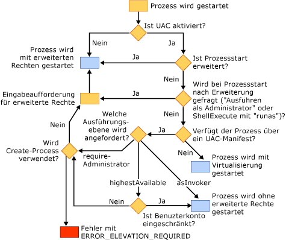

# Wie Benutzerkontensteuerung (UAC) die Anwendung beeinflusst
[!INCLUDE[vs2017banner](../assembler/inline/includes/vs2017banner.md)]

Benutzerkontensteuerung \(UAC\) ist ein Feature von Windows Vista, in dem Benutzerkonten eingeschränkte Berechtigungen haben.  Ausführliche Informationen über UAC finden Sie auf diesen Sites:  
  
-   [Schrittweise Anleitung zur Benutzerkontensteuerung in Windows](http://go.microsoft.com/fwlink/?linkid=53781)  
  
-   [Best Practices und Richtlinien für Entwickler von Anwendungen in einer Umgebung mit geringsten Rechten](http://go.microsoft.com/fwlink/?linkid=82444)  
  
-   [Verstehen und Konfigurieren der Benutzerkontensteuerung in Windows Vista](http://go.microsoft.com/fwlink/?LinkId=82445)  
  
## Erstellen von Projekten nach der Aktivierung von UAC  
 Wenn Sie ein Visual C\+\+\-Projekt unter Windows Vista erstellen, UAC bei der Erstellung deaktiviert ist und später aktiviert wird, müssen Sie das Projekt bereinigen und erneut erstellen, damit es ordnungsgemäß funktioniert.  
  
## Anwendungen, die Administratorrechte erfordern  
 Standardmäßig bettet der Visual C\+\+\-Linker ein UAC\-Fragment in das Manifest einer Anwendung mit der Ausführungsebene `asInvoker` ein.  Wenn die Anwendung für die ordnungsgemäße Ausführung Administratorrechte erfordert \(wenn sie z. B. den HKLM\-Knoten der Registrierung ändert oder in geschützte Bereiche des Datenträgers wie z. B. das Windows\-Verzeichnis schreibt\), müssen Sie die Anwendung ändern.  
  
 Die erste Option besteht darin, das UAC\-Fragment des Manifests zu ändern, um die Ausführungsebene in *requireAdministrator* zu ändern.  Die Anwendung fordert dann den Benutzer vor der Ausführung zur Angabe von Administratorrechten auf.  Informationen dazu finden Sie unter [\/MANIFESTUAC \(bettet UAC\-Informationen in Manifest ein\)](../build/reference/manifestuac-embeds-uac-information-in-manifest.md).  
  
 Die zweite Option besteht darin, durch Angabe der **\/MANIFESTUAC:NO**\-Linkeroption kein UAC\-Fragment einzubetten.  In diesem Fall wird die Anwendung virtualisiert ausgeführt.  Änderungen, die Sie an der Registrierung oder am Dateisystem vornehmen, werden nach Beendigung der Anwendung nicht beibehalten.  
  
 Im folgenden Flussdiagramm wird beschrieben, wie die Anwendung abhängig davon ausgeführt wird, ob UAC aktiviert ist und ob die Anwendung ein UAC\-Manifest besitzt:  
  
   
  
## Siehe auch  
 [Empfohlene Vorgehensweisen bezüglich der Sicherheit](../top/security-best-practices-for-cpp.md)