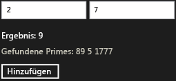

# Exemplarische Vorgehensweise: Erstellen einer Basiskomponente für Windows-Runtime mit WRL
Dieses Dokument zeigt, wie die Windows Runtime C++ Template Library (WRL) zum Erstellen einer grundlegenden Windows-Runtime-Komponente. Die Komponente addiert zwei Zahlen und löst ein Ereignis aus, wenn das Ergebnis eine Primzahl ist. Dieses Dokument wird gezeigt, wie die Komponente aus einer Uwp-app verwenden, die JavaScript nutzt.  
  
## Erforderliche Komponenten  
  
-   Erfahrung mit der [Windows-Runtime](http://msdn.microsoft.com/library/windows/apps/br211377.aspx).  
  
-   Erfahrungen mit COM.  
  
### Zum Erstellen einer grundlegenden Windows-Runtime-Komponente addiert, die zwei Zahlen  
  
1.  Erstellen Sie eine Visual C++ in Visual Studio `WRLClassLibrary` Projekt. Das Dokument [Projektvorlage für Klassenbibliothek](../windows/wrl-class-library-project-template.md) beschreibt, wie Sie diese Vorlage herunterladen. Benennen Sie das Projekt mit `Contoso`.  
  
2.  Ersetzen Sie im Contoso.cpp und Contoso.idl alle Instanzen von "WinRTClass" mit "Calculator" ein.  
  
3.  Fügen Sie in Contoso.idl, die `Add` Methode, um die `ICalculator` Schnittstelle.  
  
     [!code-cpp[wrl-basic-component#1](../windows/codesnippet/CPP/walkthrough-creating-a-basic-windows-runtime-component-using-wrl_1.idl)]  
  
4.  In Contoso.cpp, fügen die `Add` Methode, um die `public` Teil der `Calculator` Klasse.  
  
     [!code-cpp[wrl-basic-component#2](../windows/codesnippet/CPP/walkthrough-creating-a-basic-windows-runtime-component-using-wrl_2.cpp)]  
  
    > [!IMPORTANT]
    >  Da Sie eine COM-Komponente erstellen, denken Sie daran, verwenden Sie die `__stdcall` Aufrufkonvention.  
  
     Wir empfehlen die Verwendung `_Out_` und andere Quelle Annotation Language (SAL)-Anmerkungen beschreiben, wie eine Funktion ihre Parameter verwendet. SAL-Anmerkungen beschreiben auch Werte. SAL-Anmerkungen arbeiten mit der [C/C++-Codeanalysetool](/visualstudio/code-quality/code-analysis-for-c-cpp-overview) zu mögliche Fehlern in C und C++-Quellcode zu ermitteln. Häufige Codierungsfehler, die vom Tool gemeldet werden, zählen Pufferüberläufe, nicht initialisierter Speicher, Dereferenzierungen von null-Zeigern und Speicher- und Ressourcenverluste.  
  
### So verwenden Sie die Komponente aus einer Uwp-app, die JavaScript nutzt  
  
1.  Fügen Sie in Visual Studio eine neue JavaScript `Blank App` -Projekt auf die `Contoso` Lösung. Benennen Sie das Projekt mit `CalculatorJS`.  
  
2.  In der `CalculatorJS` Projekt, fügen einen Verweis auf die `Contoso` Projekt.  
  
3.  Ersetzen Sie in "default.HTML" der `body` Abschnitt mit den UI-Elementen:  
  
     [!code-html[wrl-basic-component#3](../windows/codesnippet/Html/walkthrough-creating-a-basic-windows-runtime-component-using-wrl_3.html)]  
  
4.  In der Datei "default.js", implementieren die `OnClick` Funktion.  
  
     [!code-javascript[wrl-basic-component#4](../windows/codesnippet/JavaScript/walkthrough-creating-a-basic-windows-runtime-component-using-wrl_4.js)]  
  
    > [!NOTE]
    >  In JavaScript wird der erste Buchstabe eines Methodennamens entsprechend die standardmäßigen Benennungskonventionen in Kleinbuchstaben geändert.  
  
### Hinzufügen eines Ereignisses, das ausgelöst wird, wenn eine Primzahl berechnet wird  
  
1.  In Contoso.idl, vor der Deklaration des `ICalculator`, definieren Sie den Delegattyp `PrimeNumberEvent`, stellt eine `int` Argument.  
  
     [!code-cpp[wrl-basic-component#5](../windows/codesnippet/CPP/walkthrough-creating-a-basic-windows-runtime-component-using-wrl_5.idl)]  
  
     Bei Verwendung der `delegate` -Schlüsselwort, das MIDL-Compiler erstellt eine Schnittstelle, enthält eine `Invoke` Methode, die Signatur des Delegaten übereinstimmt. In diesem Beispiel wird die generierte Datei Contoso_h.h definiert die `IPrimeNumberEvent` -Schnittstelle, die im weiteren Verlauf dieser Prozedur verwendet wird.  
  
     [!code-cpp[wrl-basic-component#13](../windows/codesnippet/CPP/walkthrough-creating-a-basic-windows-runtime-component-using-wrl_6.cpp)]  
  
2.  In der `ICalculator` Schnittstelle, definieren Sie die `PrimeNumberFound` Ereignis. Die `eventadd` und `eventremove` Attribute angeben, die der Consumer die `ICalculator` Schnittstelle abonnieren und Kündigen des Abonnements dieses Ereignis kann.  
  
     [!code-cpp[wrl-basic-component#6](../windows/codesnippet/CPP/walkthrough-creating-a-basic-windows-runtime-component-using-wrl_7.idl)]  
  
3.  Fügen Sie in Contoso.cpp, eine `private` [Microsoft::WRL::EventSource](../windows/eventsource-class.md) Membervariable der Ereignisabonnenten verwalten und das Aufrufen des ereignishandlers.  
  
     [!code-cpp[wrl-basic-component#7](../windows/codesnippet/CPP/walkthrough-creating-a-basic-windows-runtime-component-using-wrl_8.cpp)]  
  
4.  In Contoso.cpp, implementieren die `add_PrimeNumberFound` und `remove_PrimeNumberFound` Methoden.  
  
     [!code-cpp[wrl-basic-component#8](../windows/codesnippet/CPP/walkthrough-creating-a-basic-windows-runtime-component-using-wrl_9.cpp)]  
  
### Zum Auslösen des Ereignisses, wenn eine Primzahl ist berechnet  
  
1.  In Contoso.cpp, fügen die `IsPrime` Methode, um die `private` Teil der `Calculator` Klasse.  
  
     [!code-cpp[wrl-basic-component#12](../windows/codesnippet/CPP/walkthrough-creating-a-basic-windows-runtime-component-using-wrl_10.cpp)]  
  
2.  Ändern der `Calculator`des `Add` aufzurufende der [Microsoft::WRL::EventSource::InvokeAll](../windows/eventsource-invokeall-method.md) Methode, wenn eine Primzahl berechnet wird.  
  
     [!code-cpp[wrl-basic-component#11](../windows/codesnippet/CPP/walkthrough-creating-a-basic-windows-runtime-component-using-wrl_11.cpp)]  
  
### Für die Ereignisbehandlung aus JavaScript  
  
1.  Ändern Sie in "default.HTML", die `body` Abschnitt aus, um einen Textbereich enthalten, die Primzahlen enthält.  
  
     [!code-html[wrl-basic-component#9](../windows/codesnippet/Html/walkthrough-creating-a-basic-windows-runtime-component-using-wrl_12.html)]  
  
2.  Ändern Sie in "default.js", die `Add` Funktion behandelt die `PrimeNumberFound` Ereignis. Der Ereignishandler fügt die Primzahl an den Textbereich, der im vorherigen Schritt definiert wurde.  
  
     [!code-javascript[wrl-basic-component#10](../windows/codesnippet/JavaScript/walkthrough-creating-a-basic-windows-runtime-component-using-wrl_13.js)]  
  
    > [!NOTE]
    >  In JavaScript die Ereignisnamen werden in Kleinbuchstaben geändert und mit "auf", um den standardmäßigen Benennungskonventionen entsprechen vorangestellt werden.  
  
 Die folgende Abbildung zeigt die grundlegende rechneranwendung.  
  
   
  
## Nächste Schritte  
  
## Siehe auch  
 [Windows Runtime C++-Vorlagenbibliothek (WRL)](../windows/windows-runtime-cpp-template-library-wrl.md)   
 [Projektvorlage für Klassenbibliothek](../windows/wrl-class-library-project-template.md)   
 [C/C++-Codeanalysetool](/visualstudio/code-quality/code-analysis-for-c-cpp-overview)