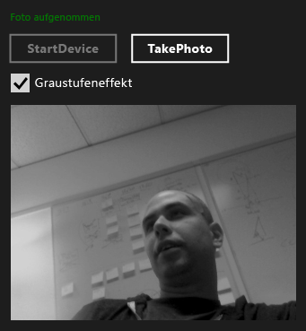

# Exemplarische Vorgehensweise: Erstellen einer Windows Store-App mithilfe von WRL und Media Foundation
[!INCLUDE[vs2017banner](../assembler/inline/includes/vs2017banner.md)]

Erfahren Sie, wie Sie die [!INCLUDE[cppwrl](../windows/includes/cppwrl_md.md)] ([!INCLUDE[cppwrl_short](../windows/includes/cppwrl_short_md.md)]) zum Erstellen einer [!INCLUDE[win8_appname_long](../build/includes/win8_appname_long_md.md)] -app, verwendet [Microsoft Media Foundation](http://msdn.microsoft.com/library/windows/apps/ms694197).  
  
 In diesem Beispiel wird eine benutzerdefinierte Media Foundation-Transformation erstellt, in der ein Graustufeneffekt auf Bilder angewendet wird, die über eine Webcam erfasst werden. Die App verwendet C++ zum Definieren der benutzerdefinierten Transformation und C# zum Verwenden der Komponente für das Transformieren der erfassten Bilder.  
  
> [!NOTE]
>  Anstelle von C# können Sie auch JavaScript, Visual Basic oder C++ verwenden, um die benutzerdefinierte Transformationskomponente zu verwenden.  
  
 In den meisten Fällen können Sie [!INCLUDE[cppwrt](../build/reference/includes/cppwrt_md.md)] ([!INCLUDE[cppwrt_short](../build/reference/includes/cppwrt_short_md.md)]) zum Erstellen der [!INCLUDE[wrt](../atl/reference/includes/wrt_md.md)]-Komponenten verwenden. (Weitere Informationen finden Sie unter [Visual C++-Sprachreferenz](../Topic/Visual%20C++%20Language%20Reference%20\(C++-CX\).md).) Manchmal müssen Sie jedoch [!INCLUDE[cppwrl_short](../windows/includes/cppwrl_short_md.md)] verwenden. Beispielsweise müssen Sie beim Erstellen einer Medienerweiterung für Microsoft Media Foundation eine Komponente erstellen, die sowohl COM- als auch [!INCLUDE[wrt](../atl/reference/includes/wrt_md.md)]-Schnittstellen implementiert. Da [!INCLUDE[cppwrt_short](../build/reference/includes/cppwrt_short_md.md)] nur [!INCLUDE[wrt](../atl/reference/includes/wrt_md.md)]-Objekte erstellen kann, um eine Medienerweiterung zu erstellen, müssen Sie [!INCLUDE[cppwrl_short](../windows/includes/cppwrl_short_md.md)] verwenden, da es die Implementierung der COM- und [!INCLUDE[wrt](../atl/reference/includes/wrt_md.md)]-Schnittstellen aktiviert.  
  
> [!NOTE]
>  Auch wenn dieses Codebeispiel lang ist, stellt es das erforderliche Minimum dar, um eine nützliche Media Foundation-Transformation zu erstellen. Sie können es als Ausgangspunkt für Ihre eigene benutzerdefinierte Transformation verwenden. Dieses Beispiel stammt aus der [Media Extensions Sample](http://code.msdn.microsoft.com/windowsapps/Media-extensions-sample-7b466096), welche verwendet Media Extensions anzuwendende wirkt sich auf Video, Video decodieren und Schema Ereignishandler, die Mediendaten generieren.  
  
## Erforderliche Komponenten  
  
-   Erfahrung mit der [Windows-Runtime](http://msdn.microsoft.com/library/windows/apps/br211377.aspx).  
  
-   Erfahrungen mit COM.  
  
-   Eine Webcam.  
  
## Wesentliche Punkte  
  
-   Verwenden Sie zum Erstellen einer benutzerdefinierten Media Foundation-Komponente eine MIDL-Definitionsdatei (Microsoft Interface Definition Language) zum Definieren einer Schnittstelle, Implementieren dieser Schnittstelle und zum Einstellen derselben, dass sie aus anderen Komponenten aktiviert werden kann.  
  
-   Die `namespace` und `runtimeclass` Attribute, und die `NTDDI_WIN8`[Version](assetId:///66ac5cf3-2230-44fd-aaf6-8013e4a4ae81) Attributwert wichtige Teile der MIDL-Definition für eine Media Foundation-Komponente, die verwendet werden [!INCLUDE[cppwrl_short](../windows/includes/cppwrl_short_md.md)].  
  
-   [Microsoft::wrl::RuntimeClass](../windows/runtimeclass-class.md) ist die Basisklasse für die benutzerdefinierte Media Foundation-Komponente. Die [Microsoft::WRL::RuntimeClassType::WinRtClassicComMix](../windows/runtimeclasstype-enumeration.md) Enum-Wert, der als Vorlagenargument angegeben wird, kennzeichnet die Klasse zur Verwendung als eine [!INCLUDE[wrt](../atl/reference/includes/wrt_md.md)] Klasse und einer klassischen COM-Runtime-Klasse.  
  
-   Die [InspectableClass](../windows/inspectableclass-macro.md) Makro implementiert grundlegende COM-Funktionen wie z. B. die Assemblyverweiszählung und die `QueryInterface` -Methode und legt die Laufzeit Klassenname und Vertrauensstufe.  
  
-   Verwenden Sie die Microsoft:: wrl::[Modulklasse](https://www.microsoftonedoc.com/#/organizations/e6f6a65cf14f462597b64ac058dbe1d0/projects/3fedad16-eaf1-41a6-8f96-0c1949c68f32/containers/a3daf831-1c5f-4bbe-964d-503870caf874/tocpaths/b4acf5de-2f4c-4c8b-b5ff-9140d023ecbe/locales/en-US) DLL-Einstiegspunkt-Funktionen implementieren, wie z. B. [DllGetActivationFactory](http://msdn.microsoft.com/library/br205771.aspx), [DllCanUnloadNow](http://msdn.microsoft.com/library/windows/desktop/ms690368\(v=vs.85\).aspx), und [DllGetClassObject](http://msdn.microsoft.com/library/windows/desktop/ms680760\(v=vs.85\).aspx).  
  
-   Verknüpfen Sie die Komponenten-DLL mit „runtimeobject.lib“. Geben Sie auch [/WINMD](../Topic/Compiler%20and%20Linker%20options%20\(C++-CX\).md) in der Linkerzeile "Windows-Metadaten generiert.  
  
-   Verwenden Sie Projektverweise, um den Zugriff auf [!INCLUDE[cppwrl_short](../windows/includes/cppwrl_short_md.md)]-Komponenten für [!INCLUDE[win8_appname_long](../build/includes/win8_appname_long_md.md)]-Apps zu ermöglichen.  
  
### So verwenden Sie [!INCLUDE[cppwrl_short](../windows/includes/cppwrl_short_md.md)] zum Erstellen der Media Foundation-Graustufentransformationskomponente  
  
1.  Erstellen Sie in Visual Studio eine **leere Projektmappe** Projekt. Nennen Sie das Projekt, z. B. `MediaCapture`.  
  
2.  Hinzufügen einer **DLL (Windows Store-apps)** Projekt der Projektmappe. Nennen Sie das Projekt, z. B. `GrayscaleTransform`.  
  
3.  Hinzufügen einer **Midl-Datei (.idl)** Datei in das Projekt. Benennen Sie die Datei, z. B. `GrayscaleTransform.idl`.  
  
4.  Fügen Sie „GrayscaleTransform.idl“ diesen Code hinzu.  
  
     [!CODE [wrl-media-capture#1](../CodeSnippet/VS_Snippets_Misc/wrl-media-capture#1)]  
  
5.  Verwenden Sie den folgenden Code, um die Inhalte von „pch.h“ zu ersetzen.  
  
     [!CODE [wrl-media-capture#2](../CodeSnippet/VS_Snippets_Misc/wrl-media-capture#2)]  
  
6.  Fügen Sie dem Projekt eine neue Headerdatei, nennen Sie sie `BufferLock.h`, und fügen Sie diesen Code hinzu:  
  
     [!CODE [wrl-media-capture#3](../CodeSnippet/VS_Snippets_Misc/wrl-media-capture#3)]  
  
7.  „GrayscaleTransform.h“ wird in diesem Beispiel nicht verwendet. Sie können ihn bei Bedarf aus dem Projekt entfernen.  
  
8.  Verwenden Sie den folgenden Code, um die Inhalte von „GrayscaleTransform.cpp“ zu ersetzen.  
  
     [!CODE [wrl-media-capture#4](../CodeSnippet/VS_Snippets_Misc/wrl-media-capture#4)]  
  
9. Eine neue DEF-Datei zum Projekt hinzufügen, nennen Sie sie `GrayscaleTransform.def`, und fügen Sie diesen Code hinzu:  
  
     [!CODE [wrl-media-capture#5](../CodeSnippet/VS_Snippets_Misc/wrl-media-capture#5)]  
  
10. Verwenden Sie den folgenden Code, um die Inhalte von „dllmain.cpp“ zu ersetzen.  
  
     [!CODE [wrl-media-capture#6](../CodeSnippet/VS_Snippets_Misc/wrl-media-capture#6)]  
  
11. In des Projekts **Eigenschaftenseiten** Dialogfeld legen die folgenden **Linker** Eigenschaften.  
  
    1.  Unter **Eingabe**, für die **Moduldefinitionsdatei**, geben Sie `GrayScaleTransform.def`.  
  
    2.  Auch unter **Eingabe**, hinzufügen `runtimeobject.lib`, `mfuuid.lib`, und `mfplatf.lib` die **zusätzliche Abhängigkeiten** Eigenschaft.  
  
    3.  Unter **Windows-Metadaten**, legen **Windows-Metadaten generieren** zu **Ja (/ WINMD)**.  
  
### So verwenden Sie [!INCLUDE[cppwrl_short](../windows/includes/cppwrl_short_md.md)] der benutzerdefinierten Media Foundation-Komponente aus einer C#-App  
  
1.  Fügen Sie einen neuen **c# leere App (XAML)** -Projekt auf die `MediaCapture` Lösung. Nennen Sie das Projekt, z. B. `MediaCapture`.  
  
2.  In der **MediaCapture** Projekt, fügen einen Verweis auf die `GrayscaleTransform` Projekt. Informationen hierzu finden Sie unter [Gewusst wie: Hinzufügen oder Entfernen von verweisen mithilfe des Verweis-Managers](../Topic/How%20to:%20Add%20or%20Remove%20References%20By%20Using%20the%20Reference%20Manager.md).  
  
3.  In Package.appxmanifest auf die **Funktionen** Registerkarte **Mikrofon** und **Webcam**. Beide Funktionen sind erforderlich, um Fotos von der Webcam zu erfassen.  
  
4.  In "MainPage.xaml", fügen Sie diesen Code in das Stammverzeichnis [Raster](http://msdn.microsoft.com/library/windows/apps/xaml/windows.ui.xaml.controls.grid.aspx) Element:  
  
     [!CODE [wrl-media-capture#7](../CodeSnippet/VS_Snippets_Misc/wrl-media-capture#7)]  
  
5.  Verwenden Sie den folgenden Code zum Ersetzen der Inhalte von „MainPage.xaml.cs“.  
  
     [!CODE [wrl-media-capture#8](../CodeSnippet/VS_Snippets_Misc/wrl-media-capture#8)]  
  
 In der folgenden Abbildung wird die MediaCapture-App veranschaulicht.  
  
   
  
## Nächste Schritte  
 Im Beispiel wird gezeigt, wie Fotos von der standardmäßigen Webcam nacheinander erfasst werden. Die [Media Extensions Sample](http://code.msdn.microsoft.com/windowsapps/Media-extensions-sample-7b466096) kann noch mehr. Es veranschaulicht die Aufzählung von Webcamgeräten und die Arbeit mit lokalen Schemahandlern, und es veranschaulicht zusätzliche Medieneffekte, die bei einzelnen Fotos und Videostreams funktionieren.  
  
## Siehe auch  
 [Windows-Runtime C++-Vorlagenbibliothek (WRL)](../windows/windows-runtime-cpp-template-library-wrl.md)   
 [Microsoft Media Foundation](http://msdn.microsoft.com/library/windows/apps/ms694197)   
 [Beispiel zu den Medien](http://code.msdn.microsoft.com/windowsapps/Media-extensions-sample-7b466096)